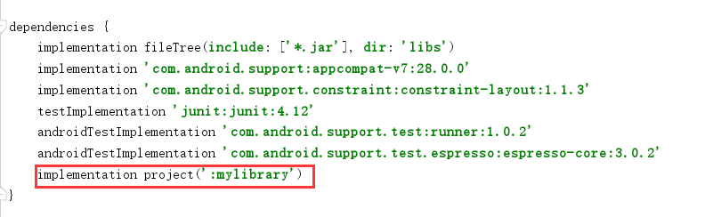

之前介绍了如何热更新如何动态加载资源，可参考：

[Android 热修复](http://www.zydeveloper.com/page/2/)

[Android插件化——动态资源加载](http://www.zydeveloper.com/2019/07/24/ResourceDynamicLoad/)

<!--more-->

现在我们来看看如何动态加载Activity？

首先有的人可能会问，activity也是一个类，不同样可以使用DexClassLoader加载上来吗？
activity是个类没错，但特殊的是activity有生命周期的，比如我们平时使用activity时会有onCreate onStart ... 如果按普通的类加载显然这些生命周期并不会正常回调，activity也不会正常使用。

目前使用的方案有反射实现、接口实现、Hook实现。反射实现有性能问题所以暂不介绍，我们先来介绍一下接口实现方式。

接口实现方式有已经完成的框架 [dynamic-load-apk](https://github.com/singwhatiwanna/dynamic-load-apk)大家可参考使用。

我们来实现一个简单的Demo来看看接口方式实现有哪些优缺点？

什么是接口实现方式呢？
我们可以这样理解，在我们的APP中（也就是宿主APP）的activity是有完整的生命周期的，但Plugin APP中的activity是没有，我们需要让插件中的activity具备生命周期，那我们是否可以使用宿主APP中的activity来通过接口的方式让插件APP中的activity同样具有生命周期呢。

话不多说上代码：

我们先来定义一个module工程用于作为宿主APP与插件APP共同的依赖库。

然后定义一个插件契约接口
```java
public interface IPluginContract {
    void onCreate(Bundle saveInstance);
    void attachContext(FragmentActivity context);

    void onStart();

    void onResume();

    void onRestart();

    void onDestroy();

    void onStop();

    void onPause();
}
```

宿主APP与插件APP都依赖该库，如：


宿主APP中我们需要一个管理插件的类来完成插件的管理工作，如：
```java

```
