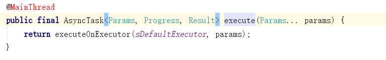
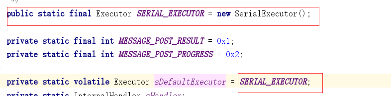
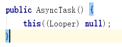
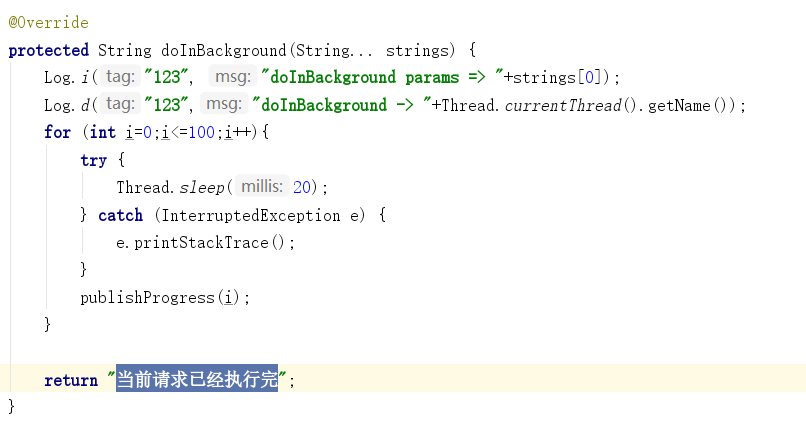

<!--more-->


```java
btnMain2Asynctask.setOnClickListener(new View.OnClickListener() {
    @Override
    public void onClick(View v) {
        //开始执行异步任务
        new MyTask().execute("我是入口参数");
    }
});
```

```java
private class MyTask extends AsyncTask<String,Integer,String>{
    @Override
    protected void onPreExecute() {
        super.onPreExecute();
        Log.d("123","onPreExecute -> "+Thread.currentThread().getName());
    }
    @Override
    protected String doInBackground(String... strings) {
        Log.i("123", "doInBackground params => "+strings[0]);
        Log.d("123","doInBackground -> "+Thread.currentThread().getName());
        for (int i=0;i<=100;i++){
            try {
                Thread.sleep(20);
            } catch (InterruptedException e) {
                e.printStackTrace();
            }
            publishProgress(i);
        }
        return "当前请求已经执行完";
    }
    @Override
    protected void onProgressUpdate(Integer... values) {
        super.onProgressUpdate(values);
        Log.i("123", "onProgressUpdate value => "+values[0]);
        Log.d("123","onProgressUpdate -> "+Thread.currentThread().getName());
        pbMain2.setProgress(values[0]);
    }
    @Override
    protected void onPostExecute(String s) {
        super.onPostExecute(s);
        Log.i("123", "result => "+s);
        Log.d("123","onPostExecute -> "+Thread.currentThread().getName());
        tvMain2Result.setText(s);
    }
}
```

我们来看 new MyTask().execute("我是入口参数"); 具体的执行过程：


我们发现execute调用了executeOnExecutor（sDefaultExecutor，params）方法，params这个就是外面传递进来的参数，我们来看看sDefaultExecutor是什么？


我们发现sDefaultExecutor就是SerialExecutor的实例，接下来我们继续看


```java
private static class SerialExecutor implements Executor {
    //线程队列
    final ArrayDeque<Runnable> mTasks = new ArrayDeque<Runnable>();
    Runnable mActive;
    public synchronized void execute(final Runnable r) {
        //加入队列尾
        mTasks.offer(new Runnable() {
            public void run() {
                try {
                    //执行runnable的run方法
                    r.run();
                } finally {
                    //执行下一个任务
                    scheduleNext();
                }
            }
        });
        //如果mActive==null 执行scheduleNext方法
        if (mActive == null) {
            scheduleNext();
        }
    }
    protected synchronized void scheduleNext() {
        //从队列中取出runnable 如果不为空交给THREAD_POOL_EXECUTOR线程池执行
        if ((mActive = mTasks.poll()) != null) {
            THREAD_POOL_EXECUTOR.execute(mActive);
        }
    }
}
```

接下来我们来看看THREAD_POOL_EXECUTOR线程池是如果创建的


```java
public static final Executor THREAD_POOL_EXECUTOR;
static {
    //线程池创建 CORE_POOL_SIZE 核心线程数
    ThreadPoolExecutor threadPoolExecutor = new ThreadPoolExecutor(
            CORE_POOL_SIZE, MAXIMUM_POOL_SIZE, KEEP_ALIVE_SECONDS, TimeUnit.SECONDS,
            sPoolWorkQueue, sThreadFactory);
    threadPoolExecutor.allowCoreThreadTimeOut(true);
    //将创建的线程池赋值给THREAD_POOL_EXECUTOR
    THREAD_POOL_EXECUTOR = threadPoolExecutor;
}
```


```java
//获取系统CPU数量
private static final int CPU_COUNT = Runtime.getRuntime().availableProcessors();
// We want at least 2 threads and at most 4 threads in the core pool,
// preferring to have 1 less than the CPU count to avoid saturating
// the CPU with background work
//获取设置的核心线程数
private static final int CORE_POOL_SIZE = Math.max(2, Math.min(CPU_COUNT - 1, 4));
//获取设置的最大线程数
private static final int MAXIMUM_POOL_SIZE = CPU_COUNT * 2 + 1;
private static final int KEEP_ALIVE_SECONDS = 30;
```
如下是executeOnExecutor方法的源码逻辑：

```java
@MainThread
public final AsyncTask<Params, Progress, Result> executeOnExecutor(Executor exec,
        Params... params) {
       //判断如果当前任务状态不是“就绪”就直接抛异常
    if (mStatus != Status.PENDING) {
        switch (mStatus) {
            case RUNNING:
                throw new IllegalStateException("Cannot execute task:"
                        + " the task is already running.");
            case FINISHED:
                throw new IllegalStateException("Cannot execute task:"
                        + " the task has already been executed "
                        + "(a task can be executed only once)");
        }
    }
    //更新任务当前状态为RUNNING
    mStatus = Status.RUNNING;
    //回调onPreExecute方法，该方法我们Demo中已经实现
    onPreExecute();
    //将入口参数传递mWorker
    mWorker.mParams = params;
    //通过线程池执行mFuture
    exec.execute(mFuture);
    return this;
}
```
如上实现线程池执行的mFuture对象及后续的调用流程参见如下分析：


先来分析 new MyTask（）发生了什么？

首先MyTask继续了AsyncTask所以 new AsyncTask构造会被调用。



```java
public AsyncTask(@Nullable Looper callbackLooper) {
    //判断入口参数callbackLooper是否为空或者是否是MainLooper 如果为空或者是MainLooper从而返回MainHandler  其他返回对应callbackLooper的Hander
    mHandler = callbackLooper == null || callbackLooper == Looper.getMainLooper()
        ? getMainHandler()
        : new Handler(callbackLooper);
    //创建了一个工作任务 WorkerRunnable继承了Callable 所以重写了如下的call方法
    mWorker = new WorkerRunnable<Params, Result>() {
        public Result call() throws Exception {
            //设置任务已经执行
            mTaskInvoked.set(true);
            Result result = null;
            try {
                //设置当前线程优先级为Background线程
                Process.setThreadPriority(Process.THREAD_PRIORITY_BACKGROUND);
                //noinspection unchecked
                //调用了doInBackground,该方法我们已经在demo中复写了
                result = doInBackground(mParams);
                Binder.flushPendingCommands();
            } catch (Throwable tr) {
                //设置了取消标记为True
                mCancelled.set(true);
                throw tr;
            } finally {
                //发送了结果数据
                postResult(result);
            }
            //返回执行结果
            return result;
        }
    };
    //计划待执行任务
    mFuture = new FutureTask<Result>(mWorker) {
        @Override
        protected void done() {
            try {
                postResultIfNotInvoked(get());
            } catch (InterruptedException e) {
                android.util.Log.w(LOG_TAG, e);
            } catch (ExecutionException e) {
                throw new RuntimeException("An error occurred while executing doInBackground()",
                        e.getCause());
            } catch (CancellationException e) {
                postResultIfNotInvoked(null);
            }
        }
    };
}
```

如下是我们自己实现的doInBackground方法逻辑，最终也返回了执行结果。

postResult（）代码逻辑如下：


```java
private Result postResult(Result result) {
    @SuppressWarnings("unchecked")
    Message message = getHandler().obtainMessage(MESSAGE_POST_RESULT,
            new AsyncTaskResult<Result>(this, result));
    message.sendToTarget();
    return result;
}
```
如上代码使用了AsyncTask里的Handler发送了Message，交给handler handleMessage来处理。如下就是处理消息的代码逻辑：


```java
private static class InternalHandler extends Handler {
    public InternalHandler(Looper looper) {
        super(looper);
    }
    @SuppressWarnings({"unchecked", "RawUseOfParameterizedType"})
    @Override
    public void handleMessage(Message msg) {
        AsyncTaskResult<?> result = (AsyncTaskResult<?>) msg.obj;
        switch (msg.what) {
            //处理如上发过来的Message
            case MESSAGE_POST_RESULT:
                // There is only one result
                result.mTask.finish(result.mData[0]);
                break;
            case MESSAGE_POST_PROGRESS:
                result.mTask.onProgressUpdate(result.mData);
                break;
        }
    }
}
```
result.mTask.finish(result.mData[0]);就是将result结果数据传递并调用了AsyncTask的finish方法。具体代码如下：

```java

private void finish(Result result) {
    //判断是否取消，如果取消就调用onCancelled回调方法，如果没有取消就调用onPostExecute方法，该方法我们已经在Demo中复写了。
    if (isCancelled()) {
        onCancelled(result);
    } else {
        //回调结果数据
        onPostExecute(result);
    }
    //设置当前任务状态为已完成
    mStatus = Status.FINISHED;
}
```
下面来分析一下AsyncTask的进度更新逻辑：

```java

@Override
protected String doInBackground(String... strings) {
    Log.i("123", "doInBackground params => "+strings[0]);
    Log.d("123","doInBackground -> "+Thread.currentThread().getName());
    for (int i=0;i<=100;i++){
        try {
            Thread.sleep(20);
        } catch (InterruptedException e) {
            e.printStackTrace();
        }
        //此处代码进行了进度发布
        publishProgress(i);
    }
    return "当前请求已经执行完";
}
```
如下是AsyncTask的publishProgress方法处理逻辑：
```java

@WorkerThread
protected final void publishProgress(Progress... values) {
    if (!isCancelled()) {
        //同理使用Handler发送了MESSAGE_POST_PROGRESS的Message
        getHandler().obtainMessage(MESSAGE_POST_PROGRESS,
                new AsyncTaskResult<Progress>(this, values)).sendToTarget();
    }
}
```

与刚才MESSAGE_POST_RESULT一样逻辑还是由InternalHandler来处理对应的What类型数据，


```java
@Override
public void handleMessage(Message msg) {
    AsyncTaskResult<?> result = (AsyncTaskResult<?>) msg.obj;
    switch (msg.what) {
        case MESSAGE_POST_RESULT:
            // There is only one result
            result.mTask.finish(result.mData[0]);
            break;
        case MESSAGE_POST_PROGRESS:
            result.mTask.onProgressUpdate(result.mData);
            break;
    }
}
```
如上onProgressUpdate我们也在Demo中实现了进度条控件的进度更新。

如上就是对AsyncTask的源码分析。