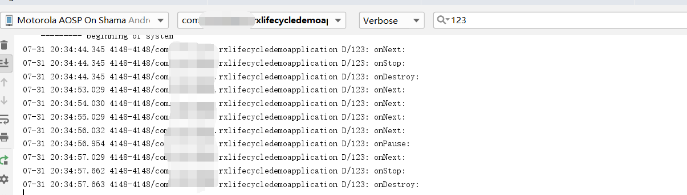

[Auto Dispose GitHub地址](https://github.com/uber/AutoDispose)

前一篇我们介绍了RxLifecycle解决Rxjava可能发送的内存泄漏问题：

[RxLifecycle 解决RxJava内存泄漏问题](http://www.zydeveloper.com/2019/08/05/RxLifecycle/)

AutoDispose是一个RxJava2工具，用于解决Rxjava内存泄漏问题。
<!--more-->

### 如何使用?

导入依赖：
```java
implementation 'com.uber.autodispose:autodispose-android-archcomponents:1.3.0'
```

手写一个RxJava的内存泄漏问题：
```java
@Override
protected void onCreate(Bundle savedInstanceState) {
    super.onCreate(savedInstanceState);
    setContentView(R.layout.activity_main);

    Observable.interval(1,TimeUnit.SECONDS)
            .subscribeOn(Schedulers.io())
            .observeOn(AndroidSchedulers.mainThread())
            .subscribe(new Observer<Long>() {
                @Override
                public void onSubscribe(Disposable d) {

                }

                @Override
                public void onNext(Long aLong) {
                    Log.d("123", "onNext: ");
                }

                @Override
                public void onError(Throwable e) {

                }

                @Override
                public void onComplete() {
                    Log.d("123", "onComplete: ");
                }
            });

}
```

这段代码我们在前一篇文章中已经验证了存在内存泄漏问题，即点击back键后onNext仍然被回调，log一直持续输出。

下面我们通过使用AutoDispose来修复Rxjava内存泄漏问题。

修改代码为：
```java
 Observable.interval(1,TimeUnit.SECONDS)
                .subscribeOn(Schedulers.io())
                .observeOn(AndroidSchedulers.mainThread())
                .as(AutoDispose.autoDisposable(AndroidLifecycleScopeProvider.from(this)))
                .subscribe(new Observer<Long>() {
                    @Override
                    public void onSubscribe(Disposable d) {

                    }

                    @Override
                    public void onNext(Long aLong) {
                        Log.d("123", "onNext: ");
                    }

                    @Override
                    public void onError(Throwable e) {

                    }

                    @Override
                    public void onComplete() {
                        Log.d("123", "onComplete: ");
                    }
                });
```
我们发现加入了
```java
.as(AutoDispose.autoDisposable(AndroidLifecycleScopeProvider.from(this)))
```
运行项目后，再次验证是否还存在内存泄漏。
查看log输出：

我们发现onNext不再被回调。

我们来看看AndroidLifecycleScopeProvider.from 传入的参数为LifecycleOwner类型。该类型是Android中的生命周期类型，也就说实现了该接口的Activity及Fragment都可以使用AutoDispose。

注：

集成AutoDispose后如出现如下错误：
```java
Error: Invoke-customs are only supported starting with Android O (--min-api 26)
```

**解决方法:**

app 的 build.gradle中android下加入如下配置:
```java
android{
        compileOptions{
            sourceCompatibility JavaVersion.VERSION_1_8
            targetCompatibility JavaVersion.VERSION_1_8
        }
    }
```