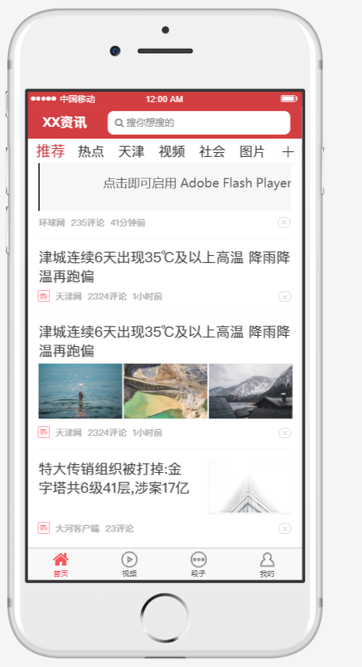
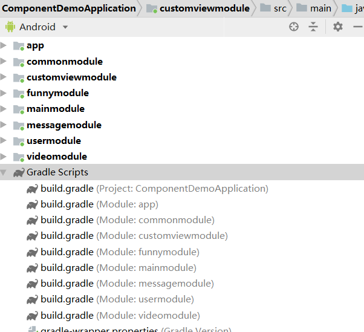
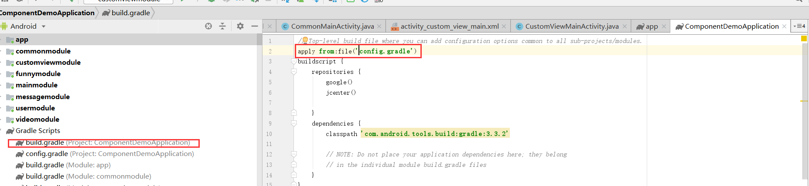
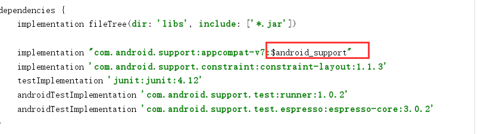
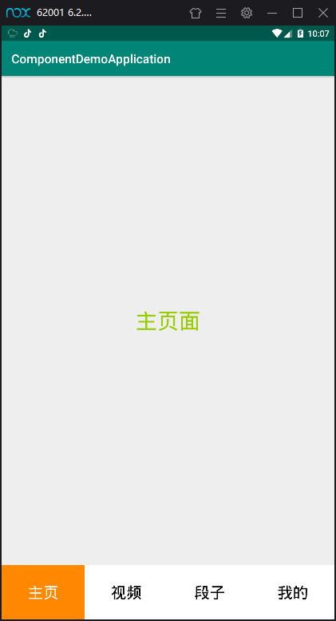

### 什么是组件化？

组件化是指解耦复杂系统时将多个功能模块拆分、重组的过程，有多种属性、状态反映其内部特性。
组件化是一种高效的处理复杂应用系统，更好的明确功能模块作用的方式。

————百度百科
<!--more-->

本人对于组件化的理解为是一种架构思想，与传统项目（一般指模块化）相比各个业务组件相互隔离，使各个组件可以单独运行单独测试，使用“壳工程”将其组装到一起。这样带来的好处是业务模块单独开发维护降低耦合性，使项目可测试性及可维护性提升。


*（该图片来源于互联网）*

上图很形象的描述了组件化各层级的结构。

对于之前我们的项目大多是将业务模块与基础模块都放到一个app工程中开发维护，这样做的缺点是不易测试，耦合度高等问题显而易见。有的朋友可能会说我们使用了MVC MVP 甚至 MVVM架构不可以解耦吗？使用架构当然可以解耦，但与组件化还不在一个层面上，组件化更偏向于将业务功能模块拆分。

### 下面我们通过一个Demo来具体演示一下组件化该如何搭建？

例如我们要实现上图这样的一个咨询类app，我们的项目结构搭建如下：


app——壳工程
mainmodule——欢迎页面 启动页面 主页面模块
videomodule——视频模块
funnymodule——段子业务模块
usermodule——用户模块对应“我的”
messagemodule——系统消息模块
commonmodule——通用模块，主要放一下BaseActivity BaseFragment 网络框架等
customviewmodule——自定义View模块

如上是我们对应该app拆分出的业务模块，其中还包括一些基础模块。

下面我们来建立一个config.gradle来统一配置工程信息。如：
```java
ext{
    /**
     * 是否模块化
     */
    isCommonModule = true
    isCustomModule = true
    isFunnyModule  = true
    isMainModule   = true
    isMessageModule = true
    isUserModule =true
    isVideoModule = true


    /*defaultConfig*/
    compile_sdk_version = 28
    min_sdk_version = 15
    target_sdk_version = 28
    version_code = 1
    version_name = "1.0.0"
    multiDexEnabled = true

    /*dependencies*/
    android_support = "28.0.0"
    retrofit = "2.4.0"
    ok_http = "3.10.0"
    rx_android = "2.0.2"
    rx_java = "2.1.4"
    dagger2 = "2.16"
}
```
然后在project的build.gradle中引入config.gradle.


这样在我们的module中就可以使用我们的配置信息了。
使用app的module build.gradle
```java
apply plugin: 'com.android.application'

android {
    compileSdkVersion compile_sdk_version
    defaultConfig {
        applicationId "com.baweigame.componentdemoapplication"
        minSdkVersion min_sdk_version
        targetSdkVersion target_sdk_version
        versionCode version_code
        versionName version_name
        testInstrumentationRunner "android.support.test.runner.AndroidJUnitRunner"
    }
    buildTypes {
        release {
            minifyEnabled false
            proguardFiles getDefaultProguardFile('proguard-android-optimize.txt'), 'proguard-rules.pro'
        }
    }
}

dependencies {
    implementation fileTree(include: ['*.jar'], dir: 'libs')
    implementation "com.android.support:appcompat-v7:$android_support"
    implementation 'com.android.support.constraint:constraint-layout:1.1.3'
    testImplementation 'junit:junit:4.12'
    androidTestImplementation 'com.android.support.test:runner:1.0.2'
    androidTestImplementation 'com.android.support.test.espresso:espresso-core:3.0.2'
    if (isCommonModule.toBoolean()){
        implementation project(':commonmodule')
    }
    if (isCustomModule.toBoolean()){
        implementation project(':customviewmodule')
    }
    if(isFunnyModule.toBoolean()){
        implementation project(':funnymodule')
    }
    if (isMainModule.toBoolean()){
        implementation project(':mainmodule')
    }
    if (isMessageModule.toBoolean()){
        implementation project(':messagemodule')
    }
    if (isUserModule.toBoolean()){
        implementation project(':usermodule')
    }
    if (isVideoModule.toBoolean()){
        implementation project(':videomodule')
    }

}


```
多个模块build.gradle大多一样，所以使用mainmodule 举例，build.gradle：
```java
if (isMainModule.toBoolean()){
    apply plugin: 'com.android.library'
}
else{
    apply plugin: 'com.android.application'
}

android {
    compileSdkVersion compile_sdk_version

    //限定命名前缀避免冲突
    resourcePrefix "${project.name}_"

    defaultConfig {
        if (!isMainModule.toBoolean()){
            applicationId "com.baweigame.mainmodule"
        }

        minSdkVersion min_sdk_version
        targetSdkVersion target_sdk_version
        versionCode version_code
        versionName version_name

        testInstrumentationRunner "android.support.test.runner.AndroidJUnitRunner"

    }

    sourceSets {
        main {
            if (isMainModule.toBoolean()) {
                manifest.srcFile module_Manifest
            } else {
                manifest.srcFile app_Manifest
            }
        }
    }

    buildTypes {
        release {
            minifyEnabled false
            proguardFiles getDefaultProguardFile('proguard-android-optimize.txt'), 'proguard-rules.pro'
        }
    }

}

dependencies {
    implementation fileTree(dir: 'libs', include: ['*.jar'])

    implementation "com.android.support:appcompat-v7:$android_support"
    implementation 'com.android.support.constraint:constraint-layout:1.1.3'
    testImplementation 'junit:junit:4.12'
    androidTestImplementation 'com.android.support.test:runner:1.0.2'
    androidTestImplementation 'com.android.support.test.espresso:espresso-core:3.0.2'
}

```


我们发现几处需要注意的地方：
```java
if (isMainModule.toBoolean()){
    apply plugin: 'com.android.library'
}
else{
    apply plugin: 'com.android.application'
}
```
如果开启main模块模式，就设置该module为library模式，反之使用application模式。

```java
//限定命名前缀避免冲突
resourcePrefix "${project.name}_"
```
限定资源命名加前缀避免冲突

```java
sourceSets {
        main {
            if (isMainModule.toBoolean()) {
                manifest.srcFile module_Manifest
            } else {
                manifest.srcFile app_Manifest
            }
        }
    }
```
我们知道AnroidMainfest文件是android工程的必须文件，用于设置权限及四大组件注册声明等。
当我们module工程为application模式时我们之前的清单文件可以正常使用，但设置成module模式后我们的清单文件就需要合并到app工程中，这样我们源清单文件中的application设置及LAUNCHER的activity都会出现合并错误。

所以我们采用使用两份清单文件提供给两种模式使用。
我们看看module模式下的清单文件：
```xml
<?xml version="1.0" encoding="utf-8"?>
<manifest xmlns:android="http://schemas.android.com/apk/res/android"
    package="com.baweigame.mainmodule">

    <application
        android:theme="@style/AppTheme">
        <activity android:name=".MainModuleActivity">

        </activity>
    </application>

</manifest>
```
在看看application模式下的清单文件：
```xml
<?xml version="1.0" encoding="utf-8"?>
<manifest xmlns:android="http://schemas.android.com/apk/res/android"
    package="com.baweigame.mainmodule">

    <application
        android:allowBackup="true"
        android:icon="@mipmap/ic_launcher"
        android:label="@string/app_name"
        android:roundIcon="@mipmap/ic_launcher_round"
        android:supportsRtl="true"
        android:theme="@style/AppTheme">
        <activity android:name=".MainModuleActivity">
            <intent-filter>
                <action android:name="android.intent.action.MAIN" />

                <category android:name="android.intent.category.LAUNCHER" />
            </intent-filter>
        </activity>
    </application>

</manifest>
```

```java
 if (!isMainModule.toBoolean()){
            applicationId "com.baweigame.mainmodule"
        }
```
如果不开启main模块模式就设置applicationId


当然还可以管理我们第三方的库版本。

#### 关于Applicaton Context 获取问题？
我们知道一个APP有且只有一个Application，我们在APP工程中获取Application Context很容易就能获取到，但是如果使用组件化方案时各业务组件获取Application Context就比较麻烦了。
那么我们如何解决这个问题呢？
我们还记得模块中有个Common业务模块吗？这个模块就是用于存放BaseApplcation BaseActivity的地方，也就是说我们可以让壳APP与各业务模块都依赖这个Common模块，然后壳App工程application实现Common模块中的BaseApplication。
如：
Common 模块中的BaseApplication。
```java
package com.baweigame.commonmodule;

import android.app.Application;
import android.content.Context;

public class BaseApplication extends Application {
    private Context mContext;

    @Override
    public void onCreate() {
        super.onCreate();
        mContext=this.getApplicationContext();
    }

    public Context getContext(){
        return mContext;
    }
}

```
壳APP工程的MyApplication
```java
package com.baweigame.componentdemoapplication;

import com.baweigame.commonmodule.BaseApplication;

public class MyApplication extends BaseApplication {
    @Override
    public void onCreate() {
        super.onCreate();
    }
}
```
当然清单文件中要指定该Application。
```xml
<application
        android:name=".MyApplication"
        android:allowBackup="false"
        android:icon="@mipmap/ic_launcher"
        android:label="@string/app_name"
        android:roundIcon="@mipmap/ic_launcher_round"
        android:supportsRtl="true"
        android:theme="@style/AppTheme">
```

#### Common模块
下面来说说Common模块，该模块是所有业务模块的基础，不只单单放一下BaseXX,它还有如下用处：

1、Common组件清单文件（AndroidMainfest.xml）声明了我们应用中用到的所有使用权限 uses-permission，放到这里是因为在组件开发模式下，所有业务组件就无需在自己的 AndroidManifest.xm 声明自己要用到的权限了。

2、Common组件的 build.gradle 需要统一依赖第三方依赖库和jar包，例如我们用到的RXJava、Dagger2,Okhttp等等。

3、Common组件中封装了Android应用的 Base类和网络请求工具、图片加载工具等等，公用的 widget控件也应该放在Common 组件中；业务组件中都用到的数据也应放于Common组件中，例如保存到 SharedPreferences 和 DataBase 中的登陆数据；

4、Common组件的资源文件中需要放置项目公用的 Drawable、layout、sting、dimen、color和style 等等，另外项目中的 Activity 主题必须定义在 Common中，方便和 BaseActivity 配合保持整个Android应用的界面风格统一。

如上引用至 [Android组件化方案](https://www.cnblogs.com/ldq2016/p/9073105.html)

上面我们就已经搭建了一个基础的组件结构。

#### 主界面搭建

下面我们使用该结构搭建一下主界面，如：

页面结构我们放到了app工程中，然后使用RadioGroup做底部导航，上面使用4个业务模块中的Fragment。（main video funny user）
在common中建立BaseFragment。
然后4个业务模块中的Fragment都集成BaseFragment。
如：
```java
public class VideoModuleFragment extends BaseFragment {
    @Nullable
    @Override
    public View onCreateView(@NonNull LayoutInflater inflater, @Nullable ViewGroup container, @Nullable Bundle savedInstanceState) {
        View v=inflater.inflate(R.layout.videomodule_video_fragment,null);
        return v;
    }
}
```
```xml
<?xml version="1.0" encoding="utf-8"?>
<LinearLayout
    xmlns:android="http://schemas.android.com/apk/res/android" android:layout_width="match_parent"
    android:layout_height="match_parent"
    android:orientation="vertical">
    <TextView
        android:gravity="center"
        style="@style/TextViewStyle"
        android:text="视频 Fragment"
        android:layout_width="match_parent"
        android:layout_height="match_parent" />
</LinearLayout>
```
其中的TextView style在common中设置如：
```xml
 <style name="TextViewStyle">
        <item name="android:textSize">35sp</item>
        <item name="android:textColor">@android:color/holo_green_light</item>
    </style>
```
其他3个业务模块同上。
看一下app MainActivity
```xml
<?xml version="1.0" encoding="utf-8"?>
<LinearLayout xmlns:android="http://schemas.android.com/apk/res/android"
    xmlns:app="http://schemas.android.com/apk/res-auto"
    xmlns:tools="http://schemas.android.com/tools"
    android:layout_width="match_parent"
    android:layout_height="match_parent"
    tools:context=".MainActivity"
    android:orientation="vertical">

    <FrameLayout
        android:id="@+id/fl_main"
        android:layout_width="match_parent"
        android:layout_height="0dp"
        android:layout_weight="9"></FrameLayout>
    <LinearLayout
        android:layout_width="match_parent"
        android:layout_height="0dp"
        android:layout_weight="1">
        <RadioGroup
            android:id="@+id/rg_main"
            android:layout_width="match_parent"
            android:layout_height="match_parent"
            android:orientation="horizontal">
            <RadioButton
                android:id="@+id/rb_main"
                style="@style/RadioButtonStyle"
                android:layout_weight="1"
                android:layout_width="0dp"
                android:layout_height="match_parent"
                android:text="主页"/>
            <RadioButton
                android:id="@+id/rb_video"
                style="@style/RadioButtonStyle"
                android:layout_weight="1"
                android:layout_width="0dp"
                android:layout_height="match_parent"
                android:text="视频"/>
            <RadioButton
                android:id="@+id/rb_funney"
                style="@style/RadioButtonStyle"
                android:layout_weight="1"
                android:layout_width="0dp"
                android:layout_height="match_parent"
                android:text="段子"/>
            <RadioButton
                android:id="@+id/rb_my"
                style="@style/RadioButtonStyle"
                android:layout_weight="1"
                android:layout_width="0dp"
                android:layout_height="match_parent"
                android:text="我的"/>
        </RadioGroup>
    </LinearLayout>
</LinearLayout>
```
其中 style="@style/RadioButtonStyle" 同样来自于common中设置，如：
```xml
<style name="RadioButtonStyle">
    <item name="android:textSize">25sp</item>
    <item name="android:textColor">@color/commonmodule_radiobutton_textcolor_selector</item>
    <item name="android:background">@drawable/commonmodule_radiobutton_selecter</item>
    <item name="android:gravity">center</item>
    <item name="android:button">@null</item>
</style>

commonmodule_radiobutton_textcolor_selector

<?xml version="1.0" encoding="utf-8"?>
<selector xmlns:android="http://schemas.android.com/apk/res/android">
    <item android:state_checked="true" android:color="@android:color/white"></item>
    <item android:state_checked="false" android:color="@android:color/black"></item>
</selector>

commonmodule_radiobutton_selecter

<?xml version="1.0" encoding="utf-8"?>
<selector xmlns:android="http://schemas.android.com/apk/res/android">
    <item android:state_checked="true" android:drawable="@android:color/holo_orange_dark"></item>
    <item android:state_checked="false" android:drawable="@android:color/white"></item>
</selector>
```

```java
package com.baweigame.componentdemoapplication;

import android.support.v4.app.Fragment;
import android.support.v7.app.AppCompatActivity;
import android.os.Bundle;
import android.widget.FrameLayout;
import android.widget.RadioGroup;

import com.baweigame.commonmodule.BaseFragment;
import com.baweigame.funnymodule.FunnyMainFragment;
import com.baweigame.mainmodule.MainModuleFragment;
import com.baweigame.usermodule.UserModuleFragment;
import com.baweigame.videomodule.VideoModuleFragment;

public class MainActivity extends AppCompatActivity {
    private FrameLayout flMain;
    private RadioGroup rgMain;

    private BaseFragment mainFragment;
    private BaseFragment videoFragment;
    private BaseFragment funnyFragment;
    private BaseFragment myFragment;

    @Override
    protected void onCreate(Bundle savedInstanceState) {
        super.onCreate(savedInstanceState);
        setContentView(R.layout.activity_main);

        initView();
        initListener();

        replaceFragment(new MainModuleFragment());
    }

    private <T extends Fragment> void replaceFragment(T fragment){
        getSupportFragmentManager().beginTransaction().replace(R.id.fl_main,fragment).commit();
    }

    private void initListener() {
        rgMain.setOnCheckedChangeListener(new RadioGroup.OnCheckedChangeListener() {
            @Override
            public void onCheckedChanged(RadioGroup group, int checkedId) {
                switch (checkedId){
                    case R.id.rb_main:
                        replaceFragment(new MainModuleFragment());
                        break;
                    case R.id.rb_video:
                        replaceFragment(new VideoModuleFragment());
                        break;
                    case R.id.rb_funney:
                        replaceFragment(new FunnyMainFragment());
                        break;
                    case R.id.rb_my:
                        replaceFragment(new UserModuleFragment());
                        break;
                }
            }
        });
    }

    private void initView() {
        flMain = (FrameLayout) findViewById(R.id.fl_main);
        rgMain = (RadioGroup) findViewById(R.id.rg_main);
    }
}

```

如上我们搭建了一下主界面。

下一篇我们来使用阿里的ARouter来进行组件间的通信。

[Android 组件化 ARouter](http://www.zydeveloper.com/2019/07/30/Arouter/)