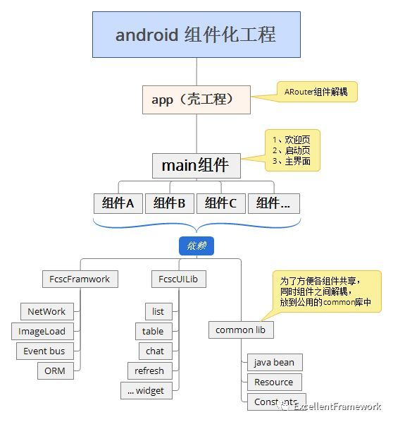

**什么是组件化？**

组件化是指解耦复杂系统时将多个功能模块拆分、重组的过程，有多种属性、状态反映其内部特性。
组件化是一种高效的处理复杂应用系统，更好的明确功能模块作用的方式。

————百度百科

本人对于组件化的理解为是一种架构思想，与传统项目（一般指模块化）相比各个业务组件相互隔离，使各个组件可以单独运行单独测试，使用“壳工程”将其组装到一起。这样带来的好处是业务模块单独开发维护降低耦合性，使项目可测试性及可维护性提升。

*（该图片来源于互联网）*

上图很形象的描述了组件化各层级的结构。

