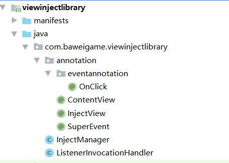
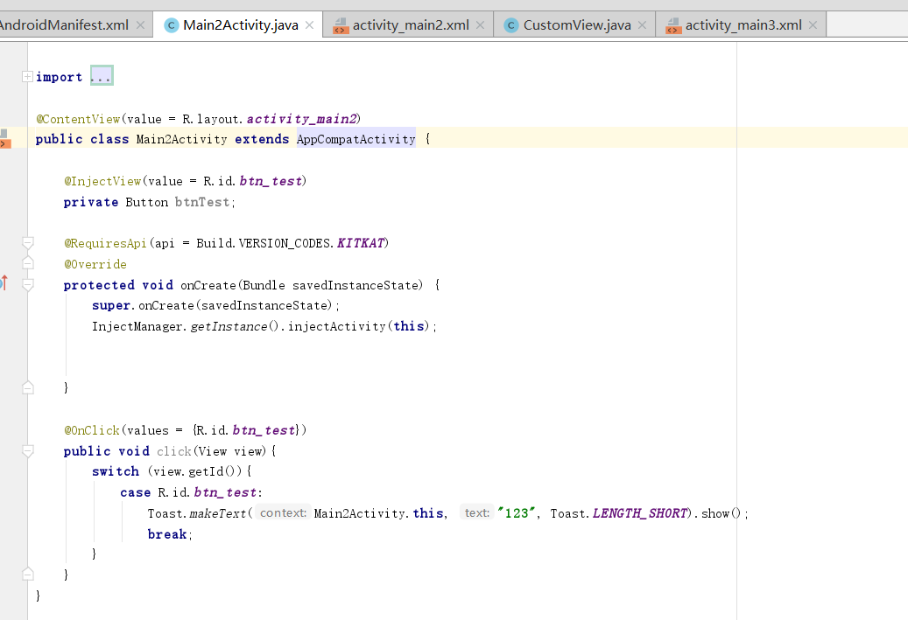

闲来无事使用自定义注解+反射实现一个简单的页面注解框架，离项目中使用还有很大距离，纯属练习使用。

<!--more-->

项目结构



页面应用



ContentView
```java
package com.baweigame.viewinjectlibrary.annotation;
import java.lang.annotation.ElementType;
import java.lang.annotation.Retention;
import java.lang.annotation.RetentionPolicy;
import java.lang.annotation.Target;
@Retention(RetentionPolicy.RUNTIME)
@Target(ElementType.TYPE)
public @interface ContentView {
    int value();
}
```

InjectView

```java
package com.baweigame.viewinjectlibrary.annotation;
import java.lang.annotation.ElementType;
import java.lang.annotation.Retention;
import java.lang.annotation.RetentionPolicy;
import java.lang.annotation.Target;
@Retention(RetentionPolicy.RUNTIME)
@Target(ElementType.FIELD)
public @interface InjectView {
    int value();
}
```

SuperEvent

```java
package com.baweigame.viewinjectlibrary.annotation;
import java.lang.annotation.ElementType;
import java.lang.annotation.Retention;
import java.lang.annotation.RetentionPolicy;
import java.lang.annotation.Target;
@Retention(RetentionPolicy.RUNTIME)
@Target(ElementType.ANNOTATION_TYPE)
public @interface SuperEvent {
    /**
     * 事件名
     * @return
     */
    String listenerName();
    /**
     * 事件类型
     * @return
     */
    Class<?> listenerType();
    /**
     * 消费的事件名称
     * @return
     */
    String callbackListenerName();
}
```
OnClick
```java
package com.baweigame.viewinjectlibrary.annotation.eventannotation;
import android.view.View;
import com.baweigame.viewinjectlibrary.annotation.SuperEvent;
import java.lang.annotation.ElementType;
import java.lang.annotation.Retention;
import java.lang.annotation.RetentionPolicy;
import java.lang.annotation.Target;
@Retention(RetentionPolicy.RUNTIME)
@Target(ElementType.METHOD)
@SuperEvent(listenerName = "setOnClickListener",listenerType = View.OnClickListener.class,callbackListenerName = "onClick")
public @interface OnClick {
    int[] values();
}
```

InjectManager
```java
package com.baweigame.viewinjectlibrary;
import android.app.Activity;
import android.os.Build;
import android.support.annotation.RequiresApi;
import android.view.View;
import com.baweigame.viewinjectlibrary.annotation.ContentView;
import com.baweigame.viewinjectlibrary.annotation.InjectView;
import com.baweigame.viewinjectlibrary.annotation.SuperEvent;
import java.lang.annotation.Annotation;
import java.lang.reflect.Field;
import java.lang.reflect.InvocationTargetException;
import java.lang.reflect.Method;
import java.lang.reflect.Proxy;
public class InjectManager {
    private static InjectManager instance=new InjectManager();
    private InjectManager(){}
    public static InjectManager getInstance(){
        return instance;
    }
    @RequiresApi(api = Build.VERSION_CODES.KITKAT)
    public void injectActivity(Activity activity){
        injectLayout(activity);
        injectViews(activity);
        injectEvents(activity);
    }
    /**
     * 注册activity布局
     * @param activity
     */
    private void injectLayout(Activity activity){
        Class<? extends Activity> clazz = activity.getClass();
        ContentView contentView = clazz.getAnnotation(ContentView.class);
        if (contentView!=null){
            int layoutId=contentView.value();
            try {
                Method setContentView = clazz.getMethod("setContentView", int.class);
                setContentView.invoke(activity,layoutId);
            } catch (NoSuchMethodException e) {
                e.printStackTrace();
            } catch (IllegalAccessException e){
                e.printStackTrace();
            } catch (InvocationTargetException e) {
                e.printStackTrace();
            }
        }
    }
    /**
     * 注册视图
     * @param activity
     */
    private void injectViews(Activity activity){
        Class<? extends Activity> clazz = activity.getClass();
        Field[] fields = clazz.getDeclaredFields();
        for (Field field:
             fields) {
            InjectView injectView = field.getAnnotation(InjectView.class);
            if (injectView!=null){
                int viewId=injectView.value();
                try {
                    Method fvbMethod = clazz.getMethod("findViewById", int.class);
                    Object obj = fvbMethod.invoke(activity, viewId);
                    field.setAccessible(true);
                    field.set(activity,obj);
                } catch (NoSuchMethodException e) {
                    e.printStackTrace();
                } catch (IllegalAccessException e) {
                    e.printStackTrace();
                } catch (InvocationTargetException e) {
                    e.printStackTrace();
                }
            }
        }
    }
    /**
     * 注册事件
     * @param activity
     */
    @RequiresApi(api = Build.VERSION_CODES.KITKAT)
    private void injectEvents(Activity activity) {
        Class<? extends Activity> clazz = activity.getClass();
        Method[] methods = clazz.getDeclaredMethods();
        for (Method method : methods) {
            Annotation[] annotations = method.getAnnotations();
            for (Annotation annotation : annotations) {
                Class<? extends Annotation> annotationType = annotation.annotationType();
                if (annotationType != null) {
                    SuperEvent eventBase = annotationType.getAnnotation(SuperEvent.class);
                    if (eventBase != null) {
                        String listenerSetter = eventBase.listenerName();
                        Class<?> listenerType = eventBase.listenerType();
                        String callBackListener = eventBase.callbackListenerName();
                        try {
                            Method valueMethod = annotationType.getDeclaredMethod("values");
                            int[] viewIds = (int[]) valueMethod.invoke(annotation);
                            ListenerInvocationHandler handler = new ListenerInvocationHandler(activity);
                            handler.addMethod(callBackListener, method);
                            Object listener = Proxy.newProxyInstance(listenerType.getClassLoader(),
                                    new Class[]{listenerType}, handler);
                            // 遍历注解的值
                            for (int viewId : viewIds) {
                                View view = activity.findViewById(viewId);
                                Method setter = view.getClass().getMethod(listenerSetter, listenerType);
                                setter.invoke(view, listener);
                            }
                        } catch (NoSuchMethodException | IllegalAccessException | InvocationTargetException e) {
                            e.printStackTrace();
                        }
                    }
                }
            }
        }
    }
}
```

ListenerInvocationHandler
```java
package com.baweigame.viewinjectlibrary;
import java.lang.reflect.InvocationHandler;
import java.lang.reflect.Method;
import java.util.HashMap;
public class ListenerInvocationHandler implements InvocationHandler {
    // 需要拦截的对象
    private Object target;
    // 需要拦截的对象键值对
    private HashMap<String, Method> methodHashMap = new HashMap<>();
    public ListenerInvocationHandler(Object target) {
        this.target = target;
    }
    @Override
    public Object invoke(Object proxy, Method method, Object[] args) throws Throwable {
        //method 等于拦截的onclick
        if (target != null) {
            // 获取需要拦截的方法名
            String methodName = method.getName(); // 假如是onClick
            // 重新赋值
            method = methodHashMap.get(methodName); // 执行拦截的方法
            if (method != null) {
                return method.invoke(target, args);
            }
        }
        return null;
    }
    /**
     * 将需要拦截的方法添加
     * @param methodName 需要拦截的方法，如：onClick()
     * @param method 执行拦截后的方法，如：show()
     */
    public void addMethod(String methodName, Method method) {
        methodHashMap.put(methodName, method);
    }
}
```