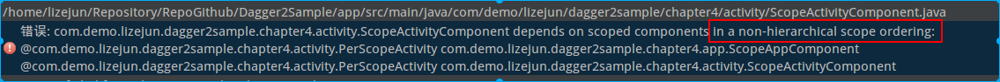
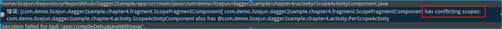

[Dagger官网地址](https://dagger.dev/)

Dagger是一个完全静态的、编译时依赖 **注入框架** ，适用于Java和Android。它是Square创建的早期版本的一个改编版本，现在由谷歌维护。
<!--more-->
### 说说什么是依赖注入？

依赖注入对于刚接触到这个概念的同学可能不太清楚什么意思，说起来也比较简单甚至我们每天都在编写这样的代码。

```java
public class A{
    private B b;
    public A(B _b){
        this.b = _b;
    }
}
```
上面的代码是不是很常见，我们发现业务类A依赖了业务类B。
这就是一个典型的依赖注入。
那我们来想想如果A被很多的其他业务类依赖如果A做了修改是不是要修改很多的地方呢？
这样我们的Dagger就应该登场了，Dagger就为了解决此类问题而生的。

#### 简单使用：

##### 导依赖

build.gradle中导入依赖如：
```java
dependencies {
    implementation 'com.google.dagger:dagger-android:2.17'
    annotationProcessor"com.google.dagger:dagger-compiler:2.17"
    implementation 'com.google.dagger:dagger-android-support:2.17' // if you use the support libraries
    annotationProcessor 'com.google.dagger:dagger-android-processor:2.17'
}
```

##### 业务类ClassA

```java
package com.baweigame.daggerdemoapplication;

import javax.inject.Inject;

public class ClassA {
    @Inject
    public ClassA(){

    }

    public int Add(int a,int b){
        return a+b;
    }
}

```

##### 业务类ClassB

```java
package com.baweigame.daggerdemoapplication;

import javax.inject.Inject;

public class ClassB {
    @Inject
    public ClassB(){

    }

    @Inject
    ClassA classA;

    public int Add(int a,int b){
        return classA.Add(a,b);
    }
}

```

##### MainActivityComponent

```java
package com.baweigame.daggerdemoapplication;

import android.app.Activity;

import dagger.Component;

@Component
public interface MainActivityComponent{
    void inject(MainActivity activity);
}
```

##### MainActivity

```java
package com.baweigame.daggerdemoapplication;

import android.app.Activity;
import android.support.v7.app.AppCompatActivity;
import android.os.Bundle;
import android.view.View;
import android.widget.TextView;
import android.widget.Toast;

import javax.inject.Inject;

import dagger.Component;

public class MainActivity extends AppCompatActivity {
    private TextView tvTest;

    @Inject
    ClassB classB;

    @Override
    protected void onCreate(Bundle savedInstanceState) {
        super.onCreate(savedInstanceState);
        setContentView(R.layout.activity_main);

        initView();
        initListener();

        DaggerMainActivityComponent.create().inject(this);
    }

    private void initListener() {
        tvTest.setOnClickListener(new View.OnClickListener() {
            @Override
            public void onClick(View v) {
                Toast.makeText(MainActivity.this, ""+classB.Add(2,3), Toast.LENGTH_SHORT).show();
            }
        });
    }

    private void initView() {
        tvTest = (TextView) findViewById(R.id.tv_test);
    }


}
```

我们看上面的例子，比较简单，首先业务类B依赖了业务类A，MainActivity依赖了业务类B，我们发现用Dagger实现起来是不是很清爽。如果我们不用Dagger我的代码大概应该是下面的样子：
```java
--一段伪代码

ClassA classA=new ClassA();
ClassB classB=new ClassB();
classB.set(classA);

classB.Add(2,3);
```
使用Dagger2
```java
 @Inject
 ClassB classB;

 classB.Add(2,3);

```
感觉是不是很简洁。
上面的例子中出现了一些新的“东西”，我们发现大多出现的是注解。

---
下面是Dagger的常用注解。

**Componet 注解**

```java
@Retention(value=RUNTIME)
@Target(value=TYPE)
@Documented
public @interface Component {
    Class<?>[] modules() default {};
    Class<?>[] dependencies() default {};
}

```

参考链接：https://dagger.dev/api/latest/dagger/Component.html

注释接口或抽象类，为其从一组模块生成注入依赖关系的实现。生成的类的类型名称将带有@Component注释，前缀为Dagger。例如，@Component interface MyComponent{…}将生成一个名为DaggerMyComponent的实现。

**Subcomponent 注解**

```java
@Retention(value=RUNTIME)
@Target(value=TYPE)
@Documented
public @interface Subcomponent {
    Class<?>[] modules() default {};
}
```

参考链接：https://dagger.dev/api/latest/dagger/Subcomponent.html

从父组件或子组件继承绑定的子组件。

**Module 注解**

```java
@Documented
@Retention(value=RUNTIME)
@Target(value=TYPE)
public @interface Module{
    Class<?>[] includes() default {};
    Class<?>[] subcomponents default {};
}
```


参考链接：https://dagger.dev/api/latest/dagger/Module.html

**Provides 注解**

```java
@Documented
@Target(value=METHOD)
@Retention(value=RUNTIME)
public @interface Provides{}
```
参考链接：https://dagger.dev/api/latest/dagger/Provides.html

注释模块的方法，以创建提供程序方法绑定。方法的返回类型绑定到其返回值。组件实现将依赖项作为参数传递给方法。

**MapKey 注解**

```java
@Documented
@Target(value=ANNOTATION_TYPE)
@Retention(value=RUNTIME)
public @interface MapKey{
    boolean unwrapValue() default true;
}
```

参考链接：https://dagger.dev/api/latest/dagger/MapKey.html

标识用于将Key与方法返回的值关联以组成映射的注释类型。
每个使用@ provide和@IntoMap注释的提供程序方法都必须有一个注释来标识映射条目的键。该注释的类型必须使用@MapKey进行注释。
通常，键注释只有一个成员，其值用作映射键。

**Dagger 2中用到的定义在 JSR-330的其他注解**
```java
public @interface Inject {
}
 
public @interface Scope {
}
 
public @interface Qualifier {
}
```

上面的例子中我们接触到了@Inject和@Component两个注解，下面来说说这两个注解是做什么用的？
如果想使用Dagger来实现依赖注入就至少要使用这两个注解：
**@Inject**用于标记需要注入的依赖，或者标记用于提供依赖的方法。
依赖注入中最重要的注解，JSR-330标准中的一部分在javax.inject包中。

Dagger 2中有3种方式提供依赖：

1、构造函数注入，如我们上面例子中的
```java
ClassA:

@Inject
public ClassA(){

}
```
注：如果存在多个构造函数，我们只能标注一个，不能同时标注多个。

2、属性注入
注：被标注的属性不能使用private修饰。
```java
@Inject
ClassB b;
```

3、方法注入
```java
@Inject
public void setClassB(ClassB _b) {
    this.b = _b;
}

```
方法注入与属性注入基本上没区别，Dagger2会在构造执行完立即调用这个方法，也就是说如果我们需要使用this的时候，使用方法注入是安全的。


**@Component**用来完成注入，在上面的例子中目标MainActivity就是使用Component完成注入。
@Component是Dagger2中最重要的一个注解，Dagger2是使用它来完成依赖注入的。
```java
@Component
public interface MainActivityComponent{
    void inject(MainActivity activity);
}
```
上面是我们上面例子中的接口，使用Component的使用方式，命名一般用 类名+Component 方式，我们rebuild工程后，Dagger2会生成一个Dagger+XXX（如：DaggerMainActivityComponent）的类。

**Component中一般使用两种方式定义方法。**

void inject(目标类 obj);
Dagger2会从目标类开始查找@Inject注解，自动生成依赖注入的代码，调用inject可完成依赖的注入。

Object getObj(); 如：ClassB getClassB();
Dagger2会到ClassB类中找被@Inject注解标注的构造器，自动生成提供ClassB依赖的代码，这种方式一般为其他Component提供依赖。

Dagger2以@Component中定义的方法作为起点，到目标类中寻找@Inject标注，生成一系列提供依赖的Factory类和注入依赖的Injector类。
而Component则是联系Factory和Injector，最终完成依赖的注入。


我们来看看Dagger2生成的类，我们发现ClassA_Factory ClassB_Factory 这两个类分别对应我们的ClassA ClassB构造函数上的@Inject注解。

Factory类
```java
/**
 * An {@linkplain Scope unscoped} {@link Provider}. While a {@link Provider} <i>may</i> apply
 * scoping semantics while providing an instance, a factory implementation is guaranteed to exercise
 * the binding logic ({@link Inject} constructors, {@link Provides} methods) upon each call to
 * {@link #get}.
 *
 * <p>Note that while subsequent calls to {@link #get} will create new instances for bindings such
 * as those created by {@link Inject} constructors, a new instance is not guaranteed by all
 * bindings. For example, {@link Provides} methods may be implemented in ways that return the same
 * instance for each call.
 */
public interface Factory<T> extends Provider<T> {
}

```
我们看ClassA_Factory这个工厂类：
```java
// Generated by Dagger (https://google.github.io/dagger).
package com.baweigame.daggerdemoapplication;

import dagger.internal.Factory;

public final class ClassA_Factory implements Factory<ClassA> {
  private static final ClassA_Factory INSTANCE = new ClassA_Factory();

  @Override
  public ClassA get() {
    return provideInstance();
  }

  public static ClassA provideInstance() {
    return new ClassA();
  }

  public static ClassA_Factory create() {
    return INSTANCE;
  }

  public static ClassA newClassA() {
    return new ClassA();
  }
}

```
这个工厂类使用单例模式给我们提供了实例化ClassA的方法。
再看看ClassB_Factory：
ClassB依赖了ClassA，所有将ClassA Provider直接传入。
```java
// Generated by Dagger (https://google.github.io/dagger).
package com.baweigame.daggerdemoapplication;

import dagger.internal.Factory;
import javax.inject.Provider;

public final class ClassB_Factory implements Factory<ClassB> {
  private final Provider<ClassA> classAProvider;

  public ClassB_Factory(Provider<ClassA> classAProvider) {
    this.classAProvider = classAProvider;
  }

  @Override
  public ClassB get() {
    return provideInstance(classAProvider);
  }

  public static ClassB provideInstance(Provider<ClassA> classAProvider) {
    ClassB instance = new ClassB();
    ClassB_MembersInjector.injectClassA(instance, classAProvider.get());
    return instance;
  }

  public static ClassB_Factory create(Provider<ClassA> classAProvider) {
    return new ClassB_Factory(classAProvider);
  }

  public static ClassB newClassB() {
    return new ClassB();
  }
}

```
MainActivity上的@Inject直接对应MainActivity_MembersInjector,依赖了ClassB，所以ClassB Provider作为参数不直接传递。
实现了MembersInjector接口
```java
/*
 * Copyright (C) 2012 The Dagger Authors.
 *
 * Licensed under the Apache License, Version 2.0 (the "License");
 * you may not use this file except in compliance with the License.
 * You may obtain a copy of the License at
 *
 * http://www.apache.org/licenses/LICENSE-2.0
 *
 * Unless required by applicable law or agreed to in writing, software
 * distributed under the License is distributed on an "AS IS" BASIS,
 * WITHOUT WARRANTIES OR CONDITIONS OF ANY KIND, either express or implied.
 * See the License for the specific language governing permissions and
 * limitations under the License.
 */

package dagger;

/**
 * Injects dependencies into the fields and methods on instances of type {@code T}. Ignores the
 * presence or absence of an injectable constructor.
 *
 * @param <T> type to inject members of
 *
 * @since 2.0 (since 1.0 without the provision that {@link #injectMembers} cannot accept
 *      {@code null})
 */
public interface MembersInjector<T> {

  /**
   * Injects dependencies into the fields and methods of {@code instance}. Ignores the presence or
   * absence of an injectable constructor.
   *
   * <p>Whenever a {@link Component} creates an instance, it performs this injection automatically
   * (after first performing constructor injection), so if you're able to let the component create
   * all your objects for you, you'll never need to use this method.
   *
   * @param instance into which members are to be injected
   * @throws NullPointerException if {@code instance} is {@code null}
   */
  void injectMembers(T instance);
}

```
```java
// Generated by Dagger (https://google.github.io/dagger).
package com.baweigame.daggerdemoapplication;

import dagger.MembersInjector;
import javax.inject.Provider;

public final class MainActivity_MembersInjector implements MembersInjector<MainActivity> {
  private final Provider<ClassB> classBProvider;

  public MainActivity_MembersInjector(Provider<ClassB> classBProvider) {
    this.classBProvider = classBProvider;
  }

  public static MembersInjector<MainActivity> create(Provider<ClassB> classBProvider) {
    return new MainActivity_MembersInjector(classBProvider);
  }

  @Override
  public void injectMembers(MainActivity instance) {
    injectClassB(instance, classBProvider.get());
  }

  public static void injectClassB(MainActivity instance, ClassB classB) {
    instance.classB = classB;
  }
}
```

最后来看看我们的@Component -> DaggerMainActivityComponent 它将Factory和MainActivity两个类联系到一起。

```java
// Generated by Dagger (https://google.github.io/dagger).
package com.baweigame.daggerdemoapplication;

public final class DaggerMainActivityComponent implements MainActivityComponent {
  private DaggerMainActivityComponent(Builder builder) {}

  public static Builder builder() {
    return new Builder();
  }

  public static MainActivityComponent create() {
    return new Builder().build();
  }

  private ClassB getClassB() {
    return injectClassB(ClassB_Factory.newClassB());
  }

  @Override
  public void inject(MainActivity activity) {
    injectMainActivity(activity);
  }

  private ClassB injectClassB(ClassB instance) {
    ClassB_MembersInjector.injectClassA(instance, new ClassA());
    return instance;
  }

  private MainActivity injectMainActivity(MainActivity instance) {
    MainActivity_MembersInjector.injectClassB(instance, getClassB());
    return instance;
  }

  public static final class Builder {
    private Builder() {}

    public MainActivityComponent build() {
      return new DaggerMainActivityComponent(this);
    }
  }
}
```

#### @Module和@Provides
这两个注解主要弥补@Inject的不足，因为在一些场景下无法使用@Inject，比如：第三方库或者抽象类中。
```java
package com.baweigame.daggerdemoapplication;

/**
 * 人类
 */
public abstract class Person {
    /**
     * 说话
     * @return
     */
    public abstract String speak();
}
```

```java
package com.baweigame.daggerdemoapplication;

import javax.inject.Inject;

public class ChinaPerson extends Person {
    @Inject
    ChinaPerson(){}
    
    @Override
    public String speak() {
        return "中国人说话";
    }
}
```

```java
package com.baweigame.daggerdemoapplication;

import javax.inject.Inject;

public class AmericaPerson extends Person {
    @Inject
    AmericaPerson(){}
    
    @Override
    public String speak() {
        return "美国人说话";
    }
}
```
```java
package com.baweigame.daggerdemoapplication;

import javax.inject.Inject;

public class PersonManager {
    Person person;
    @Inject
    public PersonManager(Person _person){
        this.person=_person;
    }
    
    public String speak(){
        return person.speak();
    }
}

```

我们在MainActivity中加入如下代码：
```java
@Inject
PersonManager person;

 tvTest.setOnClickListener(new View.OnClickListener() {
            @Override
            public void onClick(View v) {
                person.speak();
            }
        });
```
重新build运行我们的工程，我们发现出现了错误。因为Person是个抽象类无法实例化。
怎么解决类似这样的问题呢？

我们可以使用@Module @Provides这两个注解来解决，注意这两个注解是成对出现使用的，@Module修饰在 ***类*** 上，@Provides修饰在 ***方法*** 上。
我们把刚才的例子重新修改一下：
```java
/**
 * 人类
 */
public abstract class Person {
    /**
     * 说话
     * @return
     */
    public abstract String speak();
}

public class ChinaPerson extends Person {
    @Override
    public String speak() {
        return "中国人说话";
    }
}

public class AmericaPerson extends Person {

    @Override
    public String speak() {
        return "美国人说话";
    }
}

public class PersonManager {
    Person person;
    @Inject
    public PersonManager(Person _person){
        this.person=_person;
    }
    
    public String speak(){
        return person.speak();
    }
}

@Module
public class PersonModule {

    @Provides
    Person getChinaPerson(){
        return new ChinaPerson();
    }
}

@Component(modules=PersonModule.class)
public interface MainActivityComponent{
    void inject(MainActivity activity);
}

MainActivity中

@Inject
PersonManager personManager;

private void initListener() {
      tvTest.setOnClickListener(new View.OnClickListener() {
          @Override
          public void onClick(View v) {

              Toast.makeText(MainActivity.this,  ""+personManager.speak(), Toast.LENGTH_SHORT).show();
          }
      });
  }
```
我们发现原来的两个实现类去掉了构造函数的@Inject，而且加入了PersonModule类，并在MainActivityComponent类的@Component注解中指定了我们的Module  >>>> modules=PersonModule.class。我们来看看这个Module是干什么用的
```java
// Generated by Dagger (https://google.github.io/dagger).
package com.baweigame.daggerdemoapplication;

import dagger.internal.Factory;
import dagger.internal.Preconditions;

public final class PersonModule_GetChinaPersonFactory implements Factory<Person> {
  private final PersonModule module;

  public PersonModule_GetChinaPersonFactory(PersonModule module) {
    this.module = module;
  }

  @Override
  public Person get() {
    return provideInstance(module);
  }

  public static Person provideInstance(PersonModule module) {
    return proxyGetChinaPerson(module);
  }

  public static PersonModule_GetChinaPersonFactory create(PersonModule module) {
    return new PersonModule_GetChinaPersonFactory(module);
  }

  public static Person proxyGetChinaPerson(PersonModule instance) {
    return Preconditions.checkNotNull(
        instance.getChinaPerson(), "Cannot return null from a non-@Nullable @Provides method");
  }
}

```
我们发现这个Module也是一个Factory类。

Module是告诉Component，可以从这里寻找依赖对象。Component就会去找@Provide标注的方法，相当于构造器的@Inject，来提供依赖。

注： ***@Component可以指定多个@Module Component也可以依赖其它Component***

#### @Qualifier和@Named
@Qualifier是限定符，而@Named则是基于String的限定符。
如上面的例子
```java
@Module
public class PersonModule {

    @Provides
    Person getChinaPerson(){
        return new ChinaPerson();
    }

    @Provides
    Person getAmericaPerson(){
        return new AmericaPerson();
    }
}
```
Module中有多个实现之类，这时我们可以通过限定符对其区分
```java
@Module
public class PersonModule {

    @Provides
    @Named("china")
    Person getChinaPerson(){
        return new ChinaPerson();
    }

    @Provides
    @Named("america")
    Person getAmericaPerson(){
        return new AmericaPerson();
    }
}
```
在依赖时，如：
```java
public class PersonManager {
    Person person;
    @Inject
    public PersonManager(@Named("america") Person _person){
        this.person=_person;
    }

    public String speak(){
        return person.speak();
    }
}
```
最终我们使用的是“AmericaPerson”实例。
@Qualifier注解与@Named注解作用完全一样，但我们发现@Named注解有个弊端就是我们要手写字符串名称，这样很容易出错。
@Qualifier注解可以解决这个问题，但该注解是修饰在注解上的，所以我们要这样使用，如：
```java
@Module
public class PersonModule {

    @Provides
    @ChinaPersonAnn
    Person getChinaPerson(){
        return new ChinaPerson();
    }

    @Provides
    @AmericaPersonAnn
    Person getAmericaPerson(){
        return new AmericaPerson();
    }
}

@Qualifier
@Retention(RetentionPolicy.RUNTIME)
@interface ChinaPersonAnn {}

@Qualifier
@Retention(RetentionPolicy.RUNTIME)
@interface AmericaPersonAnn {}

public class PersonManager {
    Person person;
    @Inject
    public PersonManager(@ChinaPersonAnn Person _person){
        this.person=_person;
    }

    public String speak(){
        return person.speak();
    }
}
```

#### @Component的dependence和@SubComponent
上面我们说过Component可以依赖Component
还是上面的例子
我们新建PersonComponent
```java

@Component(modules = PersonModule.class)
public interface PersonComponent {
    @ChinaPersonAnn
    Person getChinaPerson();
    @AmericaPersonAnn
    Person getAmericaPerson();
}
```
把我们的PersonManager修改一下去掉注解如:
```java
public class PersonManager {
    Person person;
    @Inject
    public PersonManager(Person _person){
        this.person=_person;
    }

    public String speak(){
        return person.speak();
    }
}
```
新建PersonManagerModule

```java
@Module
public class PersonManagerModule {
    @Provides
    PersonManager providePersonManager(@ChinaPersonAnn Person _persion){
        return new PersonManager(_persion);
    }
}
```
新建PersonManagerComponent
```java
@Component(modules = PersonManagerModule.class,dependencies = PersonComponent.class)
public interface PersonManagerComponent {
    PersonManager getManager();
}
```
MainActivityComponent修改为：
```java
@Component(dependencies=PersonManagerComponent.class)
public interface MainActivityComponent{
    void inject(MainActivity activity);
}
```
MainActivity修改为：
```java
DaggerMainActivityComponent.builder()
                        .personManagerComponent(
                            DaggerPersonManagerComponent.builder()
                                    .personComponent(
                                    DaggerPersonComponent.create()
                            ).build()
                        ).build()
                .inject(this);

@Inject
PersonManager personManager;

private void initListener() {
      tvTest.setOnClickListener(new View.OnClickListener() {
          @Override
          public void onClick(View v) {

              Toast.makeText(MainActivity.this,  ""+personManager.speak(), Toast.LENGTH_SHORT).show();
          }
      });
  }
```

这就是Component的dependencies的用法，Component依赖了其他Component。
如果换成Subcomponent，可以把它理解为继承的关系，则修改Component部分就可以：
```java
@Component(modules = PersonModule.class)
public interface PersonComponent2 {
    PersonManagerComponent2 personManagerComponent();
}

@Subcomponent(modules = PersonManagerModule.class)
public interface PersonManagerComponent2 {
    MainActivityComponent2 mainActivityComponent();
}

@Subcomponent
public interface MainActivityComponent2 {
    void Inject(MainActivity activity);
}

MainActivity修改为：

@Inject
PersonManager personManager;

DaggerPersonComponent2.create().personManagerComponent().mainActivityComponent().Inject(this);

tvTest.setOnClickListener(new View.OnClickListener() {
            @Override
            public void onClick(View v) {

                Toast.makeText(MainActivity.this,  ""+personManager.speak(), Toast.LENGTH_SHORT).show();
            }
        });

```
上面代码开起来有些不合常理，PersonComponent2管理了PersonManagerComponent2和MainActivityComponent2。
Dagger2生成的代码中，Subcomponent标记的类是Componpent的内部类。
即MainActivityComponent2是PersonManagerComponent2的内部类，PersonManagerComponent2又是MainActivityComponent2的内部类。

比较适合使用Subcomponent的几个场景：
很多工具类都需要使用到Application的Context对象，此时就可以用一个Component负责提供，我们可以命名为AppComponent。
需要用到的context对象的SharePreferenceComponent，ToastComponent就可以它作为Subcomponent存在了。

而且在AppComponent中，我们可以很清晰的看到有哪些子Component，因为在里面我们定义了很多XxxComponent (Module... modules)

每个ActivityComponent也是可以作为AppComponent的Subcomponent，这样可以更方便的进行依赖注入，减少重复代码。


#### @Scope和@Singleton
One reason to break your application’s component up into Subcomponents is to use scopes. With normal, unscoped bindings, each user of an injected type may get a new, separate instance. But if the binding is scoped, then all users of that binding within the scope’s lifetime get the same instance of the bound type.

上面是google给的解释。
简单理解为在不使用@Scope的情况下，可能每次注入的对象都会是一个新的不同的对象，而@Scope能限制被注入的对象，在同一个@Scope的生命周期(lifetime)中都只存在一个且仅有一个对象，是不是很像单例。

@Scope是标志一个注入器/对象的使用范围也可以说是用来管理依赖的生命周期（也可以理解为作用域）的。它也是用来修饰注解的，而@Singleton则是@Scope的实现。
```java
/**
 * Identifies a type that the injector only instantiates once. Not inherited.
 *
 * @see javax.inject.Scope @Scope
 */
@Scope
@Documented
@Retention(RUNTIME)
public @interface Singleton {}
```
顾名思义@Scope用来管理生命周期，所以我们的命名要尽量规范详细，如：
ActivityScope
FragmentScope
ApplicationScope
。。。

@Scope所描述的注解用于两个地方：

@Component类
@Module中@Provides方法


如下内容引用：》》》[Dagger2 知识梳理(4) - @Scope 注解的使用](https://www.jianshu.com/p/3028f491006b) 如有侵权请告知！！！

在单个Component情况下来使用Scope

```java
@Documented
@Retention(RUNTIME)
@Scope
public @interface  TestScope {

}

PersonModule 中

@Provides
@Named("China")
@TestScope
Person getChinaPerson(){
    return new ChinaPerson();
}

@Provides
@Named("America")
Person getAmericaPerson(){
    return new AmericaPerson();
}

MainActivityComponent 中

@Component(modules=PersonModule.class)
@TestScope
public interface MainActivityComponent{
    void inject(MainActivity activity);
}
```

如果在Module的@Provides方法上加上了@Scope声明，那么在与他关联的Component上也必须加上相同的@Scope声明
在Component实例的生命周期内，只会创建一个由@Provides方法返回的实例，可以理解为局部单例。

在多个Component情况下来使用Scope

在依赖或者继承的组织方式中，如果其中一个Component声明了@Scope，那么其它的Component也需要声明。
在依赖关系中，被依赖的Component和需要依赖的Component的@Scope不能相同



在依赖关系中，需要依赖的Component的@Scope不可以为@Singleton。


在组织关系中，子Component的@Scope不可以和父Component的@Scope相同：



在组织关系中，如果父Component的@Scope不为@Singleton，那么子Component的@Scope可以为@Singleton。

这些限制是由Dagger2在编译时去检查的，其目的是保证使用者不要对@Scope产生滥用的现象，因为@Scope的目的是 在特定作用域内控制被注入实例的复用

示例：
(1) ScopeApp
对应于我们平时的Application类，并提供了全局的ScopeAppData类，在其ScopeAppComponent上有@Singleton注解。
```java
@Singleton
@Component(modules = {ScopeAppModule.class})
public interface ScopeAppComponent {
    public ScopeAppData getScopeAppData(); //如果它被其它的Component依赖，那么需要声明getXXX方法。
}

@Module
public class ScopeAppModule {

    @Provides
    @Singleton
    public ScopeAppData provideScopeAppData() {
        return new ScopeAppData();
    }
}

```
(2) ScopeActivity
对应于一个主页面，其内部包含了ScopeActivitySharedData和ScopeActivityNormalData，前者在ScopeActivityComponent的生命周期内保持唯一性，并带有PerScopeActivity注解。
```java
@Component(dependencies = {ScopeAppComponent.class}, modules = {ScopeActivityModule.class})
@PerScopeActivity
public interface ScopeActivityComponent {
    public void inject(ScopeActivity scopeActivity);
    ScopeFragmentComponent scopeFragmentComponent();
}

@Module
public class ScopeActivityModule {

    @Provides
    @PerScopeActivity
    public ScopeActivitySharedData provideScopeActivityData() {
        return new ScopeActivitySharedData();
    }

    @Provides
    public ScopeActivityNormalData provideScopeActivityNormalData() {
        return new ScopeActivityNormalData();
    }
}
```

(3) ScopeFragment
对于于Activity下的一个子界面，它和ScopeActivityComponent是继承关系，并带有@PerScopeFragment注解：
```java
@Subcomponent(modules = {ScopeFragmentModule.class})
@PerScopeFragment
public interface ScopeFragmentComponent {
    public void inject(ScopeFragment scopeFragment);
}

@Module
public class ScopeFragmentModule {

    @Provides
    @PerScopeFragment
    public ScopeFragmentData provideScopeFragmentData() {
        return new ScopeFragmentData();
    }
}
```

以上三个部分的关系为：


ScopeActivityComponent依赖于ScopeAppComponent


ScopeFragmentComponent继承于ScopeActivityComponent

它们的Module上都有用@Scope描述的注解：@Singleton、@PerScopeActivity，@PerScopeFragment。

验证一下：

App

```java
public class ScopeApp extends Application {

    private ScopeAppComponent mScopeAppComponent;

    @Override
    public void onCreate() {
        super.onCreate();
        mScopeAppComponent = DaggerScopeAppComponent.builder().scopeAppModule(new ScopeAppModule()).build();
    }

    public ScopeAppComponent getAppComponent() {
        return mScopeAppComponent;
    }
}
```


Activity类

```java
public class ScopeActivity extends AppCompatActivity {

    private static final String TAG = ScopeActivity.class.getSimpleName();

    private ScopeActivityComponent mScopeActivityComponent;

    @Inject
    ScopeAppData mScopeAppData;

    @Inject
    ScopeActivitySharedData mScopeActivitySharedData1;

    @Inject
    ScopeActivitySharedData mScopeActivitySharedData2;

    @Inject
    ScopeActivityNormalData mScopeActivityNormalData1;

    @Inject
    ScopeActivityNormalData mScopeActivityNormalData2;

    @Override
    protected void onCreate(Bundle savedInstanceState) {
        super.onCreate(savedInstanceState);
        setContentView(R.layout.activity_scope);
        getScopeActivityComponent().inject(this);
        TextView tvData = (TextView) findViewById(R.id.tv_scope_activity);
        String result = "[ScopeActivity Space] \n mScopeAppData=" + mScopeAppData
                + "\n\n" + "mScopeActivitySharedData1=" + mScopeActivitySharedData1
                + "\n\n" + "mScopeActivitySharedData2=" + mScopeActivitySharedData2
                + "\n\n" + "mScopeActivityNormalData1=" + mScopeActivityNormalData1
                + "\n\n" + "mScopeActivityNormalData2=" + mScopeActivityNormalData2;
        tvData.setText(result);
    }

    public ScopeActivityComponent getScopeActivityComponent() {
        if (mScopeActivityComponent == null) {
            ScopeAppComponent scopeAppComponent = ((ScopeApp) getApplication()).getAppComponent();
            mScopeActivityComponent = DaggerScopeActivityComponent.builder().scopeAppComponent(scopeAppComponent).build();
        }
        return mScopeActivityComponent;
    }
}
```


Fragment类
```java
public class ScopeFragment extends Fragment {

    private ScopeActivity mScopeActivity;

    @Inject
    ScopeAppData mScopeAppData;

    @Inject
    ScopeActivitySharedData mScopeActivitySharedData;

    @Inject
    ScopeActivityNormalData ScopeActivityNormalData;

    @Inject
    ScopeFragmentData mScopeFragmentData;

    @Override
    public void onAttach(Context context) {
        super.onAttach(context);
        mScopeActivity = (ScopeActivity) context;
    }

    @Nullable
    @Override
    public View onCreateView(LayoutInflater inflater, @Nullable ViewGroup container, Bundle savedInstanceState) {
        View rootView = inflater.inflate(R.layout.fragment_scope, container, false);
        mScopeActivity.getScopeActivityComponent().scopeFragmentComponent().inject(this);
        TextView tv = (TextView) rootView.findViewById(R.id.tv_scope_fragment);
        String result = "[ScopeFragment Space] \n mScopeAppData=" + mScopeAppData
                + "\n\n" + "mScopeActivitySharedData1=" + mScopeActivitySharedData
                + "\n\n" + "ScopeActivityNormalData=" + ScopeActivityNormalData
                + "\n\n" + "mScopeFragmentData=" + mScopeFragmentData;
        tv.setText(result);
        return rootView;
    }

    @Override
    public void onDestroy() {
        super.onDestroy();
    }
}
```
由上面例子中的现象，可以总结出以下几点：


ScopeAppData：该数据是由ScopeAppModule提供的，而它加上了@Singleton注解，并且我们调用的是同一个对象，因此在Activity和Fragment中地址相同。

ScopeActivitySharedData：在它的provide方法上，我们加上了@PerScopeActivity注解，因此在Activity和Fragment中，它的地址相同。

ScopeActivityNormalData：虽然在提供它的ScopeActivityModule中加上了@PerScopeActivity注解，但是在provide方法上没有声明，因此无论是在Activity，还是在Fragment中，都是指向不同的地址。

ScopeFragmentData：用于演示如何通过继承的方式，来实现依赖注入。

#### Set注入 Map注入 @MapKey

##### Set注入
之前的注入都是单个对象，Set注入即可以将多个对象注入到Set中。
我们使用PersonModule加入@IntoSet加入到Set中。
```java
@Module
public class PersonModule {

    @Provides
    @IntoSet
    Person getChinaPerson(){
        return new ChinaPerson();
    }

    @Provides
    @IntoSet
    Person getAmericaPerson(){
        return new AmericaPerson();
    }
}

MainActivity 中：

@Inject
Set<Person> personSet;

tvTest.setOnClickListener(new View.OnClickListener() {
            @Override
            public void onClick(View v) {
                for (Person person:
                     personSet) {
                    Toast.makeText(MainActivity.this, ""+person.speak(), Toast.LENGTH_SHORT).show();
                }
            }
        });
```
我们也可以使用如下方式同时向Set注入多个对象：
PersonModule.java
```java
@Provides
@ElementsIntoSet
public Set<Person> getPlayers(){
    HashSet set =  new HashSet<>();
    set.add(new ChinaPerson());
    set.add(new AmericaPerson());
    return set;
}
```
使用@ElementsIntoSet 并且返回Set<Player>对象
##### Map注入
Map注入与Set注入的区别是Map注入需要Key，如：
```java
@Provides
@IntoMap
@StringKey("china")
Person getChinaPerson(){
    return new ChinaPerson();
}

@Provides
@IntoMap
@StringKey("America")
Person getAmericaPerson(){
    return new AmericaPerson();
}

MainActivity 中：
@Inject
Map<String,Person> personMap;

tvTest.setOnClickListener(new View.OnClickListener() {
            @Override
            public void onClick(View v) {
                for (Map.Entry<String,Person> person:
                     personMap.entrySet()) {
                    Toast.makeText(MainActivity.this, ""+person.getKey()+" "+person.getValue().speak(), Toast.LENGTH_SHORT).show();
                }
            }
        });
```
 dagger还提供了一些内置的key类型，包裹classKey,IntKey等，android辅助包中也提供了ActivityKey等。

 我们看看StringKey的源码,是被MapKey修饰的，下面我们来聊聊Mapkey。
 ```java
@Documented
@Target(METHOD)
@Retention(RUNTIME)
@MapKey
public @interface StringKey {
  String value();
}
 ```
##### @MapKey
MapKey支持的类型有：
基本数据类型
String
Class
枚举类型
注解类型
以上数据类型的数组
Enum
如：
```java
enum MyEnum {
  ABC, DEF;
}

@MapKey
@interface MyEnumKey {
  MyEnum value();
}

@MapKey
@interface MyNumberClassKey {
  Class<? extends Number> value();
}

@Module
class MyModule {
  @Provides @IntoMap
  @MyEnumKey(MyEnum.ABC)
  static String provideABCValue() {
    return "value for ABC";
  }

  @Provides @IntoMap
  @MyNumberClassKey(BigDecimal.class)
  static String provideBigDecimalValue() {
    return "value for BigDecimal";
  }
}
```

复合Key，如：
```java
@MapKey(unwrapValue = false)
@Retention(value=RUNTIME)
public @interface GameInfo {
    String name();
    float price();
}

@Module
public class GameModule {
    @Provides
    @IntoMap
    @GameInfo(name = "game",price = 100f)
    public String getGameInfo(){
        return "gameinfo";
    }
}

MainActivity 中：

@Inject
Map<GameInfo,String> mGameInfoStringMap;

```
如上如果编译失败，要加入如下依赖：
implementation 'com.google.auto.value:auto-value:1.5.1'
provided 'javax.annotation:jsr250-api:1.0'


#### Lazy 和 Provider

Dagger2还支持Lazy模式，通过Lazy或者Provider模拟提供的实例，在@Inject的时候并不初始化，而是等到你要使用的时候，主动调用其.get方法来获取实例。

如：
```java
@Inject
Lazy<PersonManager> personManager;

@Inject
Provider<PersonManager> personManager;

tvTest.setOnClickListener(new View.OnClickListener() {
            @Override
            public void onClick(View v) {
                Toast.makeText(MainActivity.this,  ""+personManager.get().speak(), Toast.LENGTH_SHORT).show();
            }
        });
```
Lazy和Provider的区别在于：

Lazy每次get都是同一实例
Provider每次get都是新实例


**名词解释：**

JSR-330
JSR即Java Specification Requests，意思是java规范提要。
而JSR-330则是 Java依赖注入标准

本文参考文章：

[Dagger2 最清晰的使用教程](https://blog.csdn.net/heng615975867/article/details/80355090)

[Dagger2 使用（二）](https://my.oschina.net/zzxzzg/blog/1541916)