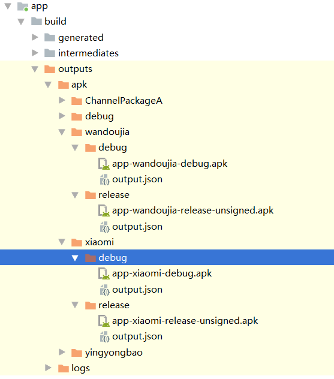

我们的产品上线后会发布到不同的应用商店供用户下载，对于不同的应用商店上线的APP版本进行跟踪统计。
这时我们对于不同的应用上线应用商店划分不同的渠道，也就是我们所说的多渠道打包。

<!--more-->

下面我们来介绍如何使用Gradle进行多渠道打包。

使用Gradle多渠道打包主要使用**ProductFlavors**。
### ProductFlavors
```java
android{
    flavorDimensions "channelpackage"
    productFlavors{
        //小米
        xiaomi{
        }
        //豌豆荚
        wandoujia{
        }
        //应用宝
        yingyongbao{
        }
    }
}
```
我们发现有3个渠道xiaomi wandoujia yingyongbao。
还有flavorDimensions,这个是干嘛用的呢？
如果不加就会报：

Error:All flavors must now belong to a named flavor dimension.Learn more at https://d.android.com/r/tools/flavorDimensions-missing-error-message.html 

大概意思是所有的flavors都要属于同一个规格。
点击链接地址后（要翻墙）：
Plugin 3.0.0 includes a new dependency mechanism that automatically matches variants when consuming a library. This means an app's debug variant automatically consumes a library's debug variant, and so on. It also works when using flavors—an app's redDebug variant will consume a library's redDebug variant. To make this work, the plugin now requires that all flavors belong to a named flavor dimension —even if you intend to use only a single dimension. Otherwise, you will get the following build error:
```java
Error:All flavors must now belong to a named flavor dimension.
The flavor 'flavor_name' is not assigned to a flavor dimension.
```
To resolve this error, assign each flavor to a named dimension, as shown in the sample below. Because dependency matching is now taken care of by the plugin, you should name your flavor dimensions carefully. For example, if all your app and library modules use the foo dimension, you'll have less control over which flavors are matched by the plugin.

我们可以参考友盟的渠道包方式在清单文件中加入：
```xml
<meta-data
            android:name="MY_CHANNEL"
            android:value="${CHANNEL_VALUE}" />
```
同时修改上面的Gradle为：
```java
flavorDimensions "channelpackage"
productFlavors{
    //小米
    xiaomi{
        manifestPlaceholders = [CHANNEL_VALUE:"xiaomi"]
    }
    //豌豆荚
    wandoujia{
        manifestPlaceholders = [CHANNEL_VALUE:"wandoujia"]
    }
    //应用宝
    yingyongbao{
        manifestPlaceholders = [CHANNEL_VALUE:"yingyongbao"]
    }
}
```
配置好后到工程的跟目录下执行：
```cmd
gradlew assemble
```
打包成功后：

在app下的output下就可以看看我们刚刚打的渠道包了。

我们看到已经打包好了不同渠道的debug与release版本的APK。

当然也可以指定打包：

**只打release版本包**
```
gradlew assembleRelease
```
**只打debug版本包**
```
gradlew assembleDebug
```
**只打小米渠道包**
```
gradlew assemblexiaomi
```
**只打小米渠道Release包**
```
gradlew assemblexiaomiRelease
```

多渠道打包时我们可能还会加入一些其他设置如：

**加入不同的APPID及版本号**：
```java
def getTime() {
    return new Date().format("yyyyMMdd", TimeZone.getTimeZone("UTC"))
}

android{
...
flavorDimensions "channelpackage"
productFlavors{
    //小米
    xiaomi{
        applicationId "com.channel.xiaomi.application"
        versionCode 1
        versionName "1.0."+getTime()
        manifestPlaceholders = [CHANNEL_VALUE:"xiaomi"]
    }
    //豌豆荚
    wandoujia{
        applicationId "com.channel.wandoujia.application"
        versionCode 1
        versionName "1.0."+getTime()
        manifestPlaceholders = [CHANNEL_VALUE:"wandoujia"]
    }
    //应用宝
    yingyongbao{
        applicationId "com.channel.yingyongbao.application"
        versionCode 1
        versionName "1.0."+getTime()
        manifestPlaceholders = [CHANNEL_VALUE:"yingyongbao"]
    }
}
...
}
```
重新打包后发现我们的applicationid与版本信息都定制化了。

**manifestPlaceholders中也可以加入多个配置，如加入第三方的APPKEY**：
```java
manifestPlaceholders = [CHANNEL_VALUE:"wandoujia",BaiduMapAPPKEY:"s9s87d7f9s6df6s78sd"]
```

**还可以不同的渠道引入不同的jar包**：
```java
dependencies {
    ...
    implementation 'com.github.leifzhang:IjkLib:0.4.3'
    xiaomiImplementation 'io.reactivex.rxjava2:rxandroid:2.1.1'
    xiaomiImplementation 'io.reactivex.rxjava2:rxjava:2.2.11'
}
```

**使用BuildConfig传递配置一些参数**：
```java
flavorDimensions "channelpackage"
productFlavors{
    //小米
    xiaomi{
        ...
        buildConfigField "String", "buildparam","\"xiaomi\""
    }
    //豌豆荚
    wandoujia{
        ...
        buildConfigField "String", "buildparam","\"wandoujia\""
    }
    //应用宝
    yingyongbao{
        ...
        buildConfigField "String", "buildparam","\"yingyongbao\""
    }
}

代码中获取：
if (BuildConfig.buildparam.equals("xiaomi")){
            
}else if (BuildConfig.buildparam.equals("wandoujia")){
    
}else if (BuildConfig.buildparam.equals("yingyongbao")){
    
}
```
BuildConfig也有一些默认的配置属性：


**甚至还可以各渠道包使用不同的资源**：
```java
  sourceSets {
        main {
            java.srcDir "src/main/java"
            res.srcDir "src/main/res"
            jniLibs.srcDir "src/main/jniLibs"
            manifest.srcFile "src/main/AndroidManifest.xml"
            assets.srcDir "src/main/assets"
        }
        xiaomi{
            java.srcDir "src/main/java"
            res.srcDir "src/main/res"
            jniLibs.srcDir "src/main/jniLibs"
            manifest.srcFile "src/main/AndroidManifest.xml"
            assets.srcDir "src/main/assets"
        }

        wandoujia{
            java.srcDir "src/main/java"
            res.srcDir "src/main/res"
            jniLibs.srcDir "src/main/jniLibs"
            manifest.srcFile "src/main/AndroidManifest.xml"
            assets.srcDir "src/main/assets"
        }

        yingyongbao{
            java.srcDir "src/main/java"
            res.srcDir "src/main/res"
            jniLibs.srcDir "src/main/jniLibs"
            manifest.srcFile "src/main/AndroidManifest.xml"
            assets.srcDir "src/main/assets"
        }
    }
```

### 可能遇到的问题？

问题1：
Android studio Error occurred during initialization of VM 问题解决


问题2：
```java
Execution failed for task ':app:compileWandoujiaDebugJavaWithJavac'.
> Could not find tools.jar. Please check that C:\Program Files (x86)\Java\jre1.8.0_211 contains a valid JDK installation.
```
环境变量中配置JAVA_HOME 指向jdk所在目录，path中加入%JAVA_HOME%\bin 
