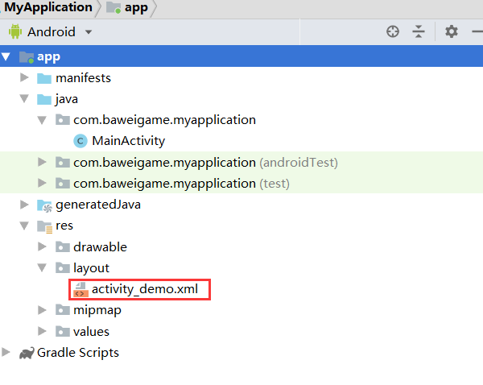

之前我们聊了一下Android插件化中的热修复，参考：（[Android 热修复](http://www.zydeveloper.com/2019/07/15/hotupdate/)），现在我们聊聊资源的动态加载。

<!--more-->

顾名思义我们之前的热更新只是解决了代码的加载，对于外部资源我们还不能直接使用。我们工程的资源最终打包后都会放到R.java文件中，然后我们可以获取Resources然后通过类似resources.getDrawable(id);方式通过id来获取我们具体的资源。但对于外部资源也就是不在我们工程中没有被放到R.java文件中的资源我们如果使用呢？

```java
Drawable drawable = resources.getDrawable(resId);
```
上面这种方式是我们平时获取资源的使用方式。

我们使用Resources的getXXX 通过resId来获取资源。
那我们考虑考虑是否可以获取插件的Resources呢？如果可以我们是不是就可以实现资源的动态加载了呢？
答案是可以的！

我们先来看看Activity是如何获取Resources的：
我们直接定位到代码，ContextThemeWrapper
继承关系，如

ContextThemeWrapper > ContextWrapper > Context

```java
@Override
public Resources getResources() {
    return getResourcesInternal();
}

private Resources getResourcesInternal() {
    if (mResources == null) {
        if (mOverrideConfiguration == null) {
            mResources = super.getResources();
        } else {
            final Context resContext = createConfigurationContext(mOverrideConfiguration);
            mResources = resContext.getResources();
        }
    }
    return mResources;
}
```

我们发现获取Resources的方法，再来看看Resources.java的构造函数
```java
/**
* Create a new Resources object on top of an existing set of assets in an
* AssetManager.
*
* @deprecated Resources should not be constructed by apps.
* See {@link android.content.Context#createConfigurationContext(Configuration)}.
*
* @param assets Previously created AssetManager.
* @param metrics Current display metrics to consider when
*                selecting/computing resource values.
* @param config Desired device configuration to consider when
*               selecting/computing resource values (optional).
*/
@Deprecated
public Resources(AssetManager assets, DisplayMetrics metrics, Configuration config) {
this(null);
mResourcesImpl = new ResourcesImpl(assets, metrics, config, new DisplayAdjustments());
}
```
我们发现Resources是由AssetManager创建处理的。
再来分析一下AssetManger
```java
/**
 * Provides access to an application's raw asset files; see {@link Resources}
 * for the way most applications will want to retrieve their resource data.
 * This class presents a lower-level API that allows you to open and read raw
 * files that have been bundled with the application as a simple stream of
 * bytes.
 */
public final class AssetManager implements AutoCloseable {
    ...
    /**
    * @deprecated Use {@link #setApkAssets(ApkAssets[], boolean)}
    * @hide
    */
    @Deprecated
    public int addAssetPath(String path) {
        return addAssetPathInternal(path, false /*overlay*/, false /*appAsLib*/);
    }
    ...
}
```
我们发现一个addAssetPath的方法，实际这个方法可以使我们传入的apk path为我们构建出AssetManager 然后通过AssetManager创建出Resources。如上是我们实现动态加载资源的初步思路。
下面实践一下是否可行？
```java
package com.baweigame.plugindemoapplication;

import android.app.Application;
import android.content.Context;
import android.content.pm.PackageInfo;
import android.content.pm.PackageManager;
import android.content.res.AssetManager;
import android.content.res.Resources;
import android.os.Environment;
import android.util.Log;

import java.io.File;
import java.lang.reflect.InvocationTargetException;
import java.lang.reflect.Method;

public class MyApplication extends Application {
    private AssetManager assetManager;
    private Resources newResource;
    private Resources.Theme mTheme;
    private PackageInfo packageInfo;

    @Override
    protected void attachBaseContext(Context base) {
        super.attachBaseContext(base);
        //创建我们自己的Resource
        String apkPath = Environment.getExternalStorageDirectory().getAbsolutePath() + "/app-debug.apk";
        packageInfo = getPackageInfo(apkPath);
        if (new File(apkPath).exists()){
            loadOtherResource(apkPath);
        }

    }

    @Override
    public void onCreate() {
        super.onCreate();
    }

    public void loadOtherResource(String apkPath){
        //创建AssetManager
        try {
            assetManager = AssetManager.class.newInstance();
            Method addAssetPathMethod = assetManager.getClass().getDeclaredMethod("addAssetPath", String.class);
            addAssetPathMethod.setAccessible(true);

            addAssetPathMethod.invoke(assetManager, apkPath);


            //初始化AssetManager内部参数
            Method ensureStringBlocks = AssetManager.class.getDeclaredMethod("ensureStringBlocks");
            ensureStringBlocks.setAccessible(true);
            ensureStringBlocks.invoke(assetManager);

            Resources supResource = getResources();
            Log.e("Main", "supResource = " + supResource);
            newResource = new Resources(assetManager, supResource.getDisplayMetrics(), supResource.getConfiguration());

            mTheme = newResource.newTheme();
            mTheme.setTo(super.getTheme());
        } catch (IllegalAccessException e) {
            e.printStackTrace();
        } catch (InstantiationException e) {
            e.printStackTrace();
        } catch (NoSuchMethodException e) {
            e.printStackTrace();
        } catch (InvocationTargetException e) {
            e.printStackTrace();
        }

    }

    @Override
    public AssetManager getAssets() {
        return assetManager==null?super.getAssets():assetManager;
    }

    @Override
    public Resources getResources() {
        return newResource==null?super.getResources():newResource;
    }

    @Override
    public Resources.Theme getTheme() {
        return mTheme == null ? super.getTheme() : mTheme;
    }

    /**
     * 获取apk包信息
     * @param resourcePath apk路径
     * @return
     */
    private PackageInfo getPackageInfo(String resourcePath){
        PackageInfo packageInfo=getPackageManager().getPackageArchiveInfo(resourcePath, PackageManager.GET_ACTIVITIES);
        return packageInfo;
    }

    /**
     * 获取插件包名
     * @return
     */
    public String getPluginPackageName(){
        return packageInfo.packageName;
    }
}

```

上面代码中，我们发现获取了内置存储中的app-debug.apk文件，因为是demo所以直接写死了。
下面我们来看看loadOtherResource这个方法都做了什么？
我们发现它主要利用反射来获取
assetManager 
newResource 
mTheme 
3个主要对象，并将我们的apk通过“addAssetPath”添加到了manager中。

然后重写了Application的3个方法getAssets、getResources、getTheme，用于替换成我们资源apk的资源。

然后我们看看MainActivity中做了什么？
```java
package com.baweigame.plugindemoapplication;

import android.app.Activity;
import android.content.res.AssetManager;
import android.content.res.Resources;
import android.support.v7.app.AppCompatActivity;
import android.os.Bundle;
import android.util.Log;

public class MainActivity extends Activity {

    @Override
    protected void onCreate(Bundle savedInstanceState) {
        super.onCreate(savedInstanceState);
        MyApplication application= (MyApplication) getApplication();
        int aa=application.getResources().getIdentifier("activity_demo","layout",application.getPluginPackageName());
        try{
            setContentView(aa);
        }
        catch (Exception e){
            Log.e("123", "onCreate: ");
        }

    }

    @Override
    public AssetManager getAssets() {
        if(getApplication() != null && getApplication().getAssets() != null){
            return getApplication().getAssets();
        }
        return super.getAssets();
    }

    @Override
    public Resources.Theme getTheme() {
        if(getApplication() != null && getApplication().getTheme() != null){
            return getApplication().getTheme();
        }
        return super.getTheme();
    }

    @Override
    public Resources getResources() {
        if(getApplication() != null && getApplication().getTheme() != null){
            return getApplication().getResources();
        }
        return super.getResources();
    }
}

```

我们发现实现了从资源apk中获取activity_demo布局文件然后设置给MainActivity。
注意我们要使用其他apk资源必须重写Activity中的getAssets、getTheme、getResources。

```java
application.getResources().getIdentifier("activity_demo","layout",application.getPluginPackageName());
```

这个方法用于获取指定资源，目前获取的是layout类型的activity_demo布局文件资源。
下面是我们加载的资源项目截图：



如上就是我们动态加载资源的简单实现。