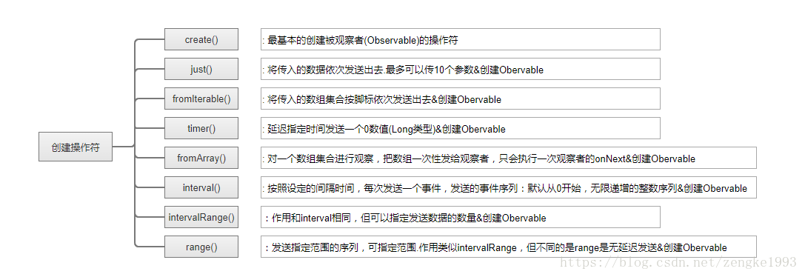
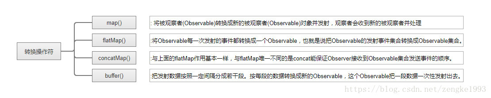
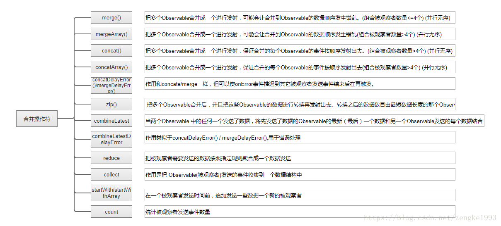
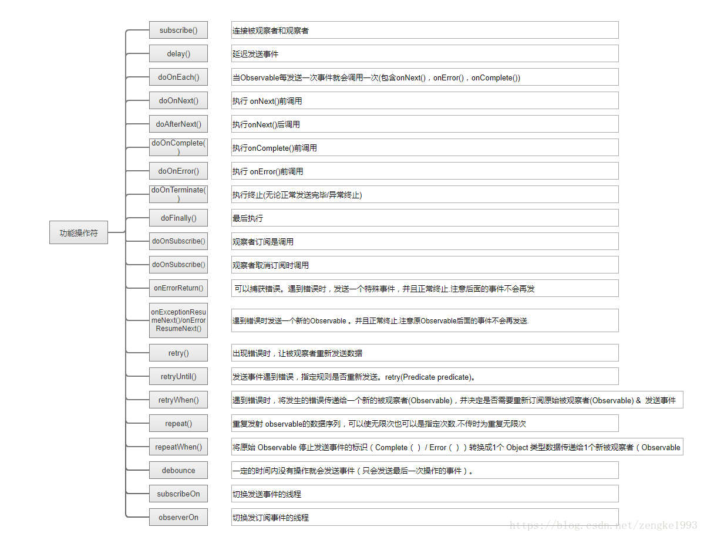
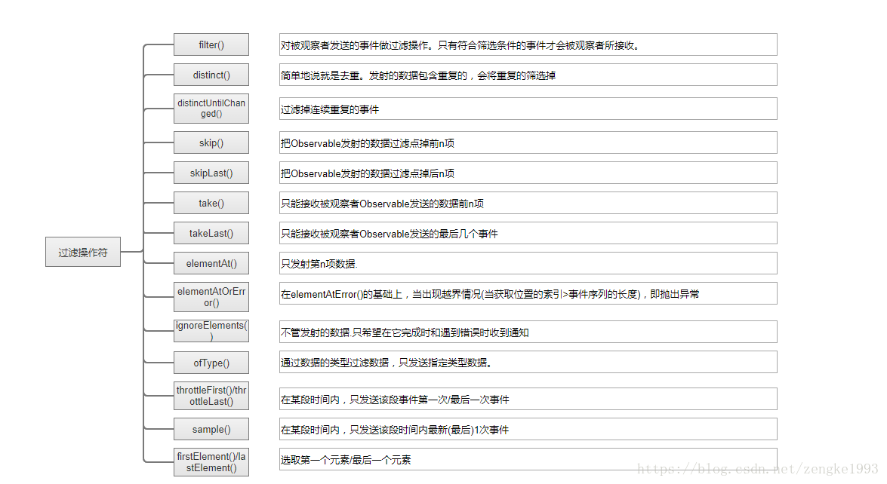

借用网上一仁兄博客,讲的很全面：

#### [《RxJava操作符汇总》](https://blog.csdn.net/zengke1993/article/details/80388510)

<!--more-->

***

***

***

***

参考链接地址：

[RxJava操作符（一） —-创建操作符](https://blog.csdn.net/zengke1993/article/details/80388673)
[RxJava操作符（二）—-转换操作符](https://blog.csdn.net/zengke1993/article/details/80389262)
[RxJava操作符（三）—-合并操作符](https://blog.csdn.net/zengke1993/article/details/80389852)
[RxJava操作符（四）—-功能操作符](https://blog.csdn.net/zengke1993/article/details/80391719)
[RxJava操作符（五） —-过滤操作符](https://blog.csdn.net/zengke1993/article/details/80392508) 
[RxJava操作符（六）—-条件操作符](https://blog.csdn.net/zengke1993/article/details/80394003?tdsourcetag=s_pcqq_aiomsg) 
