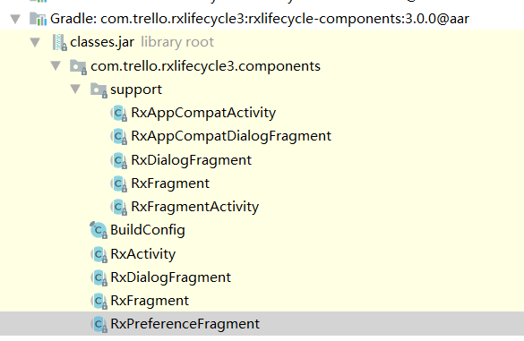
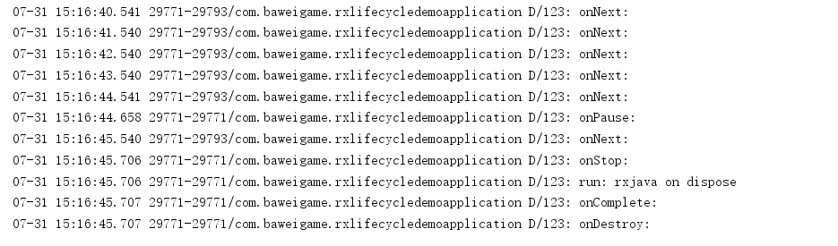
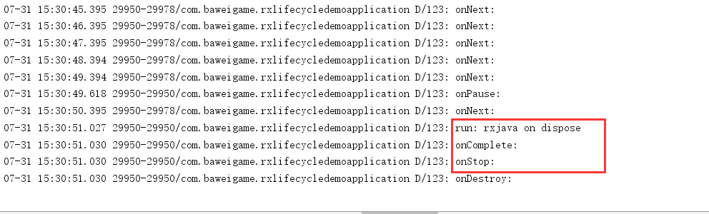

[RxLifecycle官网](https://github.com/trello/RxLifecycle)

RxLifecycle的出现是为了解决RxJava的内存泄漏问题，RxJava什么时候会出现内存泄漏？

当使用RxJava订阅执行耗时操作，这是Activity被finish了，如果任务还未执行完成没有取消订阅，这时导致Activity无法回收进而导致内存泄漏问题。

<!--more-->

RxLifecycle让RxJava变得可以感知Activity的生命周期，进而在合适的位置取消订阅，解决内存泄漏问题。

### 如何使用RxLifecycle？

首先导入依赖：

```java
implementation 'io.reactivex.rxjava2:rxandroid:2.1.1'
implementation 'io.reactivex.rxjava2:rxjava:2.2.11'

implementation 'com.trello.rxlifecycle3:rxlifecycle:3.0.0'
implementation 'com.trello.rxlifecycle3:rxlifecycle-android:3.0.0'
implementation 'com.trello.rxlifecycle3:rxlifecycle-components:3.0.0'
```
使用Rxlifecycle比较简单，

我们的当前Activity需要继承Rx...Activity,当然Fragemnt同理。
如：
```java
public class MainActivity extends RxAppCompatActivity 
```
我们写一个简单的Rxjava应用，每隔1秒执行一次，用于模拟一个可能发送内存泄漏的场景。
如:
```java
 Observable.interval(1, TimeUnit.SECONDS).subscribe(new Observer<Long>() {
            @Override
            public void onSubscribe(Disposable d) {

            }

            @Override
            public void onNext(Long aLong) {
                Log.d("123", "onNext: ");
            }

            @Override
            public void onError(Throwable e) {

            }

            @Override
            public void onComplete() {
                Log.d("123", "onComplete: ");
            }
        });
```
我们运行代码后，发现onNext的回调一直被执行，在按back键退出发现onNext回调仍然持续执行。我们说这样的情况很容易发生内存泄漏了。

### 使用bindToLifecycle

那么我们如何使用RxLifecycle里避免内存泄漏呢？我们把刚才的程序完善一下，如：
```java
 Observable.interval(1, TimeUnit.SECONDS).doOnDispose(new Action() {
            @Override
            public void run() throws Exception {
                Log.d("123", "run: rxjava on dispose");
            }
        }).compose(this.<Long>bindToLifecycle()).subscribe(new Observer<Long>() {
            @Override
            public void onSubscribe(Disposable d) {

            }

            @Override
            public void onNext(Long aLong) {
                Log.d("123", "onNext: ");
            }

            @Override
            public void onError(Throwable e) {

            }

            @Override
            public void onComplete() {
                Log.d("123", "onComplete: ");
            }
        });
```
再次运行发现，当我们按下back键时，doOnDispose被执行了，如：



也就是感应到了Activity的生命周期，从而解决可能发生的内存泄露问题。

我们看上面的代码中，加入了一句.compose(this.<Long>bindToLifecycle())就可以使用RxLifecycle了是不是很简单。

对应compose操作符不了解的可以参考：

[Rxjava中compose()操作符的使用](https://blog.csdn.net/qq_15327675/article/details/83903077)

### 使用bindUntilEvent
ActivityEvent类包括 CREATE、START、 RESUME、PAUSE、STOP、 DESTROY 这些是我们很熟悉的生命周期。
我们把刚才的代码稍微修改一下如：
```java
.compose(this.<Long>bindUntilEvent(ActivityEvent.STOP))
```
运行代码，点击back键，看看log输出：



我们发现在Activity的onStop生命周期Rxjava执行了doOnDispose回调。

如上就是我们对RxLifecycle的使用。

注：

运行项目如出现异常：
```java
Manifest merger failed : Attribute application@appComponentFactory value=(android.support.v4.app.CoreComponentFactory) from [com.android.support:support-compat:28.0.0] AndroidManifest.xml:22:18-91
	is also present at [androidx.core:core:1.0.0] AndroidManifest.xml:22:18-86 value=(androidx.core.app.CoreComponentFactory).
	Suggestion: add 'tools:replace="android:appComponentFactory"' to <application> element at AndroidManifest.xml:5:5-19:19 to override.
```
以为依赖中使用了androidx，所以与我们的support冲突了，解决办法是将我们自己项目的support更换为androidx。
```java
//    implementation 'com.android.support:appcompat-v7:28.0.0'
implementation 'androidx.appcompat:appcompat:1.0.0'
```