[Tinker 官网](http://www.tinkerpatch.com/)

### 什么是 Tinker？
Tinker 是一个开源项目([Github链接](https://github.com/Tencent/tinker))，它是微信官方的 Android 热补丁解决方案，它支持动态下发代码、So 库以及资源，让应用能够在不需要重新安装的情况下实现更新。

<!--more-->

### 为什么使用 Tinker？
当前市面的热补丁方案有很多，其中比较出名的有阿里的 AndFix、美团的 Robust 以及 QZone 的超级补丁方案。但它们都存在无法解决的问题，这也是正是推出 Tinker 的原因。
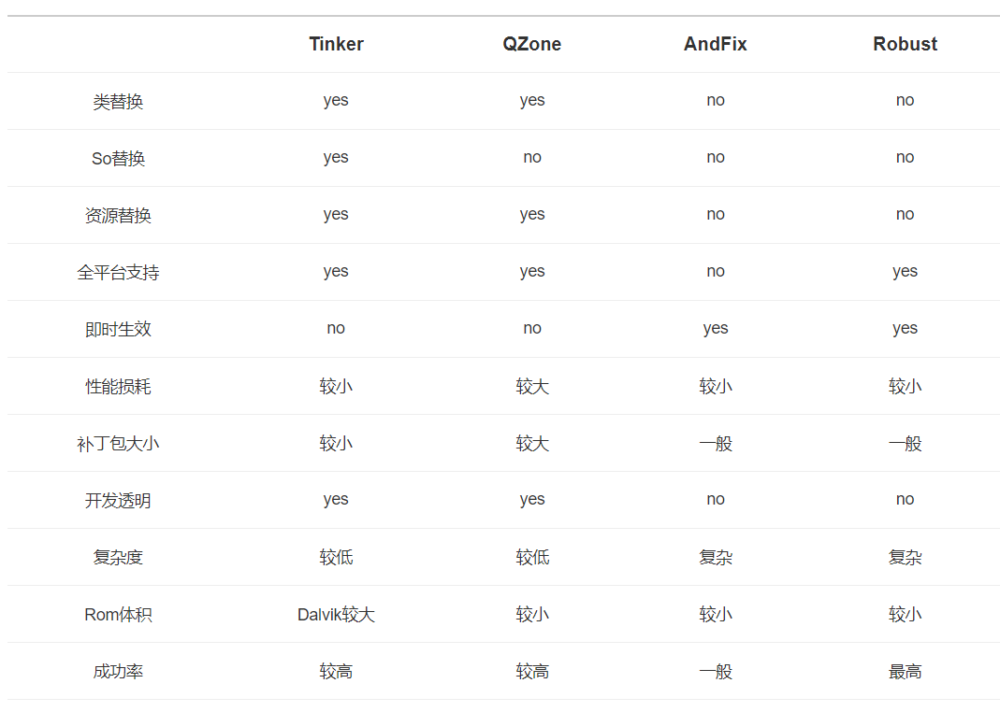

Tinker热补丁方案不仅支持类、So 以及资源的替换，它还是2.X－7.X的全平台支持。利用Tinker我们不仅可以用做 bugfix,甚至可以替代功能的发布。**Tinker 已运行在微信的数亿 Android 设备上，那么为什么你不使用 Tinker 呢？**

### 一步一步来集成Tinker
添加gradle依赖
```java
buildscript {
    repositories {
        google()
        jcenter()
    }
    dependencies {
        classpath 'com.android.tools.build:gradle:3.3.2'
        
        // NOTE: Do not place your application dependencies here; they belong
        // in the individual module build.gradle files

        // TinkerPatch 插件
        classpath "com.tinkerpatch.sdk:tinkerpatch-gradle-plugin:1.2.13.3"
    }
}
```
集成 TinkerPatch SDK
app gradle中：
```java
dependencies {
    ...

    // 若使用annotation需要单独引用,对于tinker的其他库都无需再引用
    compileOnly("com.tinkerpatch.tinker:tinker-android-anno:1.9.13.3")
    implementation("com.tinkerpatch.sdk:tinkerpatch-android-sdk:1.2.13.3")
}
```

注意,若使用 annotation 自动生成 Application， 需要单独引入 Tinker 的 tinker-android-anno 库。除此之外，我们无需再单独引入 tinker 的其他库。

为了简单方便，我们将 TinkerPatch 相关的配置都放于 tinkerpatch.gradle 中, 我们需要将其引入：
```java
apply from: 'tinkerpatch.gradle'
```

tinkerpatch.gradle文件内容:
```java
apply plugin: 'tinkerpatch-support'

/**
 * TODO: 请按自己的需求修改为适应自己工程的参数
 */
def bakPath = file("${buildDir}/bakApk/")
def baseInfo = "app-1.0.1-0814-08-39-19"
def variantName = "release"

/**
 * 对于插件各参数的详细解析请参考
 * http://tinkerpatch.com/Docs/SDK
 */
tinkerpatchSupport {
    /** 可以在debug的时候关闭 tinkerPatch **/
    /** 当disable tinker的时候需要添加multiDexKeepProguard和proguardFiles,
     这些配置文件本身由tinkerPatch的插件自动添加，当你disable后需要手动添加
     你可以copy本示例中的proguardRules.pro和tinkerMultidexKeep.pro,
     需要你手动修改'tinker.sample.android.app'本示例的包名为你自己的包名, com.xxx前缀的包名不用修改
     **/
    tinkerEnable = true
    reflectApplication = true
    /**
     * 是否开启加固模式，只能在APK将要进行加固时使用，否则会patch失败。
     * 如果只在某个渠道使用了加固，可使用多flavors配置
     **/
    protectedApp = false
    /**
     * 实验功能
     * 补丁是否支持新增 Activity (新增Activity的exported属性必须为false)
     **/
    supportComponent = true

    autoBackupApkPath = "${bakPath}"

    appKey = "f938475486f91936"

    /** 注意: 若发布新的全量包, appVersion一定要更新 **/
    appVersion = "1.0.1"

    def pathPrefix = "${bakPath}\\${baseInfo}\\${variantName}"
    def name = "${project.name}-${variantName}"

    baseApkFile = "${pathPrefix}\\${name}.apk"
    baseProguardMappingFile = "${pathPrefix}\\${name}-mapping.txt"
    baseResourceRFile = "${pathPrefix}\\${name}-R.txt"

    /**
     *  若有编译多flavors需求, 可以参照： https://github.com/TinkerPatch/tinkerpatch-flavors-sample
     *  注意: 除非你不同的flavor代码是不一样的,不然建议采用zip comment或者文件方式生成渠道信息（相关工具：walle 或者 packer-ng）
     **/
}

/**
 * 用于用户在代码中判断tinkerPatch是否被使能
 */
android {
    defaultConfig {
        buildConfigField "boolean", "TINKER_ENABLE", "${tinkerpatchSupport.tinkerEnable}"
    }
}

/**
 * 一般来说,我们无需对下面的参数做任何的修改
 * 对于各参数的详细介绍请参考:
 * https://github.com/Tencent/tinker/wiki/Tinker-%E6%8E%A5%E5%85%A5%E6%8C%87%E5%8D%97
 */
tinkerPatch {
    ignoreWarning = false
    useSign = true
    dex {
        dexMode = "jar"
        pattern = ["classes*.dex"]
        loader = []
    }
    lib {
        pattern = ["lib/*/*.so"]
    }

    res {
        pattern = ["res/*", "r/*", "assets/*", "resources.arsc", "AndroidManifest.xml"]
        ignoreChange = []
        largeModSize = 100
    }

    packageConfig {
    }
    sevenZip {
        zipArtifact = "com.tencent.mm:SevenZip:1.1.10"
//        path = "/usr/local/bin/7za"
    }
    buildConfig {
        keepDexApply = false
    }
}
```
具体含义：
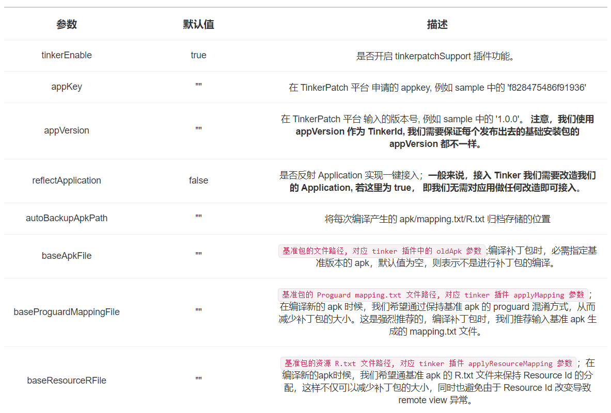
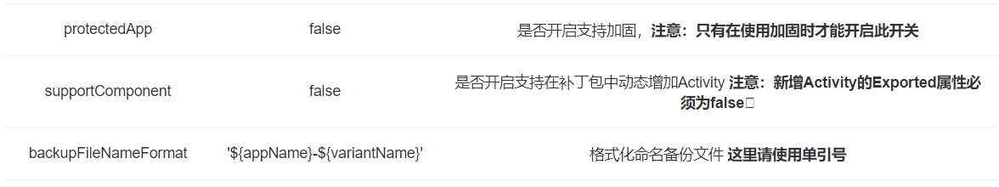

### 初始化TinkerPatch SDK
最后在我们的代码中，只需简单的初始化 TinkerPatch 的 SDK 即可，我们无需考虑 Tinker 是如何下载/合成/应用补丁包， 也无需引入各种各样 Tinker 的相关类。

#### reflectApplication = true 的情况
若我们使用 reflectApplication 模式，我们无需为接入 Tinker 而改造我们的 Application 类。
```java
public class MyApplication extends Application {

    private ApplicationLike tinkerApplicationLike;

    @Override
    public void onCreate() {
        super.onCreate();
        // 我们可以从这里获得Tinker加载过程的信息
        tinkerApplicationLike = TinkerPatchApplicationLike.getTinkerPatchApplicationLike();

        // 初始化TinkerPatch SDK, 更多配置可参照API章节中的,初始化SDK
        TinkerPatch.init(tinkerApplicationLike)
                .reflectPatchLibrary()
                //强制检查更新
                .fetchPatchUpdate(true)
                .setPatchRollbackOnScreenOff(true)
                .setPatchRestartOnSrceenOff(true)
                .setFetchPatchIntervalByHours(3);

        // 每隔3个小时(通过setFetchPatchIntervalByHours设置)去访问后台时候有更新,通过handler实现轮训的效果
        TinkerPatch.with().fetchPatchUpdateAndPollWithInterval();
    }
}
```

#### reflectApplication = false 的情况
若我们已经完成了应用的 Application 改造，即将 Application 的逻辑移动到 ApplicationLike类中。
```java
public class MyApplication extends DefaultApplicationLike {

    private ApplicationLike tinkerApplicationLike;

    public MyApplication(Application application, int tinkerFlags, boolean tinkerLoadVerifyFlag, long applicationStartElapsedTime, long applicationStartMillisTime, Intent tinkerResultIntent) {
        super(application, tinkerFlags, tinkerLoadVerifyFlag, applicationStartElapsedTime, applicationStartMillisTime, tinkerResultIntent);
    }

    @Override
    public void onCreate() {
        super.onCreate();
        // 初始化TinkerPatch SDK, 更多配置可参照API章节中的,初始化 SDK
        TinkerPatch.init(this)
                .reflectPatchLibrary()
                .setPatchRollbackOnScreenOff(true)
                .setPatchRestartOnSrceenOff(true)
                .setFetchPatchIntervalByHours(3);

        // 每隔3个小时（通过setFetchPatchIntervalByHours设置）去访问后台时候有更新,通过handler实现轮训的效果
        TinkerPatch.with().fetchPatchUpdateAndPollWithInterval();
    }
}
```
**注意**：初始化的代码建议紧跟 super.onCreate(),并且所有进程都需要初始化，已达到所有进程都可以被 patch 的目的

如果你确定只想在主进程中初始化 tinkerPatch，那也请至少在 :patch 进程中初始化，否则会有造成 :patch 进程crash，无法使补丁生效


TinkerPatch 的使用步骤非常简单，一般来说可以参考以下几个步骤：
根目录下执行：
```java
gradlew assemblerelease
```
task 构建基准包（请在发布前确保更新tinkerpatchSupport中的appVersion），tinkerPatch会基于你填入的autoBackupApkPath自动备份基础包信息到相应的文件夹，包含：apk文件、R.txt文件和mapping.txt文件 （注：mapping.txt是proguard的产物，如果你没有开启proguard则不会有这个文件）
若想发布补丁包， 只需将自动保存下来的文件分别填到tinkerpatchSupport中的baseApkFile、baseProguardMappingFile和baseResourceRFile 参数中：
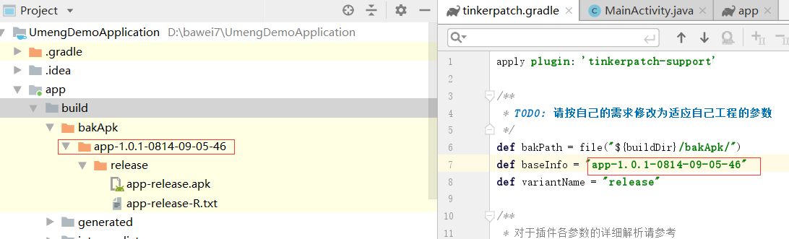

**运行:**

```java
gradlew tinkerPatchRelease
```
task 构建补丁包，补丁包将位于 build/outputs/tinkerPatch下。

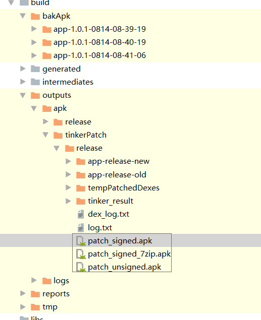

patch_signed_7zip.apk就是我们的补丁包了。

在Tinker后台下发补丁包：
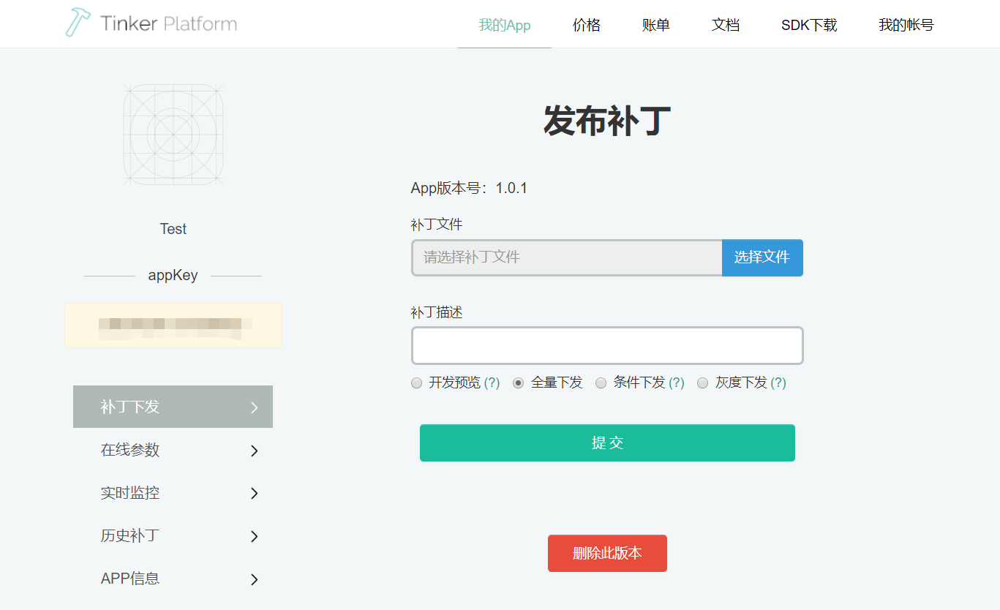

测试使用“开发预览”方式下发，不会对线上版本直接更新。我们用一个简单的界面为例：

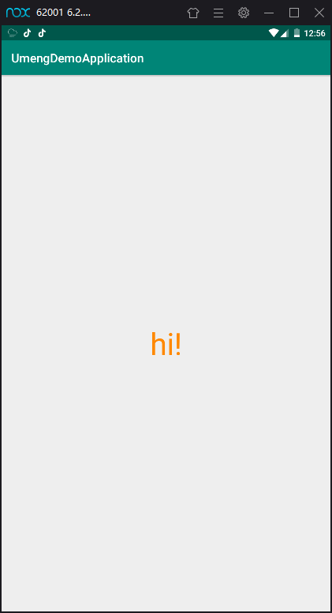

修改部分代码：
```java
 tvTest.setText("123456");
```
使用上面方式制作出补丁包，然后发布到Tinker后台。更新后如下：

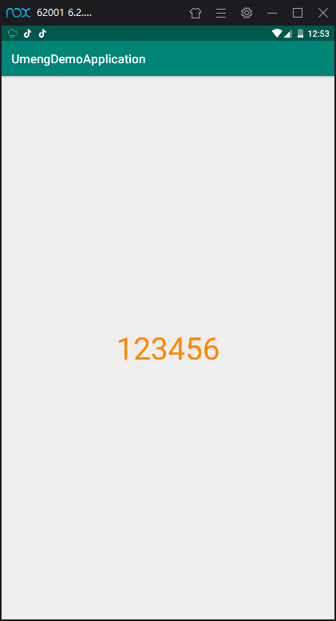


更多功能请参见 —— [Tinker 官方文档](http://www.tinkerpatch.com/Docs/SDK)


### 可能遇到的问题？
问题1：
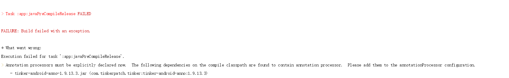

解决方法：
```java
defaultConfig {
        applicationId "com.baweigame.umengdemoapplication"
        minSdkVersion 15
        targetSdkVersion 28
        versionCode 1
        versionName "1.0"
        testInstrumentationRunner "android.support.test.runner.AndroidJUnitRunner"

        javaCompileOptions {
            annotationProcessorOptions {
                includeCompileClasspath = true
            }
        }
    }
```

问题2：
release版本签名问题,即默认打包后的release版本是个未签名的apk版本，导致制作补丁包时报错。

解决办法：
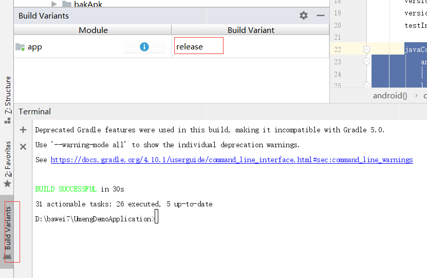

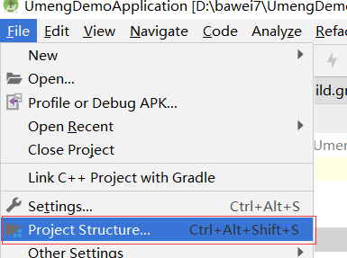

提前准备好jks文件
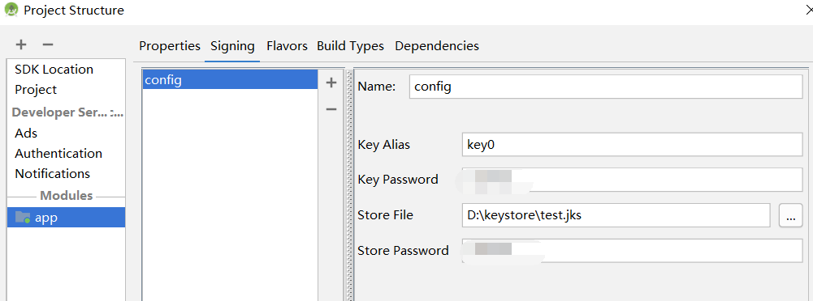

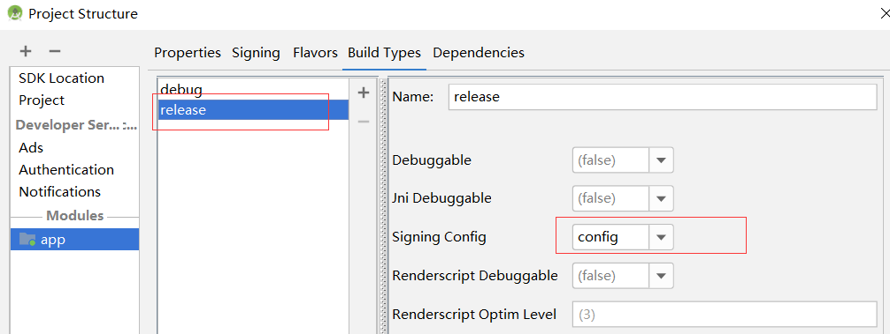