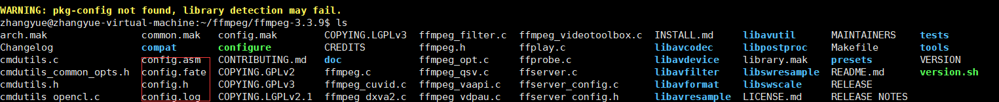

## 编译FFmpeg

在Ubuntu中编译Android平台的FFmpeg（arm和x86）

<!--more-->

环境准备：

-下载FFmpeg源码（v3.3.9）
-下载NDK（r14b）
-编写Android编译脚本

### 下载FFmpeg源码（v3.3.9）

[V3.3.9下载地址](http://www.ffmpeg.org/download.html#releases)


### 下载NDK（r14b）

[NDK r14b 下载](https://developer.android.google.cn/ndk/downloads/older_releases.html)

因为在Ubuntu下编译，便于我们方便连接操作，我这里使用XShell与XFTP工具。

### 使用FTP上传下载文件到Ubuntu中


### 解压文件


#### 解压FFmpeg

tar -zxvf ffmpeg-3.3.9.tar.gz

#### 解压NDK

unzip android-ndk-r14b-linux-x86_64.zip

### 修改脚本

#### 修改FFmpeg的configure文件

***因为android只能加载.so的动态库，不能识别如*.so.57结尾的***

将虚拟机中的configure文件使用FTP下载到本地进行如下修改：

进行如图修改：


修改内容如下：
```

#SLIBNAME_WITH_MAJOR='$(SLIBNAME).$(LIBMAJOR)'
#LIB_INSTALL_EXTRA_CMD='$$(RANLIB) "$(LIBDIR)/$(LIBNAME)"'
#SLIB_INSTALL_NAME='$(SLIBNAME_WITH_VERSION)'
#SLIB_INSTALL_LINKS='$(SLIBNAME_WITH_MAJOR) $(SLIBNAME)'
SLIBNAME_WITH_MAJOR='$(SLIBPREF)$(FULLNAME)-$(LIBMAJOR)$(SLIBSUF)'
LIB_INSTALL_EXTRA_CMD='$$(RANLIB) "$(LIBDIR)/$(LIBNAME)"'
SLIB_INSTALL_NAME='$(SLIBNAME_WITH_MAJOR)'
SLIB_INSTALL_LINKS='$(SLIBNAME)'
```

修改后更新到Ubuntu中。

设置configure权限并执行。

```
chmod 777 configure

./configure
```



#### 编写Android编译脚本
``` shell
#!/bin/bash
#NDK路径 此次要改成你真实环境ndk所在目录
export NDK_HOME=/home/**/ffmpeg/android-ndk-r14b  
#android 平台版本
export PLATFORM_VERSION=android-9
#定义build函数
function build
{
	#输出编译的哪个平台
	echo "start build ffmpeg for $ARCH"
	#传入参数——目标平台linux
	./configure --target-os=linux \
	#输出路径
	--prefix=$PREFIX --arch=$ARCH \
	#排除 doc
	--disable-doc \
	--enable-shared \
	#去掉静态库
	--disable-static \
	#去掉汇编
	--disable-yasm \
	--disable-asm \
	--disable-symver \
	--enable-gpl \
	#去掉。。。
	--disable-ffmpeg \
	--disable-ffplay \
	--disable-ffprobe \
	--disable-ffserver \
	#配置交叉编译环境
	--cross-prefix=$CROSS_COMPILE \
	#启用交叉编译环境
	--enable-cross-compile \
	--sysroot=$SYSROOT \
	#开启最小编译
	--enable-small \
	--extra-cflags="-Os -fpic $ADDI_CFLAGS" \
	--extra-ldflags="$ADDI_LDFLAGS" \
	$ADDITIONAL_CONFIGURE_FLAG
	make clean
	make
	make install
	echo "build ffmpeg for $ARCH finished"
}

#arm
ARCH=arm
CPU=arm
#输出路径为当前目录下的android下的架构 动态库及头文件会放到这里
PREFIX=$(pwd)/android/$ARCH
#配置编译工具
TOOLCHAIN=$NDK_HOME/toolchains/arm-linux-androideabi-4.9/prebuilt/linux-x86_64
#交叉编译目录
CROSS_COMPILE=$TOOLCHAIN/bin/arm-linux-androideabi-
ADDI_CFLAGS="-marm"
#系统平台目录
SYSROOT=$NDK_HOME/platforms/$PLATFORM_VERSION/arch-$ARCH/
build

#x86
ARCH=x86
CPU=x86
PREFIX=$(pwd)/android/$ARCH
TOOLCHAIN=$NDK_HOME/toolchains/x86-4.9/prebuilt/linux-x86_64
CROSS_COMPILE=$TOOLCHAIN/bin/i686-linux-android-
ADDI_CFLAGS="-march=i686 -mtune=intel -mssse3 -mfpmath=sse -m32"
SYSROOT=$NDK_HOME/platforms/$PLATFORM_VERSION/arch-$ARCH/
build
```

（使用时要将上面中文注释都去掉，否则有坑哈~~~）

执行android编译脚本：

```
chmod 777 build_android.sh

./build_android.sh

```

其中可能遇到一些问题，解决方法可以参见下方说明。
编译中：


大概编译10分钟左右，我是虚拟机编译可能比较慢，各位可以使用真机编译会快一点。
最终编译完成后如下：

取出我们使用的文件：

include头文件使用arm或者x86的都可以。


如上就是ffmpeg的编译过程。


## 常见问题

### 问题1：
```
gcc is unable to create an executable file.
```

解决方法：
```
sudo apt-get install gcc
```

### 问题2：
```
yasm/nasm not found or too old. Use --disable-yasm for a crippled build.
```
原因：
yasm是汇编编译器，ffmpeg为了提高效率使用了汇编指令，如MMX和SSE等。所以系统中未安装yasm时，就会报上面错误。

解决方法：
```
sudo apt install yasm
```

### 问题3：
```
mark command not found
```

解决方法：
```
sudo apt-get install make
```