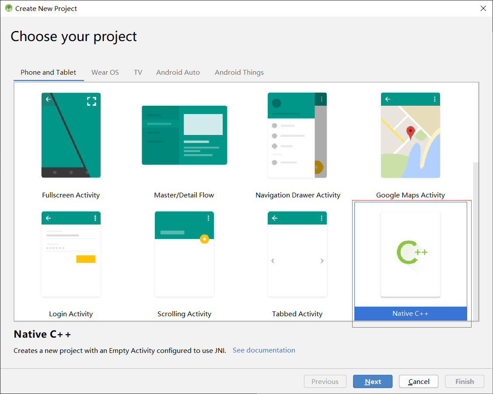
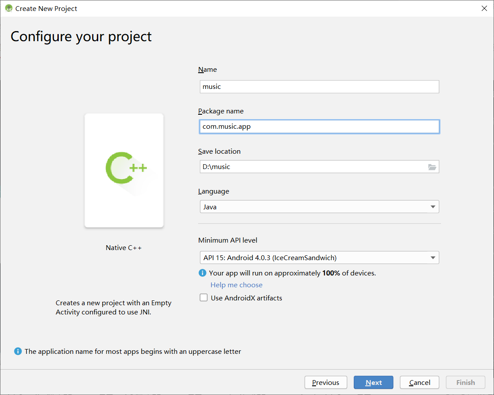
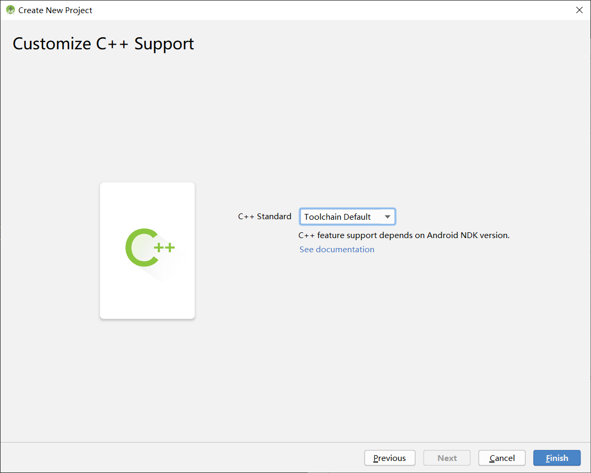
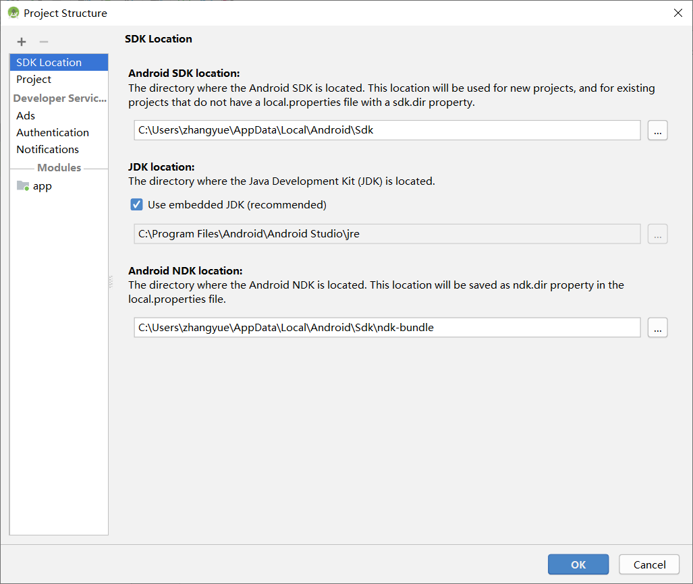
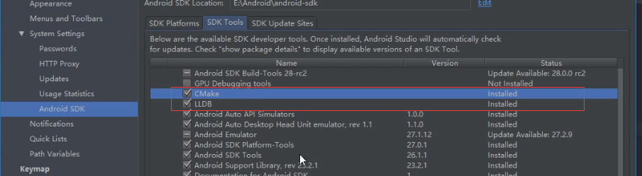

通过实现一个音乐APP来演示ffmpeg的使用。

<!--more-->

使用AndroidStudio创建项目：


下一步

下一步


Finish

如有报错，要检查是否配置了NDK，如：


下面来聊聊 CMakeLists.txt:

```txt
#cmake的版本
cmake_minimum_required(VERSION 3.4.1)

#添加一个library 名称为native-lib

add_library( # Sets the name of the library.
             native-lib

             # Sets the library as a shared library.
             SHARED

             # Provides a relative path to your source file(s).
             native-lib.cpp )

#动态库 log-lib —— 别名  log —— 实际动态库
find_library( # Sets the name of the path variable.
              log-lib

              # Specifies the name of the NDK library that
              # you want CMake to locate.
              log )

#连接上面的动态库 native-lib 及 log动态库
target_link_libraries( # Specifies the target library.
                       native-lib

                       # Links the target library to the log library
                       # included in the NDK.
                       ${log-lib} )
```

在来看看app gradle文件
```java
apply plugin: 'com.android.application'

android {
    。。。
    defaultConfig {
        。。。
        //编译时加入的动态库
        externalNativeBuild {
            cmake {
                cppFlags ""
            }
        }
    }
    buildTypes {
        release {
          。。。
        }
    }
    //build文件路径
    externalNativeBuild {
        cmake {
            path "src/main/cpp/CMakeLists.txt"
        }
    }
}

dependencies {
   。。。
}

```
再看看MainActivity加入了哪些东西：
```java
public class MainActivity extends AppCompatActivity {

    // 加入动态库
    static {
        System.loadLibrary("native-lib");
    }

    @Override
    protected void onCreate(Bundle savedInstanceState) {
        super.onCreate(savedInstanceState);
        setContentView(R.layout.activity_main);

        // Example of a call to a native method
        TextView tv = findViewById(R.id.sample_text);
        tv.setText(stringFromJNI());
    }

    //需要c/c++实现的native方法
    public native String stringFromJNI();
}

```
在看看native-lib.cpp
```c++
#include <jni.h>
#include <string>
//使用C编译
extern "C"
//导出方法 类型jsstring
JNIEXPORT jstring
//JNI调用
JNICALL
//命名为Java_开头 然后是包名.用_替换+类名+native方法名
Java_com_music_app_MainActivity_stringFromJNI(
        //
        JNIEnv* env,
        jobject /* this */) {
    std::string hello = "Hello from C++";
    return env->NewStringUTF(hello.c_str());
}

```

运行验证一下。

如果cmake没有按照，则需要安装如下：
