基于之前的工程来添加Module工程。

<!--more-->

## 创建Module工程

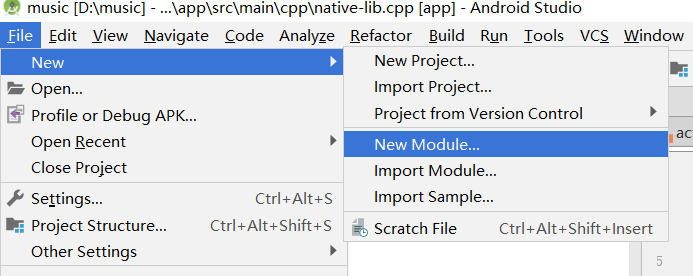
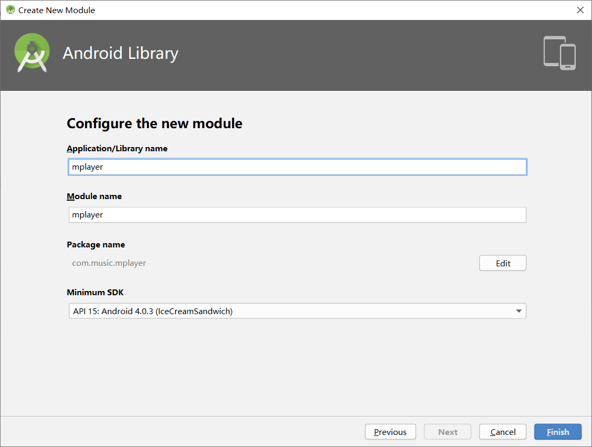
将新建的Module工程添加到APP工程中。
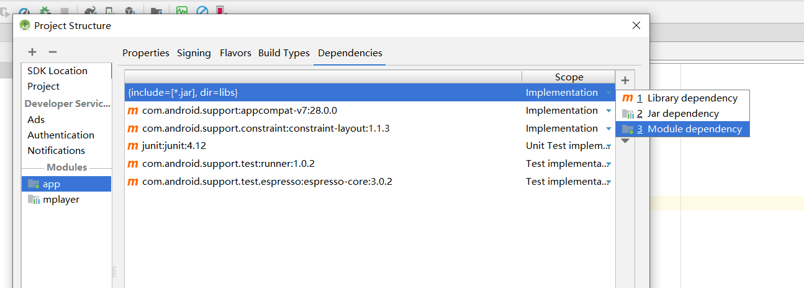

## Module添加C++支持

### 将app gradle中的配置移植到module gradle中

将app gradle中的如下配置移植到module gradle中。
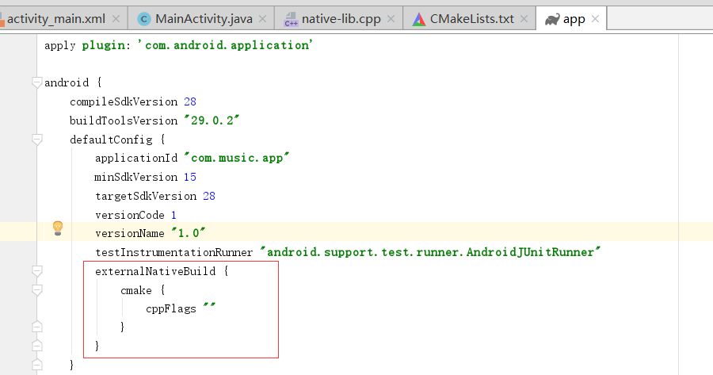
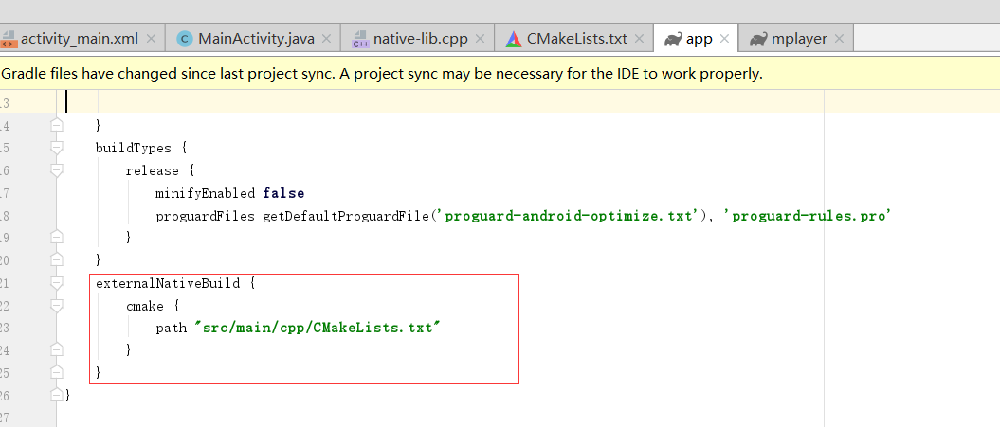

### 将app中的CMakeLists.txt移植到module中
注意我们要移植到module工程的根目录中，如：

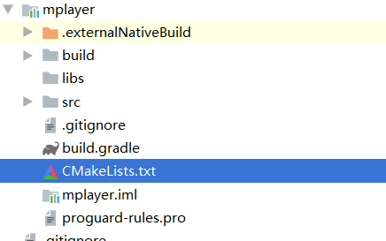

### module工程中创建类文件添加native方法
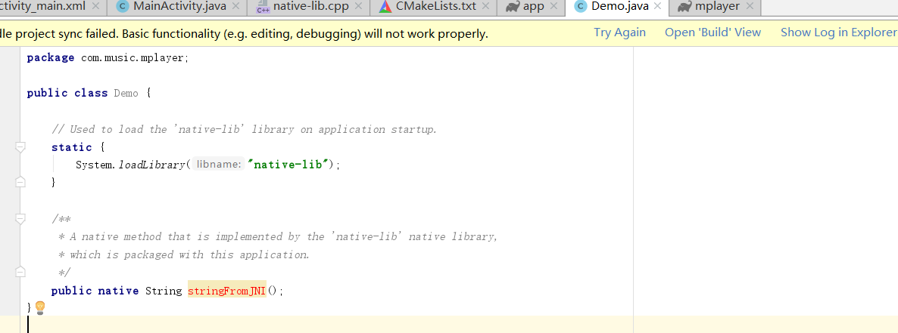
有报红的是因为我们移植过来的cpp文件jni 方法包名不对引起的。
修正为：
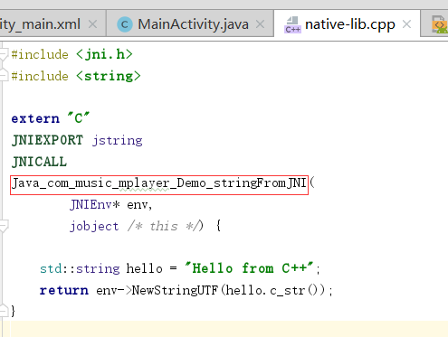

### 修改app的MainActivity代码用于测试验证结果
```java
package com.music.app;

import *;

public class MainActivity extends AppCompatActivity {


    @Override
    protected void onCreate(Bundle savedInstanceState) {
        super.onCreate(savedInstanceState);
        setContentView(R.layout.activity_main);

        // Example of a call to a native method
        TextView tv = findViewById(R.id.sample_text);
        tv.setText(new Demo().stringFromJNI());
    }


}
```
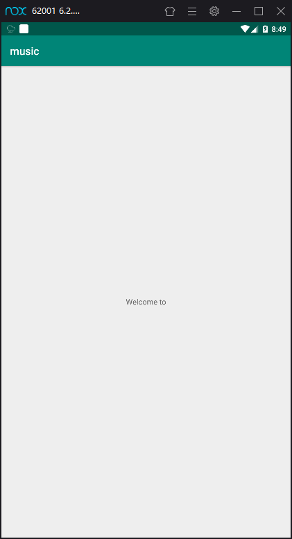

我们看到上面已经正常输出了c++的运算结果。

## 添加FFmpeg动态库

这里面提到的资源如果给位没有，请参考：

[FFmpeg系列 一、编译FFmpeg](http://www.zydeveloper.com/2019/09/04/ffmpeg-build/)

#### module cpp文件夹中创建include文件夹，并添加ffmpeg中include中所有文件


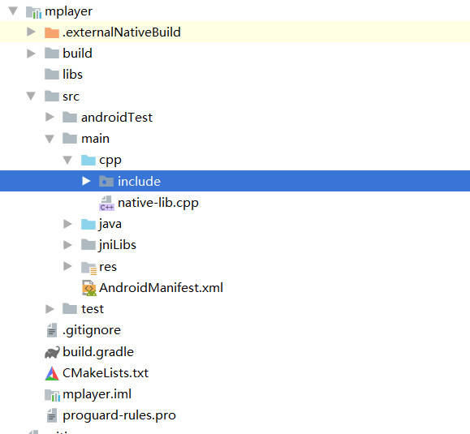

#### module main文件夹中创建jniLibs,复制arm 和 x86的.so库到jinLibs中

创建jniLibs目录
将arm和x86动态库拷贝到jinLibs目录下。
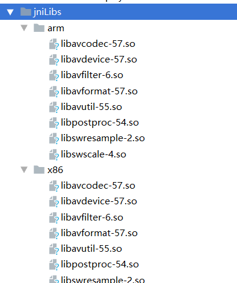

#### 配置module gradle文件
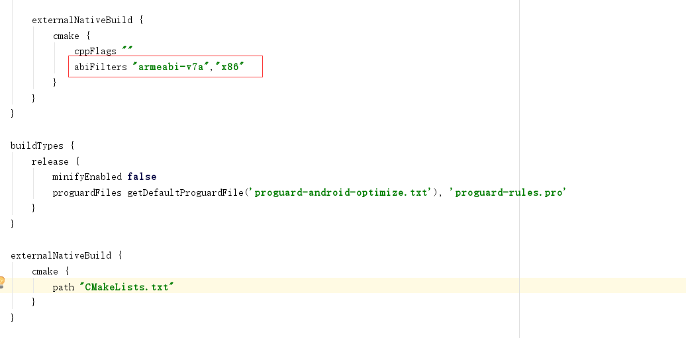


#### cmakelists.txt 配置FFmpeg

##### 导入include路径

```
#导入头文件路径
include_directories(src/main/cpp/include)
```

##### 添加动态库

```
#导入动态库
add_library(avcodec-57 SHARED IMPORTED)
```

##### 设置动态库路径

```
#设置动态库路径
set_target_properties(avcodec-57 PROPERTIES IMPORTED_LOCATION ${CMAKE_SOURCE_DIR}/src/main/jniLibs/${ANDROID_ABI}/libavcodec-57.so)

```

##### 链接动态库

```
target_link_libraries( # Specifies the target library.
                       native-lib

                       avcodec-57

                       ${log-lib} )
```

#### 最终CMake
```

cmake_minimum_required(VERSION 3.4.1)

#导入头文件路径
include_directories(include)

#导入动态库
add_library(avcodec-57 SHARED IMPORTED)

#设置动态库路径
set_target_properties(avcodec-57 PROPERTIES IMPORTED_LOCATION ${CMAKE_SOURCE_DIR}/src/main/jniLibs/${ANDROID_ABI}/libavcodec-57.so)

#导入动态库
add_library(avdevice-57 SHARED IMPORTED)

#设置动态库路径
set_target_properties(avdevice-57 PROPERTIES IMPORTED_LOCATION ${CMAKE_SOURCE_DIR}/src/main/jniLibs/${ANDROID_ABI}/libavdevice-57.so)

#导入动态库
add_library(avfilter-6 SHARED IMPORTED)

#设置动态库路径
set_target_properties(avfilter-6 PROPERTIES IMPORTED_LOCATION ${CMAKE_SOURCE_DIR}/src/main/jniLibs/${ANDROID_ABI}/libavfilter-6.so)

#导入动态库
add_library(avformat-57 SHARED IMPORTED)

#设置动态库路径
set_target_properties(avformat-57 PROPERTIES IMPORTED_LOCATION ${CMAKE_SOURCE_DIR}/src/main/jniLibs/${ANDROID_ABI}/libavformat-57.so)

#导入动态库
add_library(avutil-55 SHARED IMPORTED)

#设置动态库路径
set_target_properties(avutil-55 PROPERTIES IMPORTED_LOCATION ${CMAKE_SOURCE_DIR}/src/main/jniLibs/${ANDROID_ABI}/libavutil-55.so)

#导入动态库
add_library(postproc-54 SHARED IMPORTED)

#设置动态库路径
set_target_properties(postproc-54 PROPERTIES IMPORTED_LOCATION ${CMAKE_SOURCE_DIR}/src/main/jniLibs/${ANDROID_ABI}/libpostproc-54.so)

#导入动态库
add_library(swresample-2 SHARED IMPORTED)

#设置动态库路径
set_target_properties(swresample-2 PROPERTIES IMPORTED_LOCATION ${CMAKE_SOURCE_DIR}/src/main/jniLibs/${ANDROID_ABI}/libswresample-2.so)

#导入动态库
add_library(swscale-4 SHARED IMPORTED)

#设置动态库路径
set_target_properties(swscale-4 PROPERTIES IMPORTED_LOCATION ${CMAKE_SOURCE_DIR}/src/main/jniLibs/${ANDROID_ABI}/libswscale-4.so)


add_library(native-lib
            SHARED
            native-lib.cpp)


find_library(log-lib
              log )


target_link_libraries(native-lib
        ${log-lib}

                       avcodec-57
                        avdevice-57
                        avfilter-6
                        avformat-57
                        avutil-55
                        postproc-54
                        swresample-2
                        swscale-4

                        )
```

**注意：CMakeLists.txt文件需要放到项目跟目录，否则会出现路径不对引发的错误。**

## Demo验证FFmpeg是否集成成功

在module 工程 Demo中导入动态库并加入native方法：


```
package com.music.mplayer;

public class Demo {

    // Used to load the 'native-lib' library on application startup.
    static {
        System.loadLibrary("native-lib");

        System.loadLibrary("avcodec-57");
        System.loadLibrary("avdevice-57");
        System.loadLibrary("avfilter-6");
        System.loadLibrary("avformat-57");
        System.loadLibrary("avutil-55");
        System.loadLibrary("postproc-54");
        System.loadLibrary("swresample-2");
        System.loadLibrary("swscale-4");
    }

    /**
     * A native method that is implemented by the 'native-lib' native library,
     * which is packaged with this application.
     */
    public native String stringFromJNI();

    public native void testFFmpeg();
}

```

报红的部分 alt+enter 搞定。

native-lib.cpp代码如下：
``` c++
#include <jni.h>
#include <string>
#include <android/log.h>

extern "C"
{
#include <libavformat/avformat.h>
}

#define LOGI(FORMAT,...) __android_log_print(ANDROID_LOG_INFO,"zhangyue",FORMAT,##__VA_ARGS__);

extern "C"
JNIEXPORT jstring
JNICALL
Java_com_music_mplayer_Demo_stringFromJNI(
        JNIEnv* env,
        jobject /* this */) {

    std::string hello = "Welcome to";
    return env->NewStringUTF(hello.c_str());
}
extern "C"
JNIEXPORT void JNICALL
Java_com_music_mplayer_Demo_testFFmpeg(JNIEnv *env, jobject instance) {

// TODO
    av_register_all();
    AVCodec *c_temp = av_codec_next(NULL);
    while (c_temp != NULL)
    {
        switch (c_temp->type)
        {
            case AVMEDIA_TYPE_VIDEO:
                LOGI("[Video]:%s", c_temp->name);
                break;
            case AVMEDIA_TYPE_AUDIO:
                LOGI("[Audio]:%s", c_temp->name);
                break;
            default:
                LOGI("[Other]:%s", c_temp->name);
                break;
        }
        c_temp = c_temp->next;
    }

}
```

MainActivity代码修改为：
```java
package com.music.app;

import ****;

public class MainActivity extends AppCompatActivity {


    @Override
    protected void onCreate(Bundle savedInstanceState) {
        super.onCreate(savedInstanceState);
        setContentView(R.layout.activity_main);
        new Demo().testFFmpeg();
    }


}

```

运行程序后，logcat输出如下log：
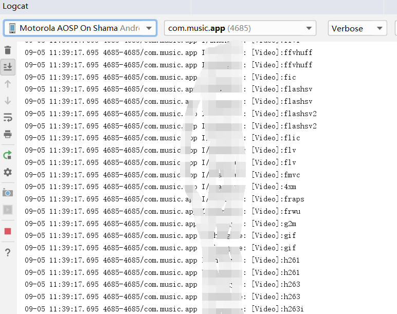

打印了ffmpeg支持的视频格式，说明我们已经集成成功了！