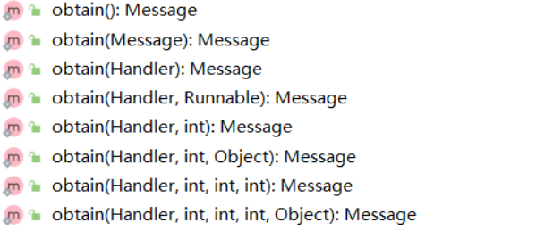

Handler原理及源码分析（上）

<!--more-->

### Handler原理及源码分析（上）

#### Demo

如下是演示Demo，后续我将使用这个Demo来对Handler进行原理分析。

```java
private void initEvent() {
btnHandlerDemoDo.setOnClickListener(new View.OnClickListener() {
@Override
public void onClick(View v) {
//启动了子线程
new Thread(new Runnable() {
@Override
public void run() {
try {
//模拟耗时操作 睡了2s
Thread.sleep(2000);
} catch (InterruptedException e) {
e.printStackTrace();
}
//构建Message对象
Message message=Message.obtain();//new Message();
message.what=DemoFlag1;
message.arg1=11;
message.arg2=22;
message.obj=new Object();// message.sendToTarget();
Log.d("123", "threadname: "+Thread.currentThread().getName());
//使用Handler发送Message
mHandler.sendMessage(message);
}
}).start();
}
});
}

private final int DemoFlag1=1;private Handler mHandler=new Handler(){
//处理发送过来Message
@Override
public void handleMessage(Message msg) {
super.handleMessage(msg);
switch (msg.what){
case DemoFlag1:
Log.d("123", "handleMessage: [DemoFlag1]");
Log.d("123", "hm thread name: "+Thread.currentThread().getName());
tvHandlerDemoContent.setText("handleMessage: [DemoFlag1]");
//tvHandlerDemoContent.setVisibility(View.VISIBLE);
break;
default:
}
}};
```
如上Demo代码演示了一个Handler很经典的使用场景，子线程发请求响应结果来更新UI。
然后下面我们先来关注两个问题：
#### 子线程中能否创建Handler？
答案是肯定的，一定可以创建不过需要一个先决条件->指定Looper，下面示例代码演示了具体实现过程：
```java
//该位置我们指定了LooperLooper.prepare();Handler handler=new Handler(){
@Override
public void handleMessage(Message msg) {
super.handleMessage(msg);
switch (msg.what){
case 0:
Log.d("123", "handleMessage: 00000");
break;
}
}};
handler.sendEmptyMessage(0);Looper.loop();
```

#### 主线程Handler为什么不用Looper.prepare()?

这个问题我们就要分析一下Android源码，其中大家都知道ActivityThread（后面简称AT）是我们的“主线程”，其实AT并不是一个真实的线程，它只是一个final的class并没有继承或者实现任何与线程相关的类或接口。
之所以称它为主线程可能是因为这个类似android中唯一使用main函数加载启动并且是zygote fock完进程之后就直接加载的类。
下面我们来看一下具体的main函数，代码如下：

```java
public static void main(String[] args) {
.........
//出现了Looper.prepare
Looper.prepareMainLooper();
// Find the value for {@link #PROC_START_SEQ_IDENT} if provided on the command line.
// It will be in the format "seq=114"
long startSeq = 0;
if (args != null) {
for (int i = args.length - 1; i >= 0; --i) {
if (args[i] != null && args[i].startsWith(PROC_START_SEQ_IDENT)) {
startSeq = Long.parseLong(
args[i].substring(PROC_START_SEQ_IDENT.length()));
}
}
}
ActivityThread thread = new ActivityThread();
thread.attach(false, startSeq);
if (sMainThreadHandler == null) {
sMainThreadHandler = thread.getHandler();
}
if (false) {
Looper.myLooper().setMessageLogging(new
LogPrinter(Log.DEBUG, "ActivityThread"));
}
.....
//Looper.loop
Looper.loop();
throw new RuntimeException("Main thread loop unexpectedly exited");
}
```
如上可见我们在ActivityThread的main函数中发现了Looper已经关联好了，具体见如上注释部分。

我们都知道Handler一般是由4部分组成：
1 Message
2 MessageQueue
3 Looper
4 Handler

#### 首先我们来看看Message

如下是Message类的定义 很简单 final 实现 Parcelable序列化接口
```java
public final class Message implements Parcelable
```
```java
/**
* User-defined message code so that the recipient can identify
* what this message is about. Each {@link Handler} has its own name-space
* for message codes, so you do not need to worry about yours conflicting
* with other handlers.
*/
public int what;

/**
* arg1 and arg2 are lower-cost alternatives to using
* {@link #setData(Bundle) setData()} if you only need to store a
* few integer values.
*/
public int arg1;

/**
* arg1 and arg2 are lower-cost alternatives to using
* {@link #setData(Bundle) setData()} if you only need to store a
* few integer values.
*/
public int arg2;

/**
* An arbitrary object to send to the recipient. When using
* {@link Messenger} to send the message across processes this can only
* be non-null if it contains a Parcelable of a framework class (not one
* implemented by the application). For other data transfer use
* {@link #setData}.
*
* <p>Note that Parcelable objects here are not supported prior to
* the {@link android.os.Build.VERSION_CODES#FROYO} release.
*/
public Object obj;
```
如上这几个属性是我们使用Message时比较常用的，很简单这边就不再解释。

如上我们看到的是Message的obtain方法各种重载。下面来看看obtain（）方法：

```java
/**
* Return a new Message instance from the global pool. Allows us to
* avoid allocating new objects in many cases.
*/
public static Message obtain() {
synchronized (sPoolSync) {
if (sPool != null) {
Message m = sPool;
sPool = m.next;
m.next = null;
m.flags = 0; // clear in-use flag
sPoolSize--;
return m;
}
}
return new Message();
}
```
如上方法可以看出obtain是对Message的一个复用，即先看sPool中是否存在如果存在则复用，否则new一个Message实例返回。
其他的方法重载就是一些属性赋值操作这里不再阐述。

##### 下面来看看Message的target属性同时关注一些message的sendToTarget（）方法
```java
/*package*/ Handler target;
```
如上市target的定义，我们发现其实target是一个Handler，这个Handler可以通过如下方法进行设置：
```java
public static Message obtain(Message orig) {
Message m = obtain();
...
m.target = orig.target;
m.callback = orig.callback;

return m;
}

//。。。
//以及obtain的其他方法重载，具体可以参加源码部分

public void setTarget(Handler target) {
this.target = target;
}
```
下面看看message的sendToTarget方法
```java
/**
* Sends this Message to the Handler specified by {@link #getTarget}.
* Throws a null pointer exception if this field has not been set.
*/
public void sendToTarget() {
target.sendMessage(this);
}
```
我们发现最终调用的还是Handler的sendMessage方法（因为target就是Hander对象）。
##### Message中还有data与callback属性
```java
/*package*/ Bundle data;/*package*/ Runnable callback;
```
我们发现data是Bundle类型，其中可以putXX数据。
callback在Message中进行了赋值也就是“setCallback”。

##### 下面我们来看看Message的复用是怎么处理的

```java

//提供给我们同步关键字使用的锁对象
public static final Object sPoolSync = new Object();
//缓存对象池
private static Message sPool;
//当前对象池中的计数器
private static int sPoolSize = 0;
//对象池最大缓存大小
private static final int MAX_POOL_SIZE = 50;
private static boolean gCheckRecycle = true;
```

如上属性是对Message的复用做设置的，具体使用我们来看一下如下代码：

```java

/**
* Return a new Message instance from the global pool. Allows us to
* avoid allocating new objects in many cases.
*/
public static Message obtain() {
synchronized (sPoolSync) {
//首先判断sPool是否为空
if (sPool != null) {
//不为空将sPool赋值给m
Message m = sPool;
//将m（也就是之前的sPool）的next对象给sPool
sPool = m.next;
//将next清空
m.next = null;
m.flags = 0; // clear in-use flag
//计数器减1
sPoolSize--;
//返回复用的对象
return m;
}
}
//如果sPool为空则创建新Message对象
return new Message();
}
```
我们发现上面的sPool与next，但它们是在哪里赋值的呢？
我们可以参见如下代码：

```java

/**
* Return a Message instance to the global pool.
* <p>
* You MUST NOT touch the Message after calling this function because it has
* effectively been freed. It is an error to recycle a message that is currently
* enqueued or that is in the process of being delivered to a Handler.
* </p>
*/
public void recycle() {
...
recycleUnchecked();
}

/**
* Recycles a Message that may be in-use.
* Used internally by the MessageQueue and Looper when disposing of queued Messages.
*/
void recycleUnchecked() {
// Mark the message as in use while it remains in the recycled object pool.
// Clear out all other details.
//如下代码对Message的属性进行了还原即释放
flags = FLAG_IN_USE;
what = 0;
arg1 = 0;
arg2 = 0;
obj = null;
replyTo = null;
sendingUid = -1;
when = 0;
target = null;
callback = null;
data = null;

synchronized (sPoolSync) {
//判断当前计数器值是否大于限定的MAX_POOL_SIZE（也就是上面代码定义的50）
if (sPoolSize < MAX_POOL_SIZE) {
//将sPool赋值给next
next = sPool;
//将当前Message对象赋值给sPool
sPool = this;
//计数器累加1
sPoolSize++;
}
}
}
```
我们发现recycle（该方法调用时机我们后续再看）也就是释放方法中调用了recycleUnchecked方法，该方法对sPool sPoolSize next进行了处理，具体参见注释信息。