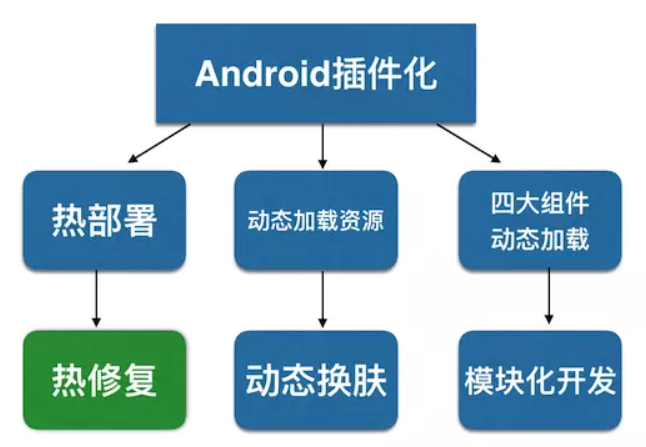
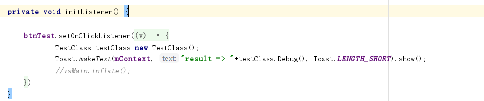
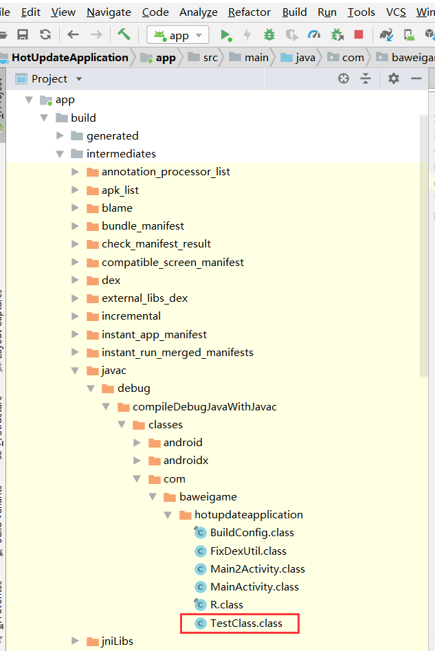
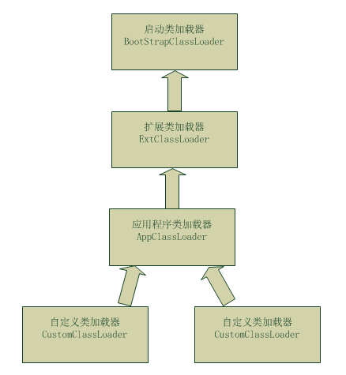

<!--more-->

## 类如何加载？

java中我们一般使用ClassLoader进行类的加载。
android 中 我们都知道最后的代码文件都会被打包成dex格式的文件；class文件包含在dex文件中。
加载dex中class文件我们需要使用DexClassLoader或者PathClassLoader。

## 类加载器

PathClassLoader可以加载Android系统中的dex文件
DexClassLoader可以加载任意目录的dex/zip/apk/jar文件 , 但是要指定optimizedDirectory.
这两个类加载器都继承BaseDexClassLoader, 并且在构造函数中, DexClassLoader多传入了一个optimizedDirectory。

我们来看看 BaseDexClassLoader

```java
public class BaseDexClassLoader extends ClassLoader {
    private final DexPathList pathList;
    public BaseDexClassLoader(String dexPath, File optimizedDirectory, String libraryPath, ClassLoader parent){
        super(parent);
        this.pathList = new DexPathList(this, dexPath, libraryPath, optimizedDirectory);
    }
}
```

构造方法中初始化了pathList, 传入三个参数 , 分别为
dexPath：目标文件路径（一般是dex文件，也可以是jar/apk/zip文件）所在目录。热修复时用来指定新的dex
optimizedDirectory：dex文件的输出目录（因为在加载jar/apk/zip等压缩格式的程序文件时会解压出其中的dex文件，该目录就是专门用于存放这些被解压出来的dex文件的）。
libraryPath：加载程序文件时需要用到的库路径。
parent：父加载器


## 类的加载过程

如下方法用于加载dex中的class文件， 拿到初始化完成的 pathList 之后 , 根据类名找出相应的class字节码文件, 如果没有异常直接返回class.

```java
@Overrideprotected Class<?> findClass(String name) throws ClassNotFoundException {
    List<Throwable> suppressedExceptions = new ArrayList<Throwable>();
    //从pathList中找到相应类名的class文件
    Class c = pathList.findClass(name, suppressedExceptions);
    //判空, 抛出异常
    if (c == null) {
        ClassNotFoundException cnfe = new ClassNotFoundException("Didn't find class \"" + name + "\" on path: " + pathList);
        for (Throwable t : suppressedExceptions) {
            cnfe.addSuppressed(t);
        }
        throw cnfe;
    }
    return c;
}
```

## DexPathList

构造函数. 我们在BaseDexClassLoader中实例化DexPathList需要用到
findClass方法, 在BaseDexClassLoader的findClass中, 本质调用了DexpathList的fndClass方法

```java
public DexPathList(ClassLoader definingContext, String dexPath,
        String libraryPath, File optimizedDirectory) {
     this.definingContext = definingContext;
     ArrayList<IOException> suppressedExceptions = new ArrayList<IOException>();
     // save dexPath for BaseDexClassLoader
     this.dexElements = makePathElements(splitDexPath(dexPath), optimizedDirectory,
                                         suppressedExceptions);
     
     this.nativeLibraryDirectories = splitPaths(libraryPath, false);
     this.systemNativeLibraryDirectories =
             splitPaths(System.getProperty("java.library.path"), true);
     List<File> allNativeLibraryDirectories = new ArrayList<>(nativeLibraryDirectories);
     allNativeLibraryDirectories.addAll(systemNativeLibraryDirectories);
     this.nativeLibraryPathElements = makePathElements(allNativeLibraryDirectories, null,
                                                       suppressedExceptions);
     
}
```

 将传入的classLoader保存起来 , 接下来使用makePathElements方法 ,来初始化Element数组

 ```java
private static Element[] makeDexElements(ArrayList<File> files, File optimizedDirectory, ArrayList<IOException> suppressedExceptions) {
    // 1.创建Element集合
    ArrayList<Element> elements = new ArrayList<Element>();
    // 2.遍历所有dex文件（也可能是jar、apk或zip文件）
    for (File file : files) {
        ZipFile zip = null;
        DexFile dex = null;
        String name = file.getName();
        ...
        // 如果是dex文件
        if (name.endsWith(DEX_SUFFIX)) {
            dex = loadDexFile(file, optimizedDirectory);
        // 如果是apk、jar、zip文件（这部分在不同的Android版本中，处理方式有细微差别）
        } else {
            zip = file;
            dex = loadDexFile(file, optimizedDirectory);
        }
        ...
        // 3.将dex文件或压缩文件包装成Element对象，并添加到Element集合中
        if ((zip != null) || (dex != null)) {
            elements.add(new Element(file, false, zip, dex));
        }
    }
    // 4.将Element集合转成Element数组返回
    return elements.toArray(new Element[elements.size()]);
}
 ```

 DexPathList的构造函数是将一个个的目标（可能是dex、apk、jar、zip , 这些类型在一开始时就定义好了）封装成一个个Element对象，最后添加到Element集合中。

Android的类加载器（不管是PathClassLoader，还是DexClassLoader），它们最后只认dex文件，而loadDexFile()是加载dex文件的核心方法，可以从jar、apk、zip中提取出dex

## findClass 方法

```java
public Class findClass(String name, List<Throwable> suppressed) {
    for (Element element : dexElements) {
        DexFile dex = element.dexFile;
        if (dex != null) {
            Class clazz = dex.loadClassBinaryName(name, definingContext, suppressed);
            if (clazz != null) {
                return clazz;
            }
        }
    }
    if (dexElementsSuppressedExceptions != null) {
        suppressed.addAll(Arrays.asList(dexElementsSuppressedExceptions));
    }
    return null;
}
```

 在DexPathList的构造函数中已经初始化了dexElements，所以这个方法就很好理解了，只是对Element数组进行遍历，一旦找到类名与name相同的类时，就直接返回这个class，找不到则返回null。

## 热修复的实现方法

加载class会使用BaseDexClassLoader，在加载时，会遍历文件下的element，并从element中获取dex文件

class文件在dex里面 , 找到dex的方法是遍历数组 , 那么热修复的原理, 就是将改好bug的dex文件放进集合的头部, 这样遍历时会首先遍历修复好的dex并找到修复好的类。

## 一个Demo演示热修复的应用（代码修复）

### 建立TestClass 类文件

内容如下：
```java
package com.baweigame.hotupdateapplication;
public class TestClass {
    public int Debug(){
        return 10/0;
    }
}
```

除0会报异常。这个类即我们需要热更新修复的类。

在MainActivity中调用如下：

即点击 按钮 将发生错误。

### 下面是热修复核心工具类：FixDexUtil

```java
package com.baweigame.hotupdateapplication;
import android.content.Context;
import android.os.Environment;
import android.support.annotation.NonNull;
import android.widget.Toast;
import java.io.File;
import java.lang.reflect.Array;
import java.lang.reflect.Field;
import java.util.HashSet;
import dalvik.system.DexClassLoader;
import dalvik.system.PathClassLoader;
public class FixDexUtil {
    private static final String DEX_SUFFIX = ".dex";
    private static final String APK_SUFFIX = ".apk";
    private static final String JAR_SUFFIX = ".jar";
    private static final String ZIP_SUFFIX = ".zip";
    public static final String DEX_DIR = "odex";
    private static final String OPTIMIZE_DEX_DIR = "optimize_dex";
    private static HashSet<File> loadedDex = new HashSet<>();
    static {
        loadedDex.clear();
    }
    /**
     * 加载补丁，使用默认目录：data/data/包名/files/odex
     *
     * @param context
     */
    public static void loadFixedDex(Context context) {
        loadFixedDex(context, null);
    }
    /**
     * 加载补丁
     *
     * @param context       上下文
     * @param patchFilesDir 补丁所在目录
     */
    public static void loadFixedDex(Context context, File patchFilesDir) {
        // dex合并之前的dex
        doDexInject(context, loadedDex);
    }
    /**
     * 验证是否需要热修复
     */
    public static boolean isGoingToFix(@NonNull Context context) {
        boolean canFix = false;
        File externalStorageDirectory = null;//Environment.getExternalStorageDirectory();
        // 遍历所有的修复dex , 因为可能是多个dex修复包
        File fileDir = externalStorageDirectory != null ?
                externalStorageDirectory :
                new File(context.getFilesDir(), DEX_DIR);// data/data/包名/files/odex（这个可以任意位置）
        File[] listFiles = fileDir.listFiles();
        if (listFiles==null){
            return false;
        }
        for (File file : listFiles) {
            if (file.getName().startsWith("classes") &&
                    (file.getName().endsWith(DEX_SUFFIX)
                            || file.getName().endsWith(APK_SUFFIX)
                            || file.getName().endsWith(JAR_SUFFIX)
                            || file.getName().endsWith(ZIP_SUFFIX))) {
                loadedDex.add(file);// 存入集合
                //有目标dex文件, 需要修复
                canFix = true;
            }
        }
        return canFix;
    }
    private static void doDexInject(Context appContext, HashSet<File> loadedDex) {
        String optimizeDir = appContext.getFilesDir().getAbsolutePath() +
                File.separator + OPTIMIZE_DEX_DIR;
        // data/data/包名/files/optimize_dex（这个必须是自己程序下的目录）
        File fopt = new File(optimizeDir);
        if (!fopt.exists()) {
            fopt.mkdirs();
        }
        try {
            // 1.加载应用程序dex的Loader
            PathClassLoader pathLoader = (PathClassLoader) appContext.getClassLoader();
            for (File dex : loadedDex) {
                // 2.加载指定的修复的dex文件的Loader
                DexClassLoader dexLoader = new DexClassLoader(
                        dex.getAbsolutePath(),// 修复好的dex（补丁）所在目录
                        fopt.getAbsolutePath(),// 存放dex的解压目录（用于jar、zip、apk格式的补丁）
                        null,// 加载dex时需要的库
                        pathLoader// 父类加载器
                );
                // 3.开始合并
                // 合并的目标是Element[],重新赋值它的值即可
                /**
                 * BaseDexClassLoader中有 变量: DexPathList pathList
                 * DexPathList中有 变量 Element[] dexElements
                 * 依次反射即可
                 */
                //3.1 准备好pathList的引用
                Object dexPathList = getPathList(dexLoader);
                Object pathPathList = getPathList(pathLoader);
                //3.2 从pathList中反射出element集合
                Object leftDexElements = getDexElements(dexPathList);
                Object rightDexElements = getDexElements(pathPathList);
                //3.3 合并两个dex数组
                Object dexElements = combineArray(leftDexElements, rightDexElements);
                // 重写给PathList里面的Element[] dexElements;赋值
                Object pathList = getPathList(pathLoader);// 一定要重新获取，不要用pathPathList，会报错
                setField(pathList, pathList.getClass(), "dexElements", dexElements);
            }
            Toast.makeText(appContext, "修复完成", Toast.LENGTH_SHORT).show();
        } catch (Exception e) {
            e.printStackTrace();
        }
    }
    /**
     * 反射给对象中的属性重新赋值
     */
    private static void setField(Object obj, Class<?> cl, String field, Object value) throws NoSuchFieldException, IllegalAccessException {
        Field declaredField = cl.getDeclaredField(field);
        declaredField.setAccessible(true);
        declaredField.set(obj, value);
    }
    /**
     * 反射得到对象中的属性值
     */
    private static Object getField(Object obj, Class<?> cl, String field) throws NoSuchFieldException, IllegalAccessException {
        Field localField = cl.getDeclaredField(field);
        localField.setAccessible(true);
        return localField.get(obj);
    }


    /**
     * 反射得到类加载器中的pathList对象
     */
    private static Object getPathList(Object baseDexClassLoader) throws ClassNotFoundException, NoSuchFieldException, IllegalAccessException {
        return getField(baseDexClassLoader, Class.forName("dalvik.system.BaseDexClassLoader"), "pathList");
    }
    /**
     * 反射得到pathList中的dexElements
     */
    private static Object getDexElements(Object pathList) throws NoSuchFieldException, IllegalAccessException {
        return getField(pathList, pathList.getClass(), "dexElements");
    }
    /**
     * 数组合并 
     */
    private static Object combineArray(Object arrayLhs, Object arrayRhs) {
        Class<?> clazz = arrayLhs.getClass().getComponentType();
        int i = Array.getLength(arrayLhs);// 得到左数组长度（补丁数组）
        int j = Array.getLength(arrayRhs);// 得到原dex数组长度
        int k = i + j;// 得到总数组长度（补丁数组+原dex数组）
        Object result = Array.newInstance(clazz, k);// 创建一个类型为clazz，长度为k的新数组
        System.arraycopy(arrayLhs, 0, result, 0, i);
        System.arraycopy(arrayRhs, 0, result, i, j);
        return result;
    }
}
```
在MainActivity中调用，如：
```java
if (FixDexUtil.isGoingToFix(mContext)) {
    FixDexUtil.loadFixedDex(mContext, Environment.getExternalStorageDirectory());
}
```

生成dex文件用于新版本修复旧版本bug：

修改TestClass,如下：
```java
package com.baweigame.hotupdateapplication;
public class TestClass {
    public int Debug(){
        return 10/2;
    }
}
```
rebuild project

找到class文件，如下：

将TestClass.class 文件拷贝出来，注意：拷贝的存放路径要与工程包名目录一致，如：

找到dx.bat 并将目录配置到环境变量中。

dx.bat目录 如： C:\Users\zhangyue\AppData\Local\Android\Sdk\build-tools\28.0.3

编译dex包命令

dx --dex --output c:\Users\zhangyue\Desktop\classes.dex C:\Users\zhangyue\Desktop\dex

生成的classes.dex 即升级修复的新版本dex文件。

将dex文件push到 /data/data/包名/files/odex 目录下，运行程序查看修复结果。

+++++++++++++++++++++++++++++++++++++++++++++++++++++++++++++++++++++++++++++++++++++++++++++++++++++++++++++
+++++++++++++++++++++++++++++++++++++++++++++++++++++++++++++++++++++++++++++++++++++++++++++++++++++++++++++

## 双亲委派机制



1. BootStrapClassLoader：启动类加载器，该ClassLoader是jvm在启动时创建的，用于加载 $JAVA_HOME/jre/lib下面的类库（或者通过参数-Xbootclasspath指定）。由于引导类加载器涉及到虚拟机本地实现细节，开发者无法直接获取到启动类加载器的引用，所以不能直接通过引用进行操作。
2. ExtClassLoader：扩展类加载器，该ClassLoader是在sun.misc.Launcher里作为一个内部类ExtClassLoader定义的（即 sun.misc.Launcher$ExtClassLoader），ExtClassLoader会加载 $JAVA_HOME/jre/lib/ext下的类库（或者通过参数-Djava.ext.dirs指定）。
3. AppClassLoader：应用程序类加载器，该ClassLoader同样是在sun.misc.Launcher里作为一个内部类AppClassLoader定义的（即 sun.misc.Launcher$AppClassLoader），AppClassLoader会加载java环境变量CLASSPATH所指定的路径下的类库，而CLASSPATH所指定的路径可以通过System.getProperty("java.class.path")获取；当然，该变量也可以覆盖，可以使用参数-cp，例如：java -cp 路径 （可以指定要执行的class目录）。
4. CustomClassLoader：自定义类加载器，该ClassLoader是指我们自定义的ClassLoader，比如tomcat的StandardClassLoader属于这一类；当然，大部分情况下使用AppClassLoader就足够了。


ClassLoader的双亲委派机制是这样的（这里先忽略掉自定义类加载器CustomClassLoader：
1. 当AppClassLoader加载一个class时，它首先不会自己去尝试加载这个类，而是把类加载请求委派给父类加载器ExtClassLoader去完成。
2. 当ExtClassLoader加载一个class时，它首先也不会自己去尝试加载这个类，而是把类加载请求委派给BootStrapClassLoader去完成。
3. 如果BootStrapClassLoader加载失败（例如在$JAVA_HOME/jre/lib里未查找到该class），会使用ExtClassLoader来尝试加载；
4. 若ExtClassLoader也加载失败，则会使用AppClassLoader来加载，如果AppClassLoader也加载失败，则会报出异常ClassNotFoundException。


