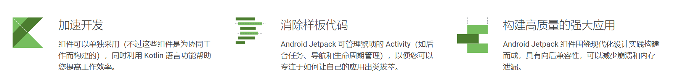
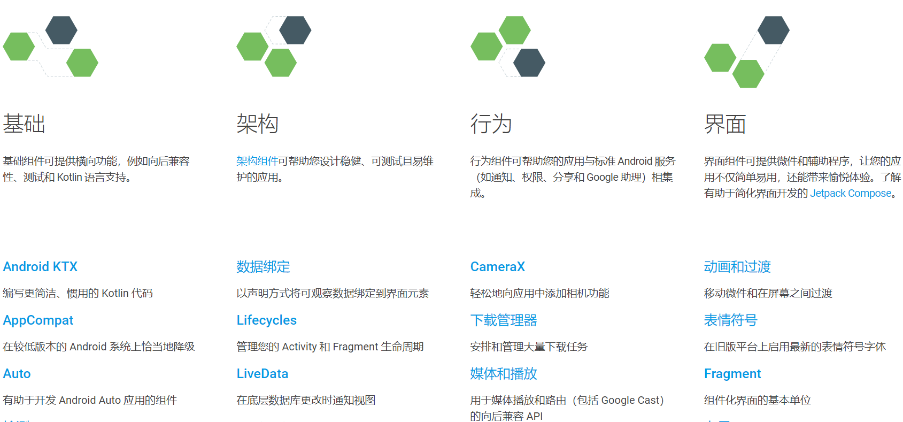
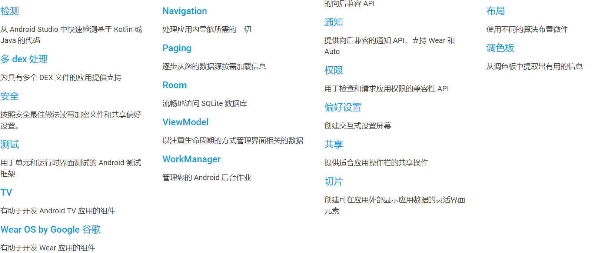
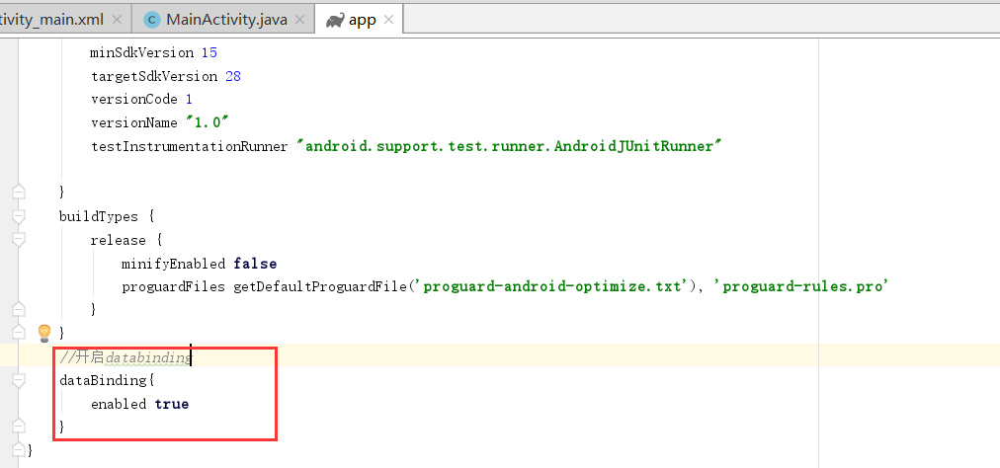
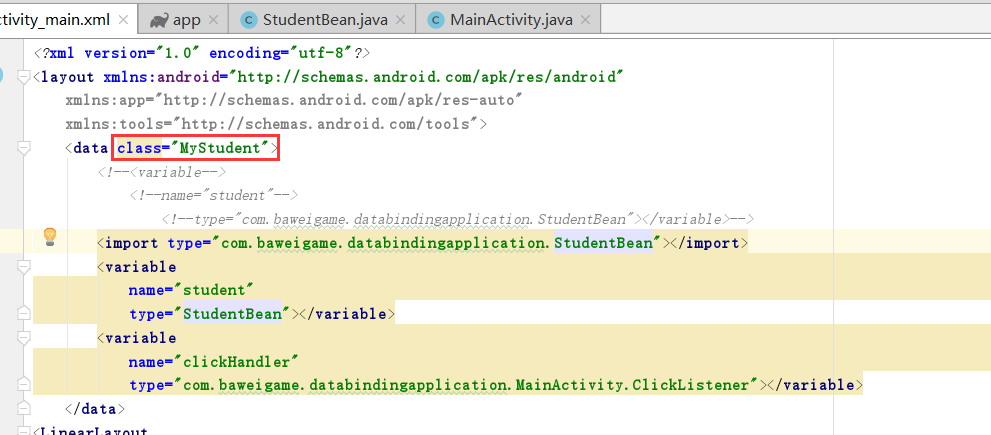

jetpack databinding
**数据绑定库**是一种支持库，借助该库，您可以使用声明性格式（而非程序化地）将布局中的界面组件绑定到应用中的数据源。
<!-- more -->

jetpack官网地址：https://developer.android.google.cn/jetpack/

## 什么是Android Jetpack？

*官方定义如下：*

**Jetpack** 是一套库、工具和指南，可帮助开发者更轻松地编写优质应用。这些组件可帮助您遵循最佳做法、让您摆脱编写样板代码的工作并简化复杂任务，以便您将精力集中放在所需的代码上。

**Jetpack** 包含与平台 API 解除捆绑的 androidx.* 软件包库。这意味着，它可以提供向后兼容性，且比 Android 平台的更新频率更高，以此确保您始终可以获取最新且最好的 Jetpack 组件版本。


Jetpack 组件是库的集合，这些库是为协同工作而构建的，不过也可以单独采用，同时利用 Kotlin 语言功能帮助您提高工作效率。可全部使用，也可混合搭配！





****
# Databinding

## 概念解释

参考链接：https://developer.android.google.cn/topic/libraries/data-binding/


**数据绑定库**是一种支持库，借助该库，您可以使用声明性格式（而非程序化地）将布局中的界面组件绑定到应用中的数据源。

比较一下Databinding给我们带来的不同之处。

看一段我们之前的代码
``` java
TextView textView = findViewById(R.id.tv_login_username);
textView.setText(User.getUserName());
```
这段代码很简单，实现的逻辑是找到TextView控件并设置其Text属性值。再来看看Databinding的实现方式。
```java
<TextView
        android:text="@{User.userName}" />
```
我们发现Databinding方式并没有使用java代码就实现了控件查找并设置Text属性值。
带来的好处是其维护起来更简单、方便。还可以提高应用性能，并且有助于防止内存泄漏以及避免空指针异常。
****
### Demo演示Databinding使用过程
#### 第一步 开启databinding
在工程build.gradle文件中开启databinding，如:

****
#### 第二步 新建实体bean类\业务实体类
新建实体bean类，如：
```java
package com.baweigame.databindingapplication;

import android.databinding.ObservableField;

public class StudentBean {
    public ObservableField<String> name=new ObservableField<>();
    private int id;
    private int age;
    private String address;

    public StudentBean() {
    }

    public int getId() {
        return id;
    }

    public void setId(int id) {
        this.id = id;
    }


    public int getAge() {
        return age;
    }

    public void setAge(int age) {
        this.age = age;
    }

    public String getAddress() {
        return address;
    }

    public void setAddress(String address) {
        this.address = address;
    }
}
```
public ObservableField<String> name=new ObservableField<>();
这里有个很有趣的东西如上。
——ObservableFields一个类中的单独的字段做观察，如果数据有变动则会收到通知。
除了ObservableField，还有ObservableBoolean、ObservableInt...

**另一种实现：**
```java
public class StudentBean extends BaseObservable{
    @Bindable
    private String name;
    private int id;
    private int age;
    private String address;

    public String getName() {
        return name;
    }

    public void setName(String name) {
        this.name = name;
        notifyPropertyChanged(BR.name);
    }

    public int getId() {
        return id;
    }

    public void setId(int id) {
        this.id = id;
    }

    public int getAge() {
        return age;
    }

    public void setAge(int age) {
        this.age = age;
    }

    public String getAddress() {
        return address;
    }

    public void setAddress(String address) {
        this.address = address;
    }
}
```
我们发现了一些差异，首先继承了BaseObservable
参考链接：https://developer.android.google.cn/reference/android/databinding/BaseObservable

@Bindable 可以加到字段名上 也可以加载 get方法上 效果是一样

set方法上手动调用notifyPropertyChanged通知数据更新，注意：参数要写BR.XX（这是一个坑）

*上面两处差异部分我们先记录下来，下面具体Demo演示时我们看具体有什么用处。*

新建响应点击事件业务处理类，如：
```java
    public class ClickListener{
        public void btnClickListener(View view){
            studentBean.setName("新名字");
        }
    }
```
****
#### 第三步 新建布局文件 
新建layout布局并设置绑定关系
```xml
<?xml version="1.0" encoding="utf-8"?>
<layout xmlns:android="http://schemas.android.com/apk/res/android"
    xmlns:app="http://schemas.android.com/apk/res-auto"
    xmlns:tools="http://schemas.android.com/tools">
    <data>
        <variable
            name="student"
            type="com.baweigame.databindingapplication.StudentBean"></variable>
        <variable
            name="clickHandler"
            type="com.baweigame.databindingapplication.MainActivity.ClickListener"></variable>
    </data>
<LinearLayout
    android:orientation="vertical"
    android:layout_width="match_parent"
    android:layout_height="match_parent">
    <TextView
        android:layout_width="match_parent"
        android:layout_height="wrap_content"
        android:text="@{student.name}"/>
    <TextView
        android:layout_width="match_parent"
        android:layout_height="wrap_content"
        android:text="@{String.valueOf(student.age)}"/>
    <TextView
        android:layout_width="match_parent"
        android:layout_height="wrap_content"
        android:text="@{student.address}"/>
    <Button
        android:text="点击"
        android:layout_width="wrap_content"
        android:layout_height="wrap_content"
        android:onClick="@{clickHandler.btnClickListener}"/>
</LinearLayout>


</layout>
```
首先我们看根节点变成了layout 并且下方为data节点 ，data节点中有包含了variable节点，这些节点都什么作用，下面我们一一说明：
- 最外层用layout标签，databinding固定写法
- data标签就是一个让我们数据绑定的标签
- variable放置绑定的变量
- variable包含type和name属性
- type属性 标识变量类型，比如java.lang.String这就是String类型，com.baweigame.databindingapplication.StudentBean 这个就是一个定义的一个StudentBean类型
com.baweigame.databindingapplication.MainActivity.ClickListener是我定义用于处理事件的业务类型
- name属性 表示的就是我定义的一个变量名称，这个变量名称我们会在下方的布局和对应的java代码中用到 

variable还有另一种写法如：
```xml
<data>
        <!--<variable-->
            <!--name="student"-->
                <!--type="com.baweigame.databindingapplication.StudentBean"></variable>-->
        <import type="com.baweigame.databindingapplication.StudentBean"
        <variable
            name="student"
            type="StudentBean"></variable>
        <variable
            name="clickHandler"
            type="com.baweigame.databindingapplication.MainActivity.ClickListener"></variable>
    </data>
```

其中**@{}**就是我们绑定数据的写法。

其中大家应该注意
```java
@{String.valueOf(Student.age)}
```
##### 表达式
即可以嵌入表达式，可以在表达式语言中使用以下运算符和关键字：

1. 基本运算 + - / * %
2. 字符串连接 +
3. 逻辑表达式 && ||
4. 二进制 & | ^
5. 一元运算符 + - ! ~
6. 移位 >> >>> <<
7. 比较运算 == > < >= <=
8. instanceof
9. 分组 ()
10. 字面值 - 字符，字符串，数字， null
11. 强转
12. 方法调用
13. 属性访问
14. 数组访问 []
15. 三元运算符 ?:

绑定处理事件
```java
@{clickHandler.btnClickListener}
```
事件处理部分：(方法与butterknife处理事件类似)
```java
public void btnClickListener(View view){
//            studentBean.name.set("新名字");
            studentBean.setName("新名字");
        }
```
大家注意到方法中我们修改了studentbean类中name值，这里面为什么修改name值ui上会同步更新就是因为上面我们的两种设置，如：
方法一：
```java
public ObservableField<String> name=new ObservableField<>();
```
方法二：
```java
 public void setName(String name) {
        this.name = name;
        notifyPropertyChanged(BR.name);
    }
```
****
#### 最后 设置Activity content
就是MainActivity中的setContentView处理，我们之前设置内容视图方法都是使用setContentView，在Databinding中我们需要如下设置方法：
```java
 ActivityMainBinding dataBinding = DataBindingUtil.setContentView(this, R.layout.activity_main);
//        studentBean.name.set("小明");
        studentBean.setName("小明");
        studentBean.setAddress("北京市朝阳区");
        studentBean.setAge(20);
        studentBean.setId(1);
        dataBinding.setStudent(studentBean);
        dataBinding.setClickHandler(new ClickListener());
```

ActivityMainBinding即自动生成的绑定类，我们看这个类生成的类名是我们的layout名+Binding组成，即生成规则=layout名+Binding
当然你也可以自定义类名，方法如：

```java
  MyStudent dataBinding = DataBindingUtil.setContentView(this, R.layout.activity_main);
```
****
如上即通过一个小Demo演示了DataBinding的具体使用方式。