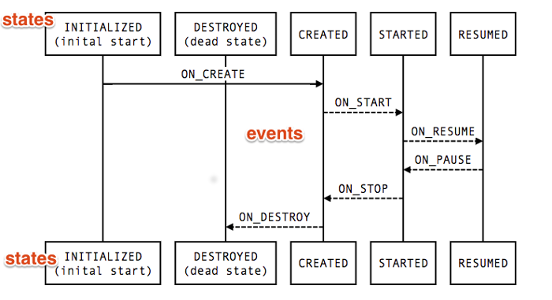
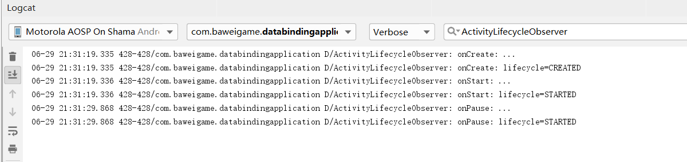

Lifecycle-aware components perform actions in response to a change in the lifecycle status of another component, such as activities and fragments. These components help you produce better-organized, and often lighter-weight code, that is easier to maintain.

A common pattern is to implement the actions of the dependent components in the lifecycle methods of activities and fragments. However, this pattern leads to a poor organization of the code and to the proliferation of errors. By using lifecycle-aware components, you can move the code of dependent components out of the lifecycle methods and into the components themselves.

<!--more-->

生命周期感知组件执行操作，以响应另一个组件生命周期状态的更改，例如Activity和Fragment。这些组件可以帮助您生成更有组织、更容易维护的轻量级代码。

一个常见的模式是在Activity和Fragment的生命周期方法中实现依赖组件的操作。但是，这种模式会导致代码错误的增加。通过使用生命周期感知组件，您可以将依赖组件的代码从生命周期方法转移到组件本身。


参考链接：https://developer.android.google.cn/topic/libraries/architecture/lifecycle

Android中的大多数应用程序组件都具有生命周期,如：Activity/Service/Fragment等。生命周期由操作系统或Framwork管理。它们是Android工作原理的核心，应用程序必须遵守它们。不这样做可能会引发内存泄漏，甚至应用程序崩溃。

可能我们之前的使用方法，如下代码：

```java
class MyLocationListener {
    public MyLocationListener(Context context, Callback callback) {
        // ...
    }

    void start() {
        // connect to system location service
    }

    void stop() {
        // disconnect from system location service
    }
}

class MyActivity extends AppCompatActivity {
    private MyLocationListener myLocationListener;

    @Override
    public void onCreate(...) {
        myLocationListener = new MyLocationListener(this, (location) -> {
            // update UI
        });
    }

    @Override
    public void onStart() {
        super.onStart();
        myLocationListener.start();
        // manage other components that need to respond
        // to the activity lifecycle
    }

    @Override
    public void onStop() {
        super.onStop();
        myLocationListener.stop();
        // manage other components that need to respond
        // to the activity lifecycle
    }
}
```
*上面代码来源于https://developer.android.google.cn/topic/libraries/architecture/lifecycle*

尽管这个示例看起来很好，但是在实际应用程序中，最终会有太多的调用来管理UI和其他组件，以响应生命周期的当前状态。管理多个组件会在生命周期方法中放置大量的代码，比如onStart()和onStop()，这使得它们很难维护。此外，不能保证组件在活动或片段停止之前启动。如果我们需要执行长时间运行的操作，比如一些配置check in onStart()，这一点尤其重要。这可能会导致一个竞态条件，即onStop()方法在onStart()之前结束，从而使组件存活的时间超过所需的时间。

Lifecycle是一个类，它保存关于组件(如Activity或Fragment)生命周期状态的信息，并允许其他对象观察这个状态。Lifecycle使用两个主要枚举来跟踪其关联组件的生命周期状态:

Event
从框架和Lifecycle类发出的生命周期事件。这些事件映射到活动和片段中的回调事件。
State
声明生命周期对象跟踪的组件的当前状态。


上图演示了States与events的对应关系。


先看一下如下两个系统接口：

```java
public interface LifecycleOwner {
    /**
     * Returns the Lifecycle of the provider.
     *
     * @return The lifecycle of the provider.
     */
    @NonNull
    Lifecycle getLifecycle();
}
```

```java

public interface LifecycleObserver {

}
```

**一个Demo演示：**
```java
package com.baweigame.databindingapplication;

import android.arch.lifecycle.Lifecycle;
import android.arch.lifecycle.LifecycleObserver;
import android.arch.lifecycle.OnLifecycleEvent;
import android.util.Log;

public class ActivityLifecycleObserver implements LifecycleObserver {

    private final String TAG=ActivityLifecycleObserver.class.getSimpleName();

    private Lifecycle mLifecycle;
    public ActivityLifecycleObserver(Lifecycle lifecycle) {
        mLifecycle=lifecycle;
    }

    @OnLifecycleEvent(Lifecycle.Event.ON_START)
    void onStart(){
        Log.d(TAG, "onStart: ...");
        Log.d(TAG, "onStart: lifecycle="+mLifecycle.getCurrentState().name());
    }

    @OnLifecycleEvent(Lifecycle.Event.ON_CREATE)
    void onCreate(){
        Log.d(TAG, "onCreate: ...");
        Log.d(TAG, "onCreate: lifecycle="+mLifecycle.getCurrentState().name());
    }

    @OnLifecycleEvent(Lifecycle.Event.ON_PAUSE)
    void onPause(){
        Log.d(TAG, "onPause: ...");

        Log.d(TAG, "onPause: lifecycle="+mLifecycle.getCurrentState().name());
    }


}

```
MainActivity的onCreate中将上面的Observer注册为观察者（典型的观察者模式）
```java
getLifecycle().addObserver(new ActivityLifecycleObserver(getLifecycle()));
```
我们看到注解 OnLifecycleEvent 即 我们上面提到的Event。再来看一下输出：

我们注意到上面的代码中，如：
```java
Log.d(TAG, "onCreate: lifecycle="+mLifecycle.getCurrentState().name());
```
打印了State信息。输出的State信息与我们上图中的State信息对应。

如上就是我们用一个小demo演示了一下lifecycle的使用方法。

可能大家看后还不清楚lifecycle究竟再我们实际工作开发中能帮我们处理什么问题，下面我给大家列举一个使用场景中的实际问题，如：
MVP架构这个大家应该都不陌生，Prestener层之前我们的管理代码片段如下：
```java
class MyActivity extends AppCompatActivity {
    private MyPresenter presenter;

    public void onCreate(...) {
        presenter= new MyPresenter ();
        presenter.create();
    }

    public void onDestroy() {
        super.onDestroy();
        presenter.destory();
    }
}
```
相信如上代码段会出现在大家的工程项目中，这样的后果是导致相应生命周期中代码臃肿也不利于维护。
使用lifecycle可以解决如上问题，如：
```java
public interface IPresenter extends LifecycleObserver {

    @OnLifecycleEvent(Lifecycle.Event.ON_CREATE)
    void onCreate(@NotNull LifecycleOwner owner);

    @OnLifecycleEvent(Lifecycle.Event.ON_DESTROY)
    void onDestroy(@NotNull LifecycleOwner owner);

    @OnLifecycleEvent(Lifecycle.Event.ON_ANY)
    void onLifecycleChanged(@NotNull LifecycleOwner owner,
                            @NotNull Lifecycle.Event event);
}
```
这样让我们的BasePresenter实现这个接口，在我们的Presenter中就可以感知到组件的生命周期，在接口方法中做业务处理即可。

