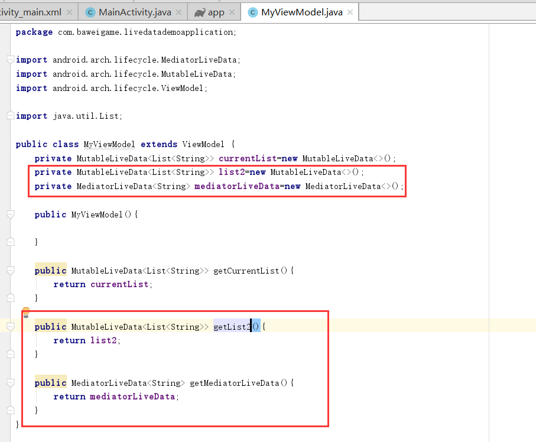
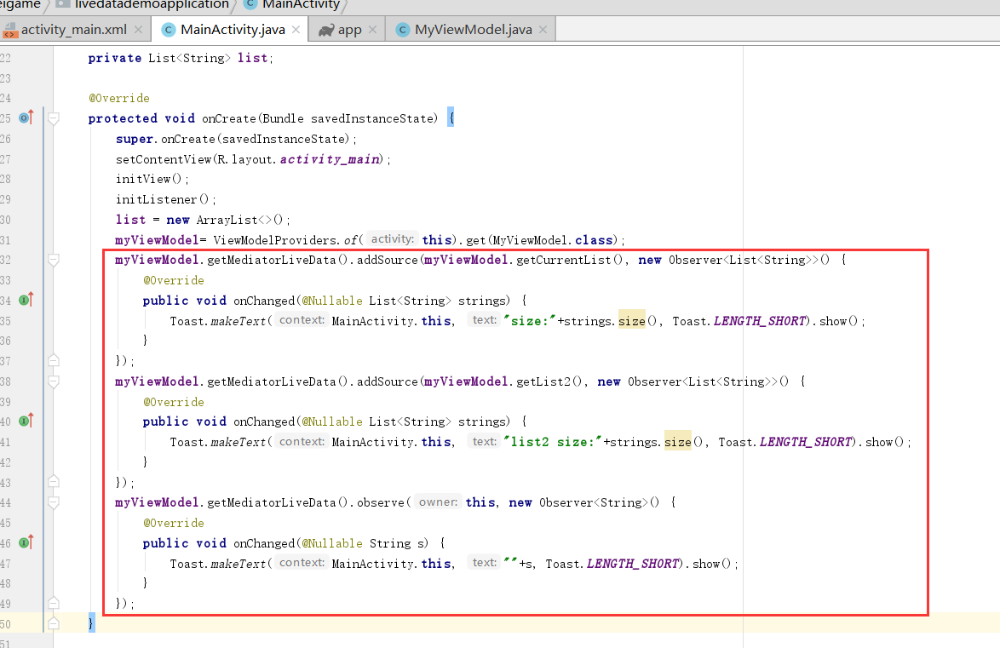
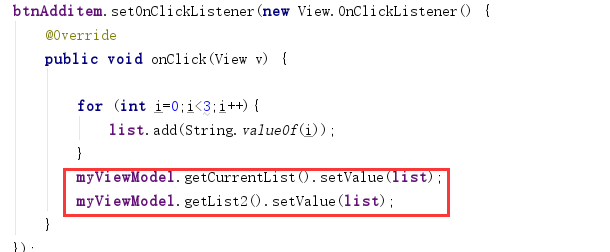

**LiveData**是一个可观察的数据持有者类。与常规的可观察对象不同，LiveData是生命周期感知的，这意味着它尊重其他应用程序组件的生命周期，比如Activity、Fragment或Service。这种意识确保LiveData只更新处于活动生命周期状态的应用程序组件观察者。

LiveData认为，如果一个观察者的生命周期处于STARTED或RESUMED状态，那么这个观察者(由observer类表示)就处于活动状态。LiveData只将更新通知活动观察者。注册为监视LiveData对象的非活动观察者不会收到有关更改的通知。您可以注册一个与实现LifecycleOwner接口的对象配对的观察者。当相应的生命周期对象的状态更改为 DESTROYED时，此关系允许删除观察者。这对于Activity和Fragment尤其有用，因为它们可以安全地观察LiveData对象，而不用担心泄漏，当Activity和Fragment的生命周期被破坏时，它们会立即取消订阅。

<!--more-->

LiveData有哪些优点呢?

1、保证UI与数据状态同步

LiveData遵循观察者模式。当生命周期状态发生变化时，LiveData通知观察者对象。可以合并代码来更新这些观察者对象中的UI。观察者可以在每次发生更改时更新UI，而不是每次应用程序数据更改时都更新UI。

2、不会发生内存泄漏

观察者被绑定到生命周期对象，并在其关联的生命周期被销毁后进行清理。

3、停止activity不会造成crash

如果观察者的生命周期是不活动的，例如在后堆栈中的活动，那么它不会接收任何LiveData事件。

4、不需要手动管理生命周期

UI组件只观察相关数据，不停止或恢复观察。LiveData自动管理所有这些，因为它在观察过程中知道相关的生命周期状态变化。

5、总是最新的数据

如果一个生命周期变为不活动的，它将在再次活动时接收最新的数据。例如，在后台的活动在返回到前台后立即接收最新的数据。

6、适当的配置更改

如果某个Activity或Fragment由于配置更改(如设备旋转)而重新创建，它将立即接收最新可用数据。

7、共享数据

可以使用singleton模式扩展LiveData对象来包装系统服务，以便在您的应用程序中共享它们。LiveData对象连接到系统服务一次，然后任何需要该资源的观察者都可以查看LiveData对象

参考：https://developer.android.google.cn/topic/libraries/architecture/livedata

LiveData是一个装饰器，可以用于任何数据，包括实现集合的对象，比如List。LiveData对象通常存储在ViewModel对象中，并通过getter方法访问。

---

**一个示例**
新建ViewModel之类

```java
package com.baweigame.livedatademoapplication;

import android.arch.lifecycle.MediatorLiveData;
import android.arch.lifecycle.MutableLiveData;
import android.arch.lifecycle.ViewModel;

import java.util.List;

public class MyViewModel extends ViewModel {
    private MutableLiveData<List<String>> currentList=new MutableLiveData<>();
    public MutableLiveData<List<String>> getCurrentList(){
        return currentList;
    }
}

```

Activity布局文件

```xml
<?xml version="1.0" encoding="utf-8"?>
<LinearLayout xmlns:android="http://schemas.android.com/apk/res/android"
    xmlns:app="http://schemas.android.com/apk/res-auto"
    xmlns:tools="http://schemas.android.com/tools"
    android:layout_width="match_parent"
    android:layout_height="match_parent"
    android:orientation="vertical"
    tools:context=".MainActivity">

    <TextView
        android:id="@+id/tv_txt"
        android:layout_width="wrap_content"
        android:layout_height="wrap_content"
        android:text="Hello World!" />

    <Button
        android:id="@+id/btn_additem"
        android:layout_width="wrap_content"
        android:layout_height="wrap_content"
        android:text="增加list item"/>


</LinearLayout>
```

Activity 代码
```java
package com.baweigame.livedatademoapplication;

import android.arch.lifecycle.Observer;
import android.arch.lifecycle.ViewModelProvider;
import android.arch.lifecycle.ViewModelProviders;
import android.support.annotation.Nullable;
import android.support.v7.app.AppCompatActivity;
import android.os.Bundle;
import android.view.View;
import android.widget.Button;
import android.widget.TextView;

import java.util.ArrayList;
import java.util.List;

public class MainActivity extends AppCompatActivity {
    private TextView tvTxt;
    private Button btnAdditem;

    private MyViewModel myViewModel;
    private List<String> list;

    @Override
    protected void onCreate(Bundle savedInstanceState) {
        super.onCreate(savedInstanceState);
        setContentView(R.layout.activity_main);
        initView();
        initListener();
        list = new ArrayList<>();
        myViewModel= ViewModelProviders.of(this).get(MyViewModel.class);
        myViewModel.getCurrentList().observe(this, new Observer<List<String>>() {
            @Override
            public void onChanged(@Nullable List<String> strings) {
                tvTxt.setText("当前存在"+strings.size()+"条数据");
            }
        });
    }

    private void initListener() {
        btnAdditem.setOnClickListener(new View.OnClickListener() {
            @Override
            public void onClick(View v) {

                for (int i=0;i<3;i++){
                    list.add(String.valueOf(i));
                }
                myViewModel.getCurrentList().setValue(list);
            }
        });
    }

    private void initView() {
        tvTxt = (TextView) findViewById(R.id.tv_txt);
        btnAdditem = (Button) findViewById(R.id.btn_additem);
    }
}

```

代码很简单，主要实现了使用LiveData的子类MutableLiveData 包含了List<String>类型数据，页面上一个Button控件一个Textview控件，点击Button控件通过MutableLiveData的setValue方法更新数据。TextView文本更新list的size。

如上演示了LiveData的基本使用方式。

MutableLiveData 类继承于LiveData
```java
public class MutableLiveData<T> extends LiveData<T> {
    @Override
    public void postValue(T value) {
        super.postValue(value);
    }

    @Override
    public void setValue(T value) {
        super.setValue(value);
    }
}
```
提供2个方法，分别为：**postValue**与**setValue**
setValue——只能从main线程调用
postValue——可以从非主线程调用

MutableLiveData还有一个子类MediatorLiveData 可观察多个LiveData对象，响应来自所观察LiveData对象的onChanged事件。

我们修改一下上面的示例来演示一下MediatorLiveData

我们加入另一个MutableLiveData list2 和 MediatorLiveData mediatorLiveData
activity代码修改为

调用了MediatorLiveData 方法加入了上面的两个MutableLiveData，并在观察者（Observer）中onChanged方法中吐丝了list的size。
注意最下面的方法observe，如果不调用该方法进行注册上面的onChanged方法是不会回调的。

我们分别设置了两个MutableLiveData的value。
运行程序我们发现两个观察者都弹出了吐丝。

---
