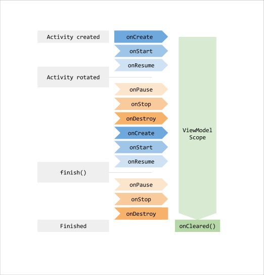

**ViewModel**类旨在以生命周期的方式存储和管理ui相关的数据。ViewModel类允许数据在配置更改(如屏幕旋转)之后继续存活下来。
<!--more-->

聊聊ViewModel主要作用？
1、应用于MVVM模式将UI层与Model业务层分离。
2、可以存储数据（如：fragment之间共享数据）
3、为UI提供数据

---

Android Framwork管理UI控件的生命周期，比如Activity和Fragment。Framwork可能决定销毁或重新创建一个UI控件，以响应某些用户操作或设备事件。如果系统销毁或重新创建一个UI控件，您存储在其中的任何与UI相关的临时数据都将丢失。例如，您的应用程序可能在其中一个活动中包含一个用户列表。当为配置更改重新创建活动时，新活动必须重新获取用户列表。对于简单数据,活动可以使用方法在onCreate()中恢复数据,但这种方法只适用于少量的数据可以序列化反序列化,而不是潜在的大量数据的用户列表或位图。另一个问题是UI控制器经常需要进行异步调用，这可能需要一些时间才能返回。UI控制器需要管理这些调用，并确保系统在销毁这些调用后对其进行清理，以避免潜在的内存泄漏。这种管理需要大量的维护，并且在为配置更改重新创建对象的情况下，这是对资源的浪费，因为对象可能不得不重新发出它已经发出的调用。活动和片段等UI控件主要用于显示UI数据、响应用户操作或处理操作系统通信(如权限请求)。要求UI控制器也负责从数据库或网络加载数据，会使类膨胀。将过多的责任分配给UI控制器可能导致一个类试图独自处理应用程序的所有工作，而不是将工作委托给其他类。以这种方式将过多的责任分配给UI控制器也会使测试变得更加困难。将视图数据所有权从UI控制器逻辑中分离出来更容易也更有效。

体系结构组件为负责UI准备数据的UI控制器提供ViewModel helper类。在配置更改期间自动保留ViewModel对象，以便它们所持有的数据可以立即用于下一个Activity或Fragment实例。例如，如果您需要在应用程序中显示用户列表，请确保将获取和保存用户列表的责任分配给ViewModel，而不是activity或fragment。

ViewModel对象的作用域是在获取ViewModel时传递给ViewModelProvider的生命周期。视图模型一直保存在内存中，直到它的作用域永久消失:对于Activity，当它结束时，而对于Fragment，当它被分离时。下图说明了一个活动在进行旋转并完成时的各种生命周期状态。图中还显示了关联活动生命周期旁边的ViewModel的生命周期。这个图说明了活动的状态。同样的基本状态也适用于片段的生命周期。

参考：https://developer.android.google.cn/topic/libraries/architecture/viewmodel

---
一个Demo来演示ViewModel使用