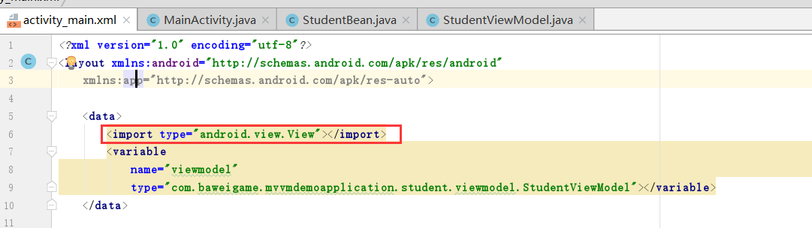

MVVM是Model-View-ViewModel的简写。它本质上就是MVC 的改进版。MVVM 就是将其中的View 的状态和行为抽象化，让我们将视图 UI 和业务逻辑分开。当然这些事 ViewModel 已经帮我们做了，它可以取出 Model 的数据同时帮忙处理 View 中由于需要展示内容而涉及的业务逻辑。

——百度百科
****
<!--more-->

Mvvm架构与Mvp架构相同的是同样分为三层，并且对应层的职责功能相同：

Model层——主要负责提供数据。Model层提供数据如：网络数据及本地数据库中提取的数据，及数据结构如实体bean类。

ViewModel层——同Mvp中P层，主要负责业务逻辑的处理。通过使用官方的Databinding组件进行View层的数据更新等。ViewModel层中不包含任何View层api，使用双向绑定对View层控件进行数据更新，同样不需要View层的引用。

View层——负责界面的显示，View层只管负责UI展示不涉及任何业务逻辑，持有ViewModel层的引用。

Mvvm与Mvp的最大区别在于ViewModel层中不持有View层的引用，这样可以解耦View层，即View层的修改不会影响ViewModel层，同样使代码可测试性增强。也同样给项目团队协作提供可能，这样负责UI开发的人员和负责开发业务功能的人员可以专心关注自己的工作。

Mvvm带来的好处还有减少了很多代码，比如：findViewById 和 操作UI的代码。
****

**举个栗子：**

*新建工程*

一般我们习惯与建立模块后再模块下建立mvvm结构目录。如下图：


****
**实体bean**

```java
package com.baweigame.mvvmdemoapplication.student.model;

public class StudentBean {
    private String name;
    private int age;
    private String address;

    public StudentBean(String name, int age, String address) {
        this.name = name;
        this.age = age;
        this.address = address;
    }

    public StudentBean() {
    }

    @Override
    public String toString() {
        return "StudentBean{" +
                "name='" + name + '\'' +
                ", age=" + age +
                ", address='" + address + '\'' +
                '}';
    }

    public String getName() {
        return name;
    }

    public void setName(String name) {
        this.name = name;
    }

    public int getAge() {
        return age;
    }

    public void setAge(int age) {
        this.age = age;
    }

    public String getAddress() {
        return address;
    }

    public void setAddress(String address) {
        this.address = address;
    }
}

```
****
**ViewModel类**
```java
package com.baweigame.mvvmdemoapplication.student.viewmodel;

import android.databinding.ObservableBoolean;
import android.databinding.ObservableField;
import android.os.Handler;
import android.os.Message;


public class StudentViewModel {
    public final ObservableBoolean isVisible=new ObservableBoolean(false);
    public final ObservableBoolean isSuccess=new ObservableBoolean(false);
    public final ObservableBoolean isFalied=new ObservableBoolean(false);

    public final ObservableField<String> name=new ObservableField<>();

    public void addStudent(){
        mHandler.postDelayed(new Runnable() {
            @Override
            public void run() {
                isVisible.set(true);
                isSuccess.set(true);
                name.set("小红同学");
            }
        },3000);
    }

    private Handler mHandler=new Handler(){
        @Override
        public void handleMessage(Message msg) {
            super.handleMessage(msg);
        }
    };
}

```
****
**Activity Layout xml**
```xml
<?xml version="1.0" encoding="utf-8"?>
<layout xmlns:android="http://schemas.android.com/apk/res/android"
    xmlns:app="http://schemas.android.com/apk/res-auto">

    <data>
        <import type="android.view.View"></import>
        <variable
            name="viewmodel"
            type="com.baweigame.mvvmdemoapplication.student.viewmodel.StudentViewModel"></variable>
    </data>

    <LinearLayout
        android:layout_width="match_parent"
        android:layout_height="match_parent"
        android:orientation="vertical">

        <TextView
            android:layout_width="match_parent"
            android:layout_height="wrap_content"
            android:text="@{viewmodel.name}"
            android:textColor="@android:color/holo_orange_dark"
            android:textSize="20sp" />

        <View
            android:layout_width="match_parent"
            android:layout_height="2dp"
            android:background="@android:color/holo_green_light"
            android:visibility="@{viewmodel.isVisible?View.VISIBLE:View.GONE}">

        </View>

        <TextView
            android:layout_width="match_parent"
            android:layout_height="wrap_content"
            android:text="添加成功"
            android:textColor="@android:color/holo_red_light"
            android:textSize="20sp"
            android:visibility="@{viewmodel.isSuccess?View.VISIBLE:View.GONE}" />

        <Button
            android:layout_width="wrap_content"
            android:layout_height="wrap_content"
            android:onClick="@{()->viewmodel.addStudent()}"
            android:text="添加学生" />
    </LinearLayout>
</layout>
```
****
**Activity代码**
```java
package com.baweigame.mvvmdemoapplication.student.view;

import android.databinding.DataBindingUtil;
import android.databinding.ViewDataBinding;
import android.support.v7.app.AppCompatActivity;
import android.os.Bundle;

import com.baweigame.mvvmdemoapplication.R;
import com.baweigame.mvvmdemoapplication.databinding.ActivityMainBinding;
import com.baweigame.mvvmdemoapplication.student.viewmodel.StudentViewModel;

public class MainActivity extends AppCompatActivity {

    @Override
    protected void onCreate(Bundle savedInstanceState) {
        super.onCreate(savedInstanceState);
        ActivityMainBinding viewDataBinding = DataBindingUtil.setContentView(this, R.layout.activity_main);
        StudentViewModel studentViewModel = new StudentViewModel();
        studentViewModel.name.set("小明同学");
        viewDataBinding.setViewmodel(studentViewModel);
    }
}
```

代码比较简单不再解释。

Databinding可参考[Jetpack系列之Databinding](http://www.zydeveloper.com/2019/07/02/jetpack-databinding/)
****


这里还有一个坑，我们的xml中设置了android:visibility属性 使用代码如：
```xml
android:visibility="@{viewmodel.isVisible?View.VISIBLE:View.GONE}"
```
原因是因为使用了View导致编译时错误，解决方案：

也就是导入View。