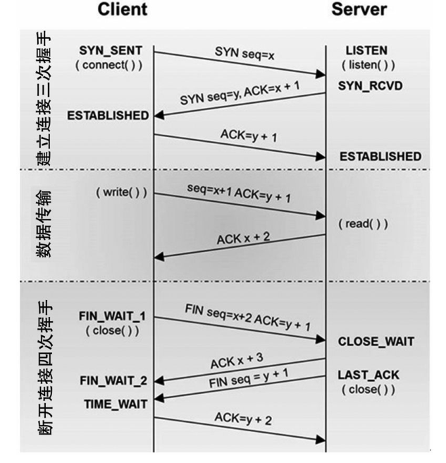
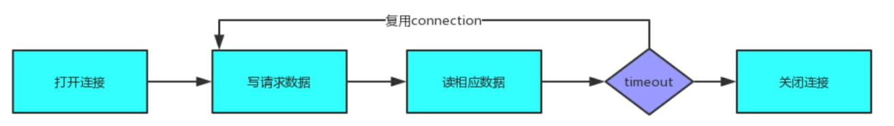
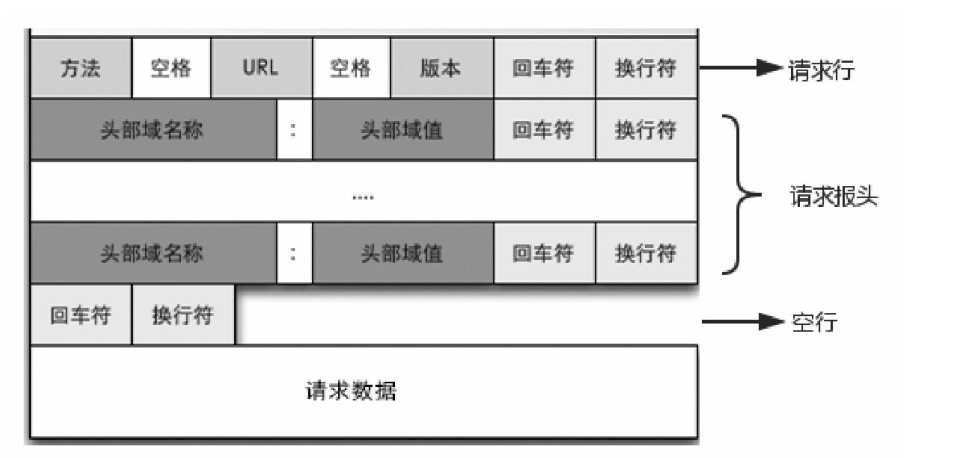
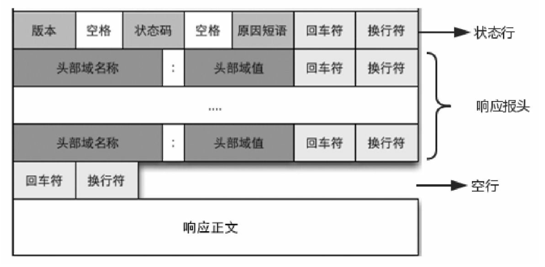

**以下内容摘录自《Android进阶之光》——刘望舒**

### TCP的三次握手与四次挥手
为什么这里要插入TCP的三次握手与四次挥手的知识呢？ 因为在后面章节分析OkHttp源码的时候会涉及。 通常我们进行HTTP连接网络的时候会进行TCP的三次握手， 然后传输数据， 之后再释放连接。

<!--more-->

#### TCP三次握手
TCP三次握手的过程如下。

• 第一次握手： 建立连接。 客户端发送连接请求报文段， 将 SYN 设置为 1、 Sequence Number（seq） 为x； 接下来客户端进入SYN_SENT状态， 等待服务端的确认。

• 第二次握手： 服务器收到客户端的 SYN 报文段， 对 SYN 报文段进行确认， 设置AcknowledgmentNumber（ACK） 为 x+1（seq+1） ； 同时自己还要发送 SYN 请求信息， 将SYN设置为1、 seq为y。 服务端将上述所有信息放到SYN+ACK报文段中， 一并发送给客户端， 此时服务端进入SYN_RCVD状态。

• 第三次握手： 客户端收到服务端的SYN+ACK报文段； 然后将ACK设置为y+1， 向服务端发送ACK报文段， 这个报文段发送完毕后， 客户端和服务端都进入ESTABLISHED （TCP连接成功）状态， 完成TCP的三次握手。

#### 四次挥手
当客户端和服务端通过三次握手建立了TCP连接以后， 当数据传送完毕， 断开连接时就需要进行TCP的四次挥手。 其四次挥手如下所示。

• 第一次挥手： 客户端设置seq和ACK， 向服务端发送一个FIN报文段。 此时， 客户端进入FIN_WAIT_1状态， 表示客户端没有数据要发送给服务端了。

• 第二次挥手： 服务端收到了客户端发送的FIN报文段， 向客户端回了一个ACK报文段。

• 第三次挥手： 服务端向客户端发送 FIN 报文段， 请求关闭连接， 同时服务端进LAST_ACK状态。

• 第四次挥手： 客户端收到服务端发送的FIN报文段， 向服务端发送ACK报文段， 然后客户端进入TIME_WAIT状态。 服务端收到客户端的ACK报文段以后， 就关闭连接。 此时， 客户端等待2MSL（最大报文段生存时间） 后依然没有收到回复， 则说明服务端已正常关闭， 这样客户端也可以关闭连接了。

如果有大量的连接， 每次在连接、 关闭时都要经历三次握手、 四次挥手， 这很显然会造成性能低下。
因此， HTTP有一种叫作keepalive connections的机制， 它可以在传输数据后仍然保持连接， 当客户端需要再次获取数据时， 直接使用刚刚空闲下来的连接而无须再次握手.

### HTTP协议原理
作为移动开发者， 开发的应用不免会对网络进行访问。 虽然现在已经有很多开源库帮助我们可以轻而易举地访问网络， 但是我们仍需要去了解网络访问的原理， 这也是一个优秀开发人员所必备的知识点。 
#### HTTP简介
HTTP 是一个属于应用层的面向对象的协议， 由于其简捷、 快速的方式， 适用于分布式超媒体信息系统。 它于1990年被提出， 经过几年的使用与发展， 得到不断的完善和扩展。
##### 1.HTTP的历史版本
• HTTP 0.9： 1991年发布的第一个版本， 只有一个命令GET， 服务器只能回应HTML格式的字符串。
• HTTP 1.0： 1996年发布的版本， 内容量大大增加。 除了GET命令外， 还引入了POST命令和HEAD命令。 HTTP请求和回应的格式除了数据部分， 每次通信都必须包括头信息， 用来描述一些元数据。
• HTTP 1.1： 1997发布的版本， 进一步完善了HTTP协议， 直到现在还是最流行的版本。
• SPDY协议： 2009年谷歌为了解决 HTTP 1.1效率不高的问题而自行研发的协议。
• HTTP 2： 2015年新发布的版本， SPDY 协议的主要特性也在此版本中。
##### 2.HTTP协议的主要特点
HTTP协议的主要特点如下。
• 支持C/S（客户/服务器） 模式。
• 简单快速： 客户向服务器请求服务时， 只需传送请求方法和路径。 请求方法常用的有GET、 HEAD、POST， 每种方法规定了客户与服务器联系的类型不同。 由于 HTTP 协议简单，使得HTTP服务器的程序规模小， 因而通信速度很快。
• 灵活： HTTP允许传输任意类型的数据对象。 正在传输的类型由Content-Type加以标记。 • 无连接： 无连接的含义是限制每次连接只处理一个请求。 服务器处理完客户的请求， 并收到客户的应答后， 即断开连接。 采用这种方式可以节省传输时间。
• 无状态： HTTP协议是无状态协议， 无状态是指协议对于事务处理没有记忆能力。 缺少状态意味着如果后续处理需要前面的信息， 则它必须重传， 这样可能导致每次连接传送的数据量增大； 而另一方面， 在服务器不需要先前信息时它的应答速度就较快。

HTTP URL的格式如下所示：

http://host[＂:＂port][abs_path]

http表示要通过HTTP协议来定位网络资源； host表示合法的Internet主机域名或者IP地址； port指定一个端口号， 为空则使用默认端口80； abs_path指定请求资源的URI（Web上任意的可用资源） 。 HTTP有两种报文， 分别是请求报文和响应报文， 下面先来查看请求报文。
#### HTTP请求报文
HTTP 报文是面向文本的， 报文中的每一个字段都是一些ASCII码串， 各个字段的长度是不确定的。 一般一个HTTP请求报文由请求行、 请求报头、 空行和请求数据4个部分组成

##### 1.请求行
请求行由请求方法、 URL字段和HTTP协议的版本组成， 格式如下：

Method Request-URI HTTP-Version CRLF

其中 Method表示请求方法； Request-URI是一个统一资源标识符； HTTP-Version表示请求的HTTP协议版本； CRLF表示回车和换行（除了作为结尾的CRLF外， 不允许出现单独的CR或LF字符） 。

HTTP请求方法有8种， 分别是GET、 POST、 HEAD、 PUT、 DELETE、 TRACE、CONNECT、OPTIONS。

 对于移动开发最常用的就是GET和POST了。

• GET： 请求获取Request-URI所标识的资源。
• POST： 在Request-URI所标识的资源后附加新的数据。
• HEAD： 请求获取由Request-URI所标识的资源的响应消息报头。
• PUT： 请求服务器存储一个资源， 并用Request-URI作为其标识。
• DELETE： 请求服务器删除Request-URI所标识的资源。
• TRACE： 请求服务器回送收到的请求信息， 主要用于测试或诊断。
• CONNECT： HTTP 1.1协议中预留给能够将连接改为管道方式的代理服务器。
• OPTIONS： 请求查询服务器的性能， 或者查询与资源相关的选项和需求。

例如， 访问我的CSDN博客地址的请求行：
GET http://zydeveloper.com

##### 2.请求报头
在请求行之后会有0个或者多个请求报头， 每个请求报头都包含一个名字和一个值， 它们之间用英文冒号“： ”分割。 关于请求报头， 我们会在后面做统一解释。
##### 3.请求数据
请求数据不在GET方法中使用， 而在POST方法中使用。 POST方法适用于需要客户填写表单的场合，与请求数据相关的最常用的请求报头是Content-Type和Content-Length。
#### HTTP响应报文

HTTP 的响应报文由状态行、 响应报头、 空行、 响应正文组成。 关于响应报头， 我们会在后面做统一解释。 响应正文是服务器返回的资源的内容。 我们先来看看状态行。
状态行格式如下所示：

HTTP-Version Status-Code Reason-Phrase CRLF

其中， HTTP-Version表示服务器HTTP协议的版本； Status-Code表示服务器发回的响应状态码； ReasonPhrase表示状态码的文本描述。 状态码由3位数字组成， 第一个数字定义了响应的类别， 且有以下5种可能取值。

• 100～199： 指示信息， 收到请求， 需要请求者继续执行操作。
• 200～299： 请求成功， 请求已被成功接收并处理。
• 300～399： 重定向， 要完成请求必须进行更进一步的操作。
• 400～499： 客户端错误， 请求有语法错误或请求无法实现。
• 500～599： 服务器错误， 服务器不能实现合法的请求。

常见的状态码如下。
• 200 OK： 客户端请求成功。
• 400 Bad Request： 客户端请求有语法错误， 服务器无法理解。
• 401 Unauthorized： 请求未经授权， 这个状态码必须和WWW-Authenticate报头域一起使用。
• 403 Forbidden： 服务器收到请求， 但是拒绝提供服务。
• 500 Internal Server Error： 服务器内部错误， 无法完成请求。
• 503 Server Unavailable： 服务器当前不能处理客户端的请求， 一段时间后可能恢复正常。

例如， 访问我的CSDN博客地址， 响应的状态行如下所示：

HTTP/1.1 200 OK

#### HTTP的消息报头
消息报头分为通用报头、 请求报头、 响应报头、 实体报头等。 消息报头由键值对组成， 每行一对， 关键字和值用英文冒号“： ”分隔。
##### 1.通用报头
它既可以出现在请求报头， 也可以出现在响应报头中， 如下所示。
• Date： 表示消息产生的日期和时间。
• Connection： 允许发送指定连接的选项。 例如指定连接是连续的； 或者指定“close”选项， 通知服务器， 在响应完成后， 关闭连接。
• Cache-Control： 用于指定缓存指令， 缓存指令是单向的（响应中出现的缓存指令在请求中未必会出现） ， 且是独立的（一个消息的缓存指令不会影响另一个消息处理的缓存机制） 。
##### 2.请求报头
请求报头通知服务器关于客户端请求的信息。 典型的请求报头如下所示。
• Host： 请求的主机名， 允许多个域名同处一个IP地址， 即虚拟主机。
• User-Agent： 发送请求的浏览器类型、 操作系统等信息。
• Accept： 客户端可识别的内容类型列表， 用于指定客户端接收哪些类型的信息。
• Accept-Encoding： 客户端可识别的数据编码。
• Accept-Language： 表示浏览器所支持的语言类型。
• Connection： 允许客户端和服务器指定与请求/响应连接有关的选项。 例如， 这时为Keep-Alive则表示保持连接。
• Transfer-Encoding： 告知接收端为了保证报文的可靠传输， 对报文采用了什么编码方式。
##### 3.响应报头
用于服务器传递自身信息的响应。 常见的响应报头如下所示。
• Location： 用于重定向接收者到一个新的位置， 常用在更换域名的时候。
• Server： 包含服务器用来处理请求的系统信息， 与User-Agent请求报头是相对应的。
##### 4.实体报头
实体报头用来定义被传送资源的信息， 其既可用于请求也可用于响应。 请求和响应消息都可以传送一个实体。 常见的实体报头如下所示。
• Content-Type： 发送给接收者的实体正文的媒体类型。
• Content-Lenght： 实体正文的长度。
• Content-Language： 描述资源所用的自然语言。
• Content-Encoding： 实体报头被用作媒体类型的修饰符。 它的值指示了已经被应用到实体正文的附加内容的编码， 因而要获得Content-Type报头域中所引用的媒体类型， 必须采用相应的解码机制。
• Last-Modified： 实体报头用于指示资源的最后修改日期和时间。
• Expires： 实体报头给出响应过期的日期和时间。