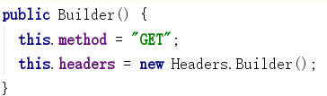

OkHttp的原理及源码分析（上）

<!--more-->

注：我们的OkHttp源码分析是在3.12.0版本

如下是OkHttp的流程图（来源于网络）


如下是我们经常使用的OkHttp的使用场景或者方法，下面我们用一个简单Get请求连进一步分析Okhttp的原理以及源码。
```java
//构建OkHttpClient的实体对象  
//OkHttp给我提供两种创建OkHttpClient对象的方法
//一种是使用Builder.build（）典型建造者方式，可以不断的构建及丰富自己
//一种是直接new来创建，但是它是可以创建一个实例但是只能使用源码中的默认配置
HttpLoggingInterceptor httpLoggingInterceptor=new HttpLoggingInterceptor();
        //创建了一个http请求的日志拦截器
        httpLoggingInterceptor.setLevel(HttpLoggingInterceptor.Level.BODY);
        client = new OkHttpClient.Builder()
                .addNetworkInterceptor(httpLoggingInterceptor)
                //超时设置
                .connectTimeout(10, TimeUnit.SECONDS)
                .readTimeout(10,TimeUnit.SECONDS)
                .writeTimeout(10,TimeUnit.SECONDS)
                .build();
//        client=new OkHttpClient();
```
如下代码演示了一个Get请求使用同步方式获取结果

```java

//                                            Post请求时创建的RequestBody -> FormBody   MultipartBody ContentTypeOverridingRequestBody（这是一个private）
//                        RequestBody requestBody=new FormBody.Builder()
//                                .add("","")
//                                .build();

//                                         使用建造者模式来构建一个Request对象
                        Request request = new Request.Builder()
                                .url("https://www.baidu.com")
                                .get()
//                                .post(requestBody)
                                .build();
//                        如下同步请求
//                        try {
//                            Response response = client.newCall(request).execute();
//                            Log.d("123", "initData: "+response.body().string());
//                        } catch (IOException e) {
//                            e.printStackTrace();
//                        }


//                                          如下异步请求
                        client.newCall(request).enqueue(new Callback() {
                            @Override
                            public void onFailure(Call call, IOException e) {
                                Log.e("123", "onFailure: "+e.getLocalizedMessage() );
                            }


                            @Override
                            public void onResponse(Call call, final Response response) throws IOException {
                                final String msg=response.body().string();
                                Log.d("123", "initData: "+msg);
                                runOnUiThread(new Runnable() {
                                    @Override
                                    public void run() {
                                        tvOkhttpContent.setText(msg);
                                    }
                                });
                            }
                        });
```
首先分享OkHttpClient的构建过程
```java
client = new OkHttpClient.Builder()
                .addNetworkInterceptor(httpLoggingInterceptor)
                //超时设置
                .connectTimeout(10, TimeUnit.SECONDS)
                .readTimeout(10,TimeUnit.SECONDS)
                .writeTimeout(10,TimeUnit.SECONDS)
                .build();
```
Builder（）中代码如下：

```java

public Builder() {
  //分发器初始化
  dispatcher = new Dispatcher();
  //协议部分 
  protocols = DEFAULT_PROTOCOLS;
  connectionSpecs = DEFAULT_CONNECTION_SPECS;
  eventListenerFactory = EventListener.factory(EventListener.NONE);
  proxySelector = ProxySelector.getDefault();
  if (proxySelector == null) {
    proxySelector = new NullProxySelector();
  }
  cookieJar = CookieJar.NO_COOKIES;
  socketFactory = SocketFactory.getDefault();
  hostnameVerifier = OkHostnameVerifier.INSTANCE;
  certificatePinner = CertificatePinner.DEFAULT;
  proxyAuthenticator = Authenticator.NONE;
  authenticator = Authenticator.NONE;
  //初始化了连接池
  connectionPool = new ConnectionPool();
  dns = Dns.SYSTEM;
  followSslRedirects = true;
  followRedirects = true;
  retryOnConnectionFailure = true;
  //超时设置
  callTimeout = 0;
  connectTimeout = 10_000;
  readTimeout = 10_000;
  writeTimeout = 10_000;
  pingInterval = 0;
}
```
Builder（）中属性赋值
```java

.connectTimeout(10, TimeUnit.SECONDS)
  .readTimeout(10,TimeUnit.SECONDS)
  .writeTimeout(10,TimeUnit.SECONDS)
```
.build（）

```java

//创建了OkhttpClient对象并把Builder传递进去
public OkHttpClient build() {
  //将Builder中设置属性直接给OkHttpClient对象赋值了 this->Builder实例
  return new OkHttpClient(this);
}
```
其次，我们来分析Request的构建过程

```java
Request request = new Request.Builder()
                                .url("https://www.baidu.com")
                                .get()
                                .build();
```
Request.Builder() 设置了默认就是GET请求，所以上面.get（）可以不写。初始化了Headers.Builder().



```java
//就是将我们传递的String类型的Url转换为HttpUrl 并赋值
.url("https://www.baidu.com")
```

```java
//给method->"GET" requestBody进行了赋值 其中还包括对method的null 与 “”的判断  还有对requestBody的校验
.get()
```

```java
//校验url不可以为空 然后new 了Request对象并把Builder（）对象传递进去 Request中就是将Builder里面设置的属性赋值给Request中对应的属性
public Request build() {
  if (url == null) throw new IllegalStateException("url == null");
  return new Request(this);
}
```
如下是对Post请求的一些代码跟踪


如下是requestBody的创建，同样这些核心的对象都是通过建造者模式创建的。


RequestBody有如下三个子类：

FormBody一般就是表单提交方式的Post
MultipartBody 一般文件上传/提交
...

FormBody.Builder()的源码如下：

大家能看到Builder（）内部调用了一个构造重载函数，入口参数设置了null 该入口参数是字段字符编码。

接下来add方法，源码如下：


这里值得我们注意的是 names  values 是两个ArrayList数据结构（不像我们平时经常使用的Map）。

如下是build（）的源码：

我们发现创建了FormBody然后把上面的names values传递进去，然后给FormBody的对应属性赋值。
如上就是FormBody的构建构成。

接下来.post(requestBody)

我们发现与GET请求调用了一样的方法 method（xx,xx）
入口参数 method 传递的是“POST”
第二个参数就是我们刚刚构建的FormBody实例