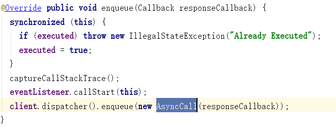
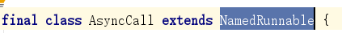

OkHttp的原理及源码分析（下）

<!--more-->

接下来我们来分析OkHttp的真正的网络请求是如何发送的？


client.newCall(request) 的源码分析如下：


newCall实际是调用了RealCall.newRealCall 然后 把okhttpclient（this） 还有构建的get请求的Request对象  还有一个forWebSocket 传递进去。


我们发现newRealCall方法里面首创建了一个RealCall的实例，然后设置了一下eventListener。


如果是RealCall的构造函数，其中很容易发现对入口参数传递过来的值给予RealCall对应属性。重试拦截器的创建就超时处理，超时是在timeout.timeout设置的，其实也就是通过我们OkHttpClient的Builder来进行设置的，如：


然后，如果超时就调用了timedOut方法，最后执行了cancel（）；方法，如下是cancel方法的源码


其实就是调用了重试拦截器的cancel方法。
如上就是client.newCall(request)代码的执行逻辑。

--------------------------------------------------------------------------------------------------

拓展内容：
分析RealCall 实现了 Call  Call 继承了 Cloneable
我们发现Call中使用了原型模式，目的是创建新Call对象。
对应我们的最终实现类是RealCall，所以如果我们要创建一个新的RealCall实例 就可以通过clone方法。
整个设计思路我们可以理解为使用了原型设计模式来进行的处理。

接下来我们将分析enqueue方法，注意入口参数Callback

实际是调用了RealCall的enqueue方法，源码如下：

判断是否当前任务已经在执行，直接就抛一个异常。
设置了一下eventListener的callStart 传入了RealCall实例。
使用client的分发器（dispatcher，它是在OkHttpClient的 Builder（）中初始化）的enqueue方法，该方法传递了一个AsyncCall对象实例，AsyncCall中有传递了responseCallback（它就是我们在代码中调用enqueue时传递的Callback对象）。

下面我们来看AsyncCall，源码如下：
构造函数如下，很简单就是把外面的responseCallback进行复制给它的对应属性。

下面来看一下AsyncCall它的继承关系。

我们发现继承了NamedRunnable，如下是NamedRunnable的源码：

```java
//继承了Runnable接口 并且实现了Runnable的run方法
public abstract class NamedRunnable implements Runnable {
  protected final String name;
  public NamedRunnable(String format, Object... args) {
    this.name = Util.format(format, args);
  }
  @Override public final void run() {
    String oldName = Thread.currentThread().getName();
    Thread.currentThread().setName(name);
    try {
      //执行子类中需要实现的execute（）方法
      execute();
    } finally {
      Thread.currentThread().setName(oldName);
    }
  }
  //该类需要子类必须实现
  protected abstract void execute();
}
```
下面我们来继续分享 client.dispather().enqueue(...)方法。

Dispather.java 类中enqueue方法如下：

首先将传递过来的call加入到readyAsyncCalls队列中，如下是readyAsyncCalls的初始化代码：

下面是promoteAndExecute代码的执行逻辑

```java
private boolean promoteAndExecute() {
  assert (!Thread.holdsLock(this));
  //初始化了一个任务执行计划
  List<AsyncCall> executableCalls = new ArrayList<>();
  boolean isRunning;
  synchronized (this) {
    //迭代readAsyncCalls队列
    for (Iterator<AsyncCall> i = readyAsyncCalls.iterator(); i.hasNext(); ) {
      //获取到请求任务
      AsyncCall asyncCall = i.next();
      //runningAsyncCalls.size 如果大于 maxRequests(64) 直接跳出循环
      if (runningAsyncCalls.size() >= maxRequests) break; // Max capacity.
      //判断请求数量大于了已经设置的host的处理任务阀值（maxRequestRerHost=5）跳出当前循环
      if (runningCallsForHost(asyncCall) >= maxRequestsPerHost) continue; // Host max capacity.
      //readyAsyncCalls 中对于 AsyncCall 移除掉
      i.remove();
      //然后把asyncCall加入到executableCalls集合中
      executableCalls.add(asyncCall);
      //然后又把asyncCall加入到runningAsyncCalls队列里面来
      runningAsyncCalls.add(asyncCall);
    }
    isRunning = runningCallsCount() > 0;
  }
  for (int i = 0, size = executableCalls.size(); i < size; i++) {
    //从上面局部定义请求集合中取出将要执行的任务
    AsyncCall asyncCall = executableCalls.get(i);
    //执行任务 传递了一个入口参数 使用的方法executorService（）（该方法目的是获取线程池）
    asyncCall.executeOn(executorService());
  }
  return isRunning;
}
```
executorService（）创建并获取线程池，源码如下：
```java
//创建线程池
public synchronized ExecutorService executorService() {
  if (executorService == null) {
    executorService = new ThreadPoolExecutor(0, Integer.MAX_VALUE, 60, TimeUnit.SECONDS,
        new SynchronousQueue<Runnable>(), Util.threadFactory("OkHttp Dispatcher", false));
  }
  return executorService;
}
```
```java
void executeOn(ExecutorService executorService) {
  assert (!Thread.holdsLock(client.dispatcher()));
  //success 是否成功标记
  boolean success = false;
  try {
    //使用外面传入进来的线程池，调用线程池execute方法（该方法入口参数是this -> AsyncCall）
    //为什么传入this给线程池就可以运行？因为AsyncCall继承了NamedRunnable，NamedRunnable实现了Runnable接口
    executorService.execute(this);
    //标记设置true
    success = true;
  } catch (RejectedExecutionException e) {
    //自定义了IO异常
    InterruptedIOException ioException = new InterruptedIOException("executor rejected");
    ioException.initCause(e);
    //回调给EventListener
    eventListener.callFailed(RealCall.this, ioException);
    //回调给我们编写代码时传入的Callback
    responseCallback.onFailure(RealCall.this, ioException);
  } finally {
    //执行成功走如下代码
    if (!success) {
      client.dispatcher().finished(this); // This call is no longer running!
    }
  }
}
```
为什么会走到下面的execute（）？
原因是因为执行 executorService.execute(this);
this=AsyncCall的实例，AsyncCall继承NamedRunnable，NamedRunnable的run方法里面执行了execute（）方法，这个方法是必须由子类来实现的一个方法，也就AsyncCall的execute方法。

```java
@Override protected void execute() {
  boolean signalledCallback = false;
  timeout.enter();
  try {
    //下面这行代码很重要了，从拦截器链中获取执行的响应结果数据
    Response response = getResponseWithInterceptorChain();
    if (retryAndFollowUpInterceptor.isCanceled()) {
      signalledCallback = true;
      responseCallback.onFailure(RealCall.this, new IOException("Canceled"));
    } else {
      signalledCallback = true;
      responseCallback.onResponse(RealCall.this, response);
    }
  } catch (IOException e) {
    e = timeoutExit(e);
    if (signalledCallback) {
      // Do not signal the callback twice!
      Platform.get().log(INFO, "Callback failure for " + toLoggableString(), e);
    } else {
      eventListener.callFailed(RealCall.this, e);
      responseCallback.onFailure(RealCall.this, e);
    }
  } finally {
    client.dispatcher().finished(this);
  }
}
```
如下是责任链处理：
```java
//开始真正的执行网络请求
  Response getResponseWithInterceptorChain() throws IOException {
    // Build a full stack of interceptors.
    // 责任链
    List<Interceptor> interceptors = new ArrayList<>();
    //在配置okhttpClient 时设置的intercept 由用户自己设置
    interceptors.addAll(client.interceptors());
    //负责处理失败后的重试与重定向
    interceptors.add(retryAndFollowUpInterceptor);
    //负责把用户构造的请求转换为发送到服务器的请求 、把服务器返回的响应转换为用户友好的响应 处理 配置请求头等信息
    //从应用程序代码到网络代码的桥梁。首先，它根据用户请求构建网络请求。然后它继续呼叫网络。最后，它根据网络响应构建用户响应。
    interceptors.add(new BridgeInterceptor(client.cookieJar()));
    //处理 缓存配置 根据条件(存在响应缓存并被设置为不变的或者响应在有效期内)返回缓存响应
    //设置请求头(If-None-Match、If-Modified-Since等) 服务器可能返回304(未修改)
    //可配置用户自己设置的缓存拦截器
    interceptors.add(new CacheInterceptor(client.internalCache()));
    //连接服务器 负责和服务器建立连接 这里才是真正的请求网络
    interceptors.add(new ConnectInterceptor(client));
    if (!forWebSocket) {
      //配置okhttpClient 时设置的networkInterceptors
      //返回观察单个网络请求和响应的不可变拦截器列表。
      interceptors.addAll(client.networkInterceptors());
    }
    //执行流操作(写出请求体、获得响应数据) 负责向服务器发送请求数据、从服务器读取响应数据
    //进行http请求报文的封装与请求报文的解析
    interceptors.add(new CallServerInterceptor(forWebSocket));
    //创建责任链
    Interceptor.Chain chain = new RealInterceptorChain(interceptors, null, null, null, 0,
        originalRequest, this, eventListener, client.connectTimeoutMillis(),
        client.readTimeoutMillis(), client.writeTimeoutMillis());
    //执行责任链
    return chain.proceed(originalRequest);
  }
```
如下是责任链的执行处理
```java
public Response proceed(Request request, StreamAllocation streamAllocation, HttpCodec httpCodec,
    RealConnection connection) throws IOException {
  if (index >= interceptors.size()) throw new AssertionError();


  calls++;


  // If we already have a stream, confirm that the incoming request will use it.
  if (this.httpCodec != null && !this.connection.supportsUrl(request.url())) {
    throw new IllegalStateException("network interceptor " + interceptors.get(index - 1)
        + " must retain the same host and port");
  }


  // If we already have a stream, confirm that this is the only call to chain.proceed().
  if (this.httpCodec != null && calls > 1) {
    throw new IllegalStateException("network interceptor " + interceptors.get(index - 1)
        + " must call proceed() exactly once");
  }


  // Call the next interceptor in the chain.
//创建新的拦截链，链中的拦截器集合index+1
  RealInterceptorChain next = new RealInterceptorChain(interceptors, streamAllocation, httpCodec,
      connection, index + 1, request, call, eventListener, connectTimeout, readTimeout,
      writeTimeout);
//执行当前的拦截器-如果在配置okhttpClient，时没有设置intercept默认是先执行：retryAndFollowUpInterceptor 拦截器
  Interceptor interceptor = interceptors.get(index);
//执行拦截器
  Response response = interceptor.intercept(next);


  // Confirm that the next interceptor made its required call to chain.proceed().
  if (httpCodec != null && index + 1 < interceptors.size() && next.calls != 1) {
    throw new IllegalStateException("network interceptor " + interceptor
        + " must call proceed() exactly once");
  }


  // Confirm that the intercepted response isn't null.
  if (response == null) {
    throw new NullPointerException("interceptor " + interceptor + " returned null");
  }


  if (response.body() == null) {
    throw new IllegalStateException(
        "interceptor " + interceptor + " returned a response with no body");
  }


  return response;
}
```
如上代码中说明了新建了一个RealInterceptorChain 责任链 并且 index+1获取到下一个拦截器，然后 执行interceptors.get(index); 获取当前的拦截器返回最终的Response响应结果数据。

这样设计的一个优点是，责任链中每个拦截器都会执行chain.proceed()方法之前的代码，等责任链最后一个拦截器执行完毕后会返回最终的响应数据。

如上源码中我们发现具体的拦截器以及顺序如下：
自定义的拦截器
RetryAndFollowUpInterceptor
BridgeInterceptor
CacheInterceptor
ConnectIntercetot
CallServerInterceptor
下面分别来看一下具体的拦截器作用都有哪些（如下内容部分来源网络）？

自定义拦截器：

这个是开发人员自己实现具体要按实际业务分析

RetryAndFollowUpInterceptor：

请求失败后进行重试
服务器返回请求需要进行重定向时直接发起新的请求，并在条件允许情况下复用当前连接

BridgeInterceptor：

设置内容长度，内容编码
设置gzip压缩，并在接收到内容后进行解压
添加cookie
设置其他报头，如User-Agent,Host,Keep-alive等，其中Keep-Alive是实现多路复用的必要步骤

CacheInterceptor

职责很明确，就是负责Cache的管理

当网络请求有符合要求的Cache时直接返回Cache
当服务器返回内容有改变时更新当前cache
如果当前cache失效，删除

ConnectInterceptor：

为当前请求找到合适的连接，可能复用已有连接也可能是重新创建的连接，返回的连接由连接池负责决定。

CallServerInterceptor：

负责向服务器发起真正的访问请求，并在接收到服务器返回后读取响应返回

StreamAllocation的作用是什么？

       StreamAllocation负责统筹管理Connection、Stream、Call三个实体类，具体就是为一个Call（Realcall），寻找（ findConnection() ）一个Connection（RealConnection），获取一个Stream（HttpCode）。

最后释放资源

最后无论是execute（）同步请求还是enqueue（）异步请求都会调用如下代码来善终。


```java
finally {
  client.dispatcher().finished(this);
}
```

```java

//如果是异步请求就是AsyncCall
/** Used by {@code AsyncCall#run} to signal completion. */
void finished(AsyncCall call) {
  finished(runningAsyncCalls, call);
}
//如果是同步请求就是RealCall
/** Used by {@code Call#execute} to signal completion. */
void finished(RealCall call) {
  finished(runningSyncCalls, call);
}

```

```java
private <T> void finished(Deque<T> calls, T call) {
  Runnable idleCallback;
  synchronized (this) {
    //将请求对象call从对应的队列里面移除掉
    if (!calls.remove(call)) throw new AssertionError("Call wasn't in-flight!");
    //给idleCallback赋值
    idleCallback = this.idleCallback;
  }
  //判断是否还有任务再执行
  boolean isRunning = promoteAndExecute();
  //如果没有任务在执行了并且还有人注册了idleCallback 然后就回调idleCallback的run方法
  if (!isRunning && idleCallback != null) {
    idleCallback.run();
  }
}
```
