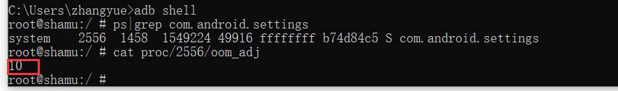
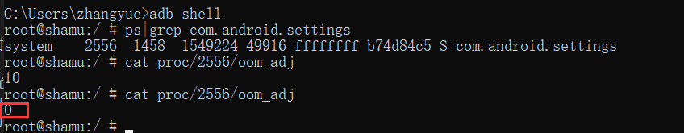
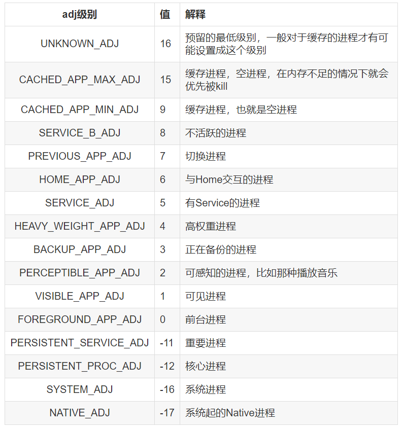

进程保活对于作为Android开发的程序猿应该并不陌生，一些App对于进程保活有着很强烈的需求。比如一个IM类App对于信息接收就需要app进程一直存活才可以，否则对方好友发送了信息，如果app已经被干掉从而导致无法收到信息，这样的用户体验是很差的。用户很可能会直接卸载掉你的app，因为这样的app对于用户来说没什么使用价值。
<!--more-->
我们都知道Android的App一般最少存在一个进程，或者多个进程。目前的主流App一般都会使用多进程的方案。多进程起到的作用可以增加进程存活的概率或者隔离危险代码（容易产生Crash）或者可以用来突破方法数65535的限制。

## 进程划分？
Android中的进程通常被划分了5级，我们按重要程度由高到低排列一下：

**1、Foreground process——前台进程**
某个进程持有一个正在与用户交互的Activity并且该Activity正处于resume的状态。
某个进程持有一个Service，并且该Service与用户正在交互的Activity绑定。
某个进程持有一个Service，并且该Service调用startForeground()方法使之位于前台运行。
某个进程持有一个Service，并且该Service正在执行它的某个生命周期回调方法，比如onCreate()、 onStart()或onDestroy()。
某个进程持有一个BroadcastReceiver，并且该BroadcastReceiver正在执行其onReceive()方法。

**2、Visible process——可见进程**
拥有不在前台、但仍对用户可见的 Activity（已调用 onPause()）。
拥有绑定到可见（或前台）Activity 的 Service

**3、Service process——服务进程**
某个进程中运行着一个Service且该Service是通过startService()启动的，与用户看见的界面没有直接关联。

**4、Background process——后台进程**
在用户按了"back"或者"home"后,程序本身看不到了,但是其实还在运行的程序，比如Activity调用了onPause方法

**5、Empty process——空进程**
某个进程不包含任何活跃的组件时该进程就会被置为空进程，完全没用,杀了它只有好处没坏处。

## 什么是内存阀值？
我们知道Android的App退到后台时，系统并不会直接结束掉该app。而是将其缓存起来，当打开的app越来越多后导致内存不足，那么系统就开始结束不重要的进程从而释放其内存提供给优先级高的应用使用。
这套杀进程释放内存的机制，Android中被叫做Low Memory Killer。那么这个内存不足怎么来规定呢，我们知道不足一定有一个限定值，这个值就是**内存阀值**。
使用*cat /sys/module/lowmemorykiller/parameters/minfree*可以查看手机的内存阀值。

内存不足时进程进行回收是按上面的重要程度有低到高进行回收。

进程是有优先级的，adj来表示我们的优先级。
oom_adj的值越小，进程的优先级越高，普通进程oom_adj值是大于等于0的，而系统进程oom_adj的值是小于0的，我们可以通过cat /proc/进程id/oom_adj可以看到当前进程的adj值。

我们发现 设置 的进程优先级现在是10，我们现在没有启动 设置。下面我们来打开设置app并查看一下现在的优先级。

我们看当前 设置 的进程优先级已经变为了0。优先级有了提高。
oom_adj主要由一下几种，注意每个手机厂商可能不一样。

从上面我们发现在系统内存紧张的情况下会优先杀时oom_adj值比较大的应用，反过来说我们将oom_adj的值变小也可以减少系统杀死我们应用的概率。

---
### Android 进程保活系列：

[Android 进程保活（一）写在前面](http://www.zydeveloper.com/2019/07/15/processlive1/)
[Android 进程保活（二）双服务进程包活](http://www.zydeveloper.com/2019/07/15/processlive2/)
[Adnroid 进程保活（三）1像素方案保活](http://www.zydeveloper.com/2019/07/15/processlive3/)
[Android 进程保活（四）使用“前台服务”保活](http://www.zydeveloper.com/2019/07/16/processlive4/)
[Android 进程保活（五）JobSheduler进程重生](http://www.zydeveloper.com/2019/07/16/processlive5/)