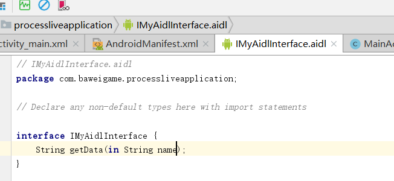
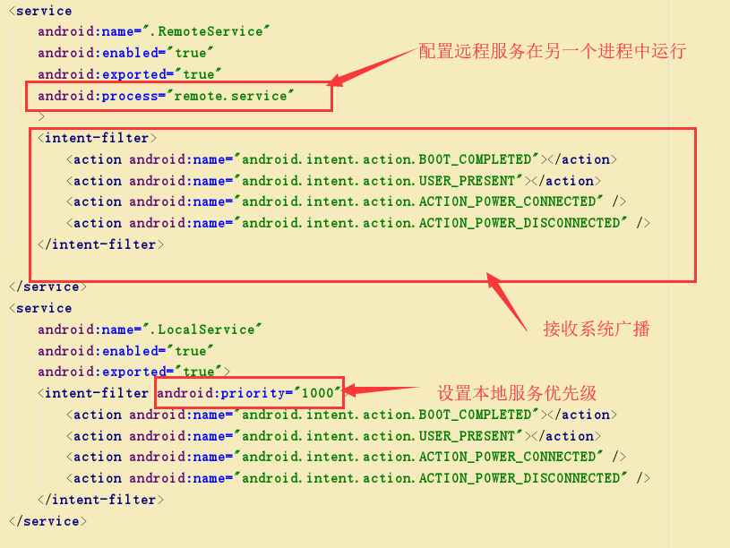
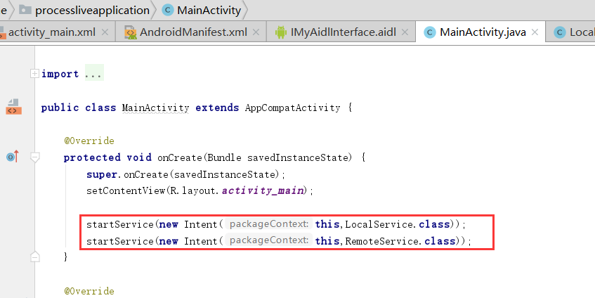
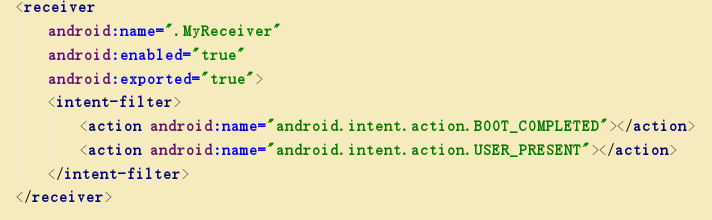
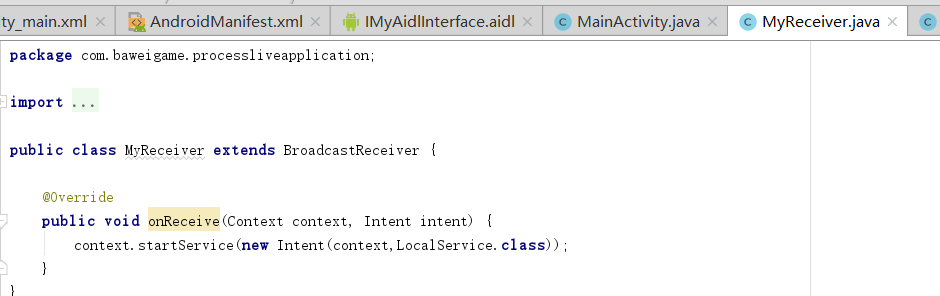

1、双进程守护保活方案
<!--more-->

创建aidl接口文件用于进程间通信，如下：

方法自定义。

创建本地服务及远程服务 LocalService  RemoteService

清单配置如下：


本地服务代码：

```java
package com.baweigame.processliveapplication;
import android.app.Notification;
import android.app.Service;
import android.content.ComponentName;
import android.content.Context;
import android.content.Intent;
import android.content.ServiceConnection;
import android.os.Handler;
import android.os.IBinder;
import android.os.Message;
import android.os.RemoteException;
import android.util.Log;
/**
* 本地服务
*/
public class LocalService extends Service {
    private IMyAidlInterface remoteService;
    private MyBinder myBinder;
    public LocalService() {
    }
    ServiceConnection serviceConnection=new ServiceConnection() {
        @Override
        public void onServiceConnected(ComponentName name, IBinder binder) {
            Log.d("zzzz", "onServiceConnected: localservice is connected...");
            try {
//                remoteService = (IMyAidlInterface) binder;
//                remoteService.getData("localservice");
            } catch (Exception e) {
                e.printStackTrace();
            }
        }
        @Override
        public void onServiceDisconnected(ComponentName name) {
            Log.d("zzzz", "onServiceDisconnected: localservice is disconnected...");
            startService(new Intent(LocalService.this,RemoteService.class));
            bindService(new Intent(LocalService.this,RemoteService.class),serviceConnection, Context.BIND_IMPORTANT);
        }
    };
    @Override
    public int onStartCommand(Intent intent, int flags, int startId) {
        Log.d("zzzz", "onStartCommand: localservice is onstartcommand...");
        startForeground(1,new Notification());
        bindService(new Intent(this,RemoteService.class),serviceConnection, Context.BIND_IMPORTANT);
        startDo();
        return START_STICKY;
    }
    private void startDo() {
        handler.postDelayed(new Runnable() {
            @Override
            public void run() {
                handler.sendEmptyMessage(0);
                handler.postDelayed(this,2*1000);
            }
        },2*1000);
    }
    private Handler handler=new Handler(){
        @Override
        public void handleMessage(Message msg) {
            super.handleMessage(msg);
            Log.d("zzzz", "handleMessage: ****************************************");
        }
    };
    @Override
    public IBinder onBind(Intent intent) {
        myBinder = new MyBinder();
        return myBinder;
    }
    private class MyBinder extends IMyAidlInterface.Stub{
        @Override
        public String getData(String name) throws RemoteException {
            return LocalService.class.getSimpleName();
        }
    }
}
```
远程服务代码文件：
```java
package com.baweigame.processliveapplication;
import android.app.Notification;
import android.app.Service;
import android.content.ComponentName;
import android.content.Context;
import android.content.Intent;
import android.content.ServiceConnection;
import android.os.IBinder;
import android.os.RemoteException;
import android.util.Log;
/**
* 远程服务
*/
public class RemoteService extends Service {
    private MyBinder myBinder;
    public RemoteService() {
    }
    ServiceConnection serviceConnection=new ServiceConnection() {
        @Override
        public void onServiceConnected(ComponentName name, IBinder service) {
            Log.d("zzzz", "onServiceConnected: remoteservice is connected...");
//            try {
//                IMyAidlInterface localService= (IMyAidlInterface) service;
//                localService.getData(RemoteService.class.getSimpleName());
//            } catch (RemoteException e) {
//                e.printStackTrace();
//            }
        }
        @Override
        public void onServiceDisconnected(ComponentName name) {
            Log.d("zzzz", "onServiceDisconnected: remoteservice is disconnected...");
            startService(new Intent(RemoteService.this,LocalService.class));
            bindService(new Intent(RemoteService.this,LocalService.class),serviceConnection,Context.BIND_IMPORTANT);
        }
    };
    @Override
    public IBinder onBind(Intent intent) {
        myBinder = new MyBinder();
        return myBinder;
    }
    @Override
    public int onStartCommand(Intent intent, int flags, int startId) {
        Log.d("zzzz", "onStartCommand: remoteservice is onstartcommand...");
        startForeground(1,new Notification());
        bindService(new Intent(this,LocalService.class),serviceConnection, Context.BIND_IMPORTANT);
        return START_STICKY;
    }
    private class MyBinder extends IMyAidlInterface.Stub{
        @Override
        public String getData(String name) throws RemoteException {
            return RemoteService.class.getSimpleName();
        }
    }
}
```
MainActivity中启动服务

使用静态注册广播接收系统重启或者屏幕解锁等系统广播来启动本地服务增加存活概率
清单文件：

广播文件：

使用电源锁保证息屏后服务不被杀
清单文件中加入权限：
<uses-permission android:name="android.permission.WAKE_LOCK"></uses-permission>


---
### Android 进程保活系列：

[Android 进程保活（一）写在前面](http://www.zydeveloper.com/2019/07/15/processlive1/)
[Android 进程保活（二）双服务进程包活](http://www.zydeveloper.com/2019/07/15/processlive2/)
[Adnroid 进程保活（三）1像素方案保活](http://www.zydeveloper.com/2019/07/15/processlive3/)
[Android 进程保活（四）使用“前台服务”保活](http://www.zydeveloper.com/2019/07/16/processlive4/)
[Android 进程保活（五）JobSheduler进程重生](http://www.zydeveloper.com/2019/07/16/processlive5/)