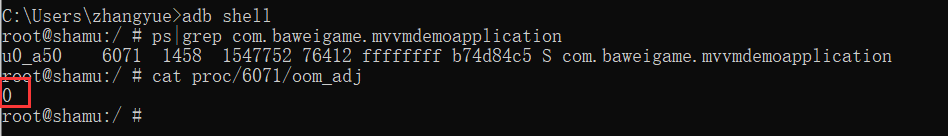
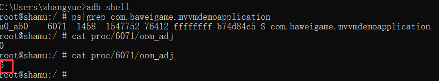

1像素保活方案坊间流传是手机QQ的保活的方案。什么意思呢？就是我们在手机锁屏时开启一个Activity，为了不让用户有感知，让这个Activity大小为1像素并设置透明无切换动画。在开启屏幕时把这个Activity关掉。

<!--more-->
## 一个Demo来演示一下
创建一个Android工程，默认为我们生成一个MainActivity，这是我们程序的入口Activity。我们通过观察oom_adj值来看一下优先级。
首先启动App，我们看oom_adj的值

我们看oom_adj的值为0，所以当前优先级很高不会被系统杀死。
我们点击home键或者back键来观察一下oom_adj。

我们发现oom_adj的值已经变为了6，所以退到后台的app在资源紧张的情况下就有可能被杀死了。

关于oom_adj可参考:

[Android 进程保活（一）写在前面](http://www.zydeveloper.com/2019/07/15/processlive1/)

从而我们可通过提高oom_adj的值可以使我们的app被系统杀死的概率变低。

我们使用的1像素保活方案就是应用了这点。

创建一个1像素的Activity，如下：
```java
package com.baweigame.mvvmdemoapplication;

import android.support.v7.app.AppCompatActivity;
import android.os.Bundle;
import android.util.Log;
import android.view.Gravity;
import android.view.Window;
import android.view.WindowManager;

public class OnePXActivity extends AppCompatActivity {

    @Override
    protected void onCreate(Bundle savedInstanceState) {
        super.onCreate(savedInstanceState);
        setContentView(R.layout.activity_one_px);

        Log.d("123", "onCreate: OnePxActivity...");
        createOnePxWindow();

        OnePxManager.getInstance().setActivity(this);
    }

    /**
     * 创建1像素窗体
     */
    private void createOnePxWindow() {
        Window window = getWindow();
        //放在左上角
        window.setGravity(Gravity.START | Gravity.TOP);
        WindowManager.LayoutParams attributes = window.getAttributes();
        //宽高为1个像素
        attributes.width = 1;
        attributes.height = 1;
        
        attributes.x = 0;
        attributes.y = 0;
        window.setAttributes(attributes);
    }
}

```
同时为了更好的隐藏，可以给这个1像素Activity设置样式如：
```xml
 <style name="OnePxStyle">
        <item name="android:windowIsTranslucent">true</item>
        <item name="android:windowBackground">@android:color/transparent</item>
        <item name="android:windowAnimationStyle">@null</item>
        <item name="android:windowNoTitle">true</item>
    </style>
```
即设置了背景透明及没有切换效果，这样可以更好的隐藏自己。
```xml
<activity android:name=".OnePXActivity" android:theme="@style/OnePxStyle">

        </activity>
```

创建一个管理类来控制Activity的开启与关闭，如下：
```java
package com.baweigame.mvvmdemoapplication;

import android.app.Activity;
import android.content.Context;
import android.content.Intent;

import java.lang.ref.WeakReference;

public class OnePxManager {
    private static OnePxManager instance=new OnePxManager();
    public static OnePxManager getInstance(){
        return instance;

    }
    private OnePxManager(){}

    private WeakReference<Activity> weakReference;

    public void setActivity(Activity activity){
        weakReference=new WeakReference<Activity>(activity);
    }

    public void  startActivity(Context context){
        Intent intent = new Intent(context, OnePXActivity.class);
        intent.setFlags(Intent.FLAG_ACTIVITY_NEW_TASK);
        context.startActivity(intent);
    }

    public void finishActivity(){
        if (weakReference!=null){
            if (weakReference.get()!=null){
                weakReference.get().finish();
            }
        }
    }
}

```
我们开启与关闭Activity的时机设计为屏幕锁屏时开启，屏幕解锁时关闭。所以编写如下广播：
```java
package com.baweigame.mvvmdemoapplication;

import android.content.BroadcastReceiver;
import android.content.Context;
import android.content.Intent;
import android.util.Log;

public class OnePxReceiver extends BroadcastReceiver {
    @Override
    public void onReceive(Context context, Intent intent) {
        //开屏
        if (intent.getAction().equals(Intent.ACTION_SCREEN_ON)){
            Log.d("123", "onReceive: user screen_on");
            closeActivity();
        }
        //锁屏
        else if(intent.getAction().equals(Intent.ACTION_SCREEN_OFF)){
            Log.d("123", "onReceive: user screen_off");
            openActivity(context);
        }
    }

    /**
     * 开启1像素Activity
     * @param context
     */
    private void openActivity(Context context) {
        OnePxManager.getInstance().startActivity(context);
    }

    /**
     * 关闭Activity
     */
    private void closeActivity() {
        OnePxManager.getInstance().finishActivity();
    }
}

```
由于SCREEN_ON与SCREEN_OFF这两个广播不能使用静态方式注册，所以我们在MainActivity中动态注册广播。
```java
package com.baweigame.mvvmdemoapplication;

import android.content.Intent;
import android.content.IntentFilter;
import android.support.v7.app.AppCompatActivity;
import android.os.Bundle;
import android.view.View;

public class MainActivity extends AppCompatActivity {

    @Override
    protected void onCreate(Bundle savedInstanceState) {
        super.onCreate(savedInstanceState);
        setContentView(R.layout.activity_main);

        registerOnePxReceiver(this);
    }

    /**
     * 注册1像素广播
     * @param mainActivity
     */
    private void registerOnePxReceiver(MainActivity mainActivity) {
        IntentFilter intentFilter=new IntentFilter();
        intentFilter.addAction(Intent.ACTION_SCREEN_ON);
        intentFilter.addAction(Intent.ACTION_SCREEN_OFF);
        registerReceiver(new OnePxReceiver(),intentFilter);
    }
}

```
我们来运行一下看看效果。

为了让我们的这种方法更加可靠，可以将广播注册过程放到服务中去，并将服务运行在另一个进程如：
```xml
<service android:name=".OnePxService"
            android:process=":onepx_service"/>
```
同时提高存活概率可以使用双进程守护方案来进一步加强，可参考：

[Android 进程保活（二）双服务进程包活](http://www.zydeveloper.com/2019/07/15/processlive2/)


---
### Android 进程保活系列：

[Android 进程保活（一）写在前面](http://www.zydeveloper.com/2019/07/15/processlive1/)
[Android 进程保活（二）双服务进程包活](http://www.zydeveloper.com/2019/07/15/processlive2/)
[Adnroid 进程保活（三）1像素方案保活](http://www.zydeveloper.com/2019/07/15/processlive3/)
[Android 进程保活（四）使用“前台服务”保活](http://www.zydeveloper.com/2019/07/16/processlive4/)
[Android 进程保活（五）JobSheduler进程重生](http://www.zydeveloper.com/2019/07/16/processlive5/)