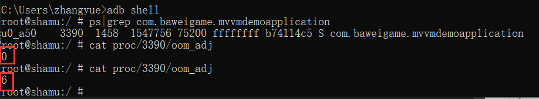
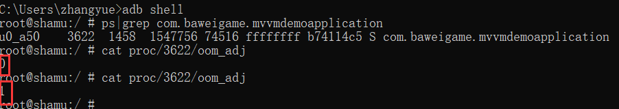

前台服务方式保活实际是利用了Android前台服务的一个漏洞。
即：
android api 在18之前的版本我们调用startForeground来提高应用程序的oom_adj值，在18版本后我们需要使用Service中启动一个InnerService两个服务同时startForeground并且绑定相同的ID，然后stop掉InnerService,这样做是将通知栏上的图标移除。

关于oom_adj可参考：

[Android 进程保活（一）写在前面](http://www.zydeveloper.com/2019/07/15/processlive1/)
<!--more-->

**用Demo来演示一下**

首先创建一个Demo
```java
package com.baweigame.mvvmdemoapplication;

import android.app.Notification;
import android.app.NotificationManager;
import android.app.Service;
import android.content.Intent;
import android.os.Build;
import android.os.Handler;
import android.os.IBinder;
import android.support.annotation.RequiresApi;

public class MyService extends Service {
    public static final int NOTIFICATION_ID=0x11;

    public MyService() {
    }

    @Override
    public IBinder onBind(Intent intent) {
        throw new UnsupportedOperationException("Not yet implemented");
    }

    @Override
    public void onCreate() {
        super.onCreate();
        //API Version 18以下
        if (Build.VERSION.SDK_INT <Build.VERSION_CODES.JELLY_BEAN_MR2) {
            startForeground(NOTIFICATION_ID, new Notification());
        } else {
            //API Version 18以上
            Notification.Builder builder = new Notification.Builder(this);
            builder.setSmallIcon(R.mipmap.ic_launcher);
            startForeground(NOTIFICATION_ID, builder.build());
            startService(new Intent(this, InnerService.class));
        }
    }

    public  static class  InnerService extends Service{
        @Override
        public IBinder onBind(Intent intent) {
            return null;
        }
        @RequiresApi(api = Build.VERSION_CODES.JELLY_BEAN)
        @Override
        public void onCreate() {
            super.onCreate();
            //发送与上面服务中ID相同的Notification，然后将其取消并取消自己的前台显示
            Notification.Builder builder = new Notification.Builder(this);
            builder.setSmallIcon(R.mipmap.ic_launcher);
            startForeground(NOTIFICATION_ID, builder.build());
            new Handler().postDelayed(new Runnable() {
                @Override
                public void run() {
                    stopForeground(true);
                    NotificationManager manager = (NotificationManager) getSystemService(NOTIFICATION_SERVICE);
                    manager.cancel(NOTIFICATION_ID);
                    stopSelf();
                }
            },100);

        }
    }
}

```
在没有使用这个服务前我们看看oom_adj的值变化，首先直接启动App，我们看一下oom_adj的值，如：

我这里面进行了2次操作，分别为打开App 点击了Home键
我们发现打开App时我们的oom_adj值为0
点击Home键后我们的oom_adj的值为6

下面我们开启上面的服务在来验证一下oom_adj值的变化。
```java
startService(new Intent(this,MyService.class));
```

我们发现刚打开App时我们的oom_adj值是0，点击Home键后我们的oom_adj的值为1
即使用这种方式确实提高了我们App的优先级提高了存活概率。

---
### Android 进程保活系列：

[Android 进程保活（一）写在前面](http://www.zydeveloper.com/2019/07/15/processlive1/)
[Android 进程保活（二）双服务进程包活](http://www.zydeveloper.com/2019/07/15/processlive2/)
[Adnroid 进程保活（三）1像素方案保活](http://www.zydeveloper.com/2019/07/15/processlive3/)
[Android 进程保活（四）使用“前台服务”保活](http://www.zydeveloper.com/2019/07/16/processlive4/)
[Android 进程保活（五）JobSheduler进程重生](http://www.zydeveloper.com/2019/07/16/processlive5/)