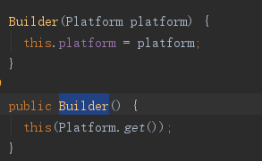
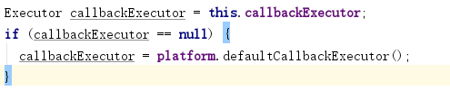

Retrofit 实现原理与源码分析（上）

<!--more-->

创建Retrofit实例方法，参考：

```java
/**
* 初始化Retrofit
*/
private void initRetrofit(){
 retrofit = new Retrofit.Builder()
 .baseUrl(Config.SERVER_URL)
 .addCallAdapterFactory(RxJava2CallAdapterFactory.create())
 .addCallAdapterFactory(LiveDataCallAdapterFactory.create())
 .addConverterFactory(GsonConverterFactory.create())
 .client(createOkHttpClient())
 .build();

}
```

1、Retrofit.Builder()


platform 进行设置 -> Platform.get()


PLATFORM 变量由 findPlatform();初始化。


首先 试着加载 android.os.Build，如果加载成功 SDK_INT!=0 认为是Android平台 返回 new Android（）；
                                                    如果加载失败 吃掉ClassNotFoundException异常 让代码继续顺序执行；

其后 试着加载 java.util.optional 如果加载成功，认为是Java8平台 返回 new Java8（）；
                                                  如果加载失败，吃掉ClassNotFoundException异常，让代码继续顺序执行；

最后，返回 new Platform（）；


Builder()执行完确定了Platform。

2、.baseUrl(Config.SERVER_URL)


通过checkNotNull判断传入是否为空

Utils.java


3、.addCallAdapterFactory(RxJava2CallAdapterFactory.create())
添加回调适配器工厂


向callAdapterFactories集合中加入传入进来的factory。

callAdapterFactories——Retrofit中存放CallAdapter.Factory的集合。

4、.addConverterFactory(GsonConverterFactory.create())
添加格式化的适配器工厂

向converterFactories集合中加入传入进来的factory。

converterFactories——Retrofit中存放Converter.Factory的集合。

5、.client(createOkHttpClient())

传入参数类型OkHttpClient，说明Retrofit只能支持OkHttp

callFactory逻辑代码如下：


6、.build();
————————————————————————————————————
```java
/**
* Create the {@link Retrofit} instance using the configured values.
* <p>
* Note: If neither {@link #client} nor {@link #callFactory} is called a default {@link
* OkHttpClient} will be created and used.
*/
public Retrofit build() {
if (baseUrl == null) {
throw new IllegalStateException("Base URL required.");
}

okhttp3.Call.Factory callFactory = this.callFactory;
if (callFactory == null) {
callFactory = new OkHttpClient();
}

Executor callbackExecutor = this.callbackExecutor;
if (callbackExecutor == null) {
callbackExecutor = platform.defaultCallbackExecutor();
}

// Make a defensive copy of the adapters and add the default Call adapter.
List<CallAdapter.Factory> callAdapterFactories = new ArrayList<>(this.callAdapterFactories);
callAdapterFactories.addAll(platform.defaultCallAdapterFactories(callbackExecutor));

// Make a defensive copy of the converters.
List<Converter.Factory> converterFactories = new ArrayList<>(
1 + this.converterFactories.size() + platform.defaultConverterFactoriesSize());

// Add the built-in converter factory first. This prevents overriding its behavior but also
// ensures correct behavior when using converters that consume all types.
converterFactories.add(new BuiltInConverters());
converterFactories.addAll(this.converterFactories);
converterFactories.addAll(platform.defaultConverterFactories());

return new Retrofit(callFactory, baseUrl, unmodifiableList(converterFactories),
unmodifiableList(callAdapterFactories), callbackExecutor, validateEagerly);
}
```
————————————————————————————————————————————————————————
分析如下：


第一步、BaseUrl检查 如果为空也就是没有设置，直接抛异常


第二步、判断有没有通过外部设置Client，如果有直接用外部传入的OkHttpClient，如果没有就new OkHttpClient（）


第三步、判断有没有通过外部设置线程池，如果有直接用，如果没有就platform.defaultCallbackExecutor（）
platform进行选择，因为我们是android系统 所有platform就是 Android（）实例，所以defaultCallbackExecutor就是（retorfit）Android 的内部实现方法


第四步、整合所有的CallAdapter.Factory , 
                            


具体整合代码如下：


第五步、整合所有的Converter.Factory

首先，它依据外面设置的this.converterFactories.size()（如：GsonConverterFactory）;platform（platform、defaultConverterFactoriesSize（））下的converter（

    return Build.VERSION.SDK_INT >= 24
    ? singletonList(OptionalConverterFactory.INSTANCE)
    : Collections.<Converter.Factory>emptyList();

            ）
;+1。 初始化我们的ArrayList大小。

最后、将各个Convert.Factory 添加到我们刚初始化好的ArrayList中。


第六步、更加我们上前5步设置的业务属性来构建真正的Retrofit实例

