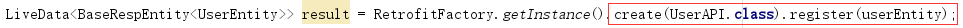
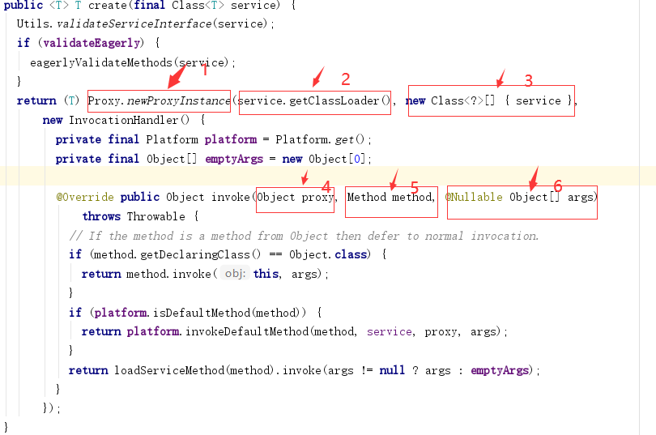
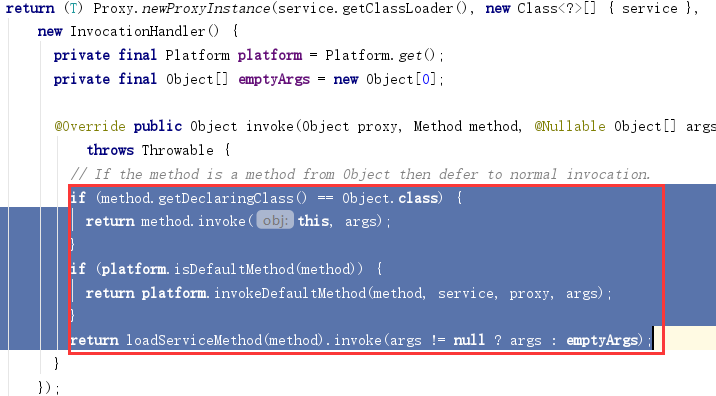
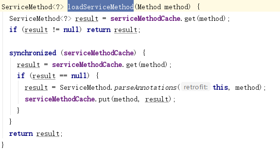
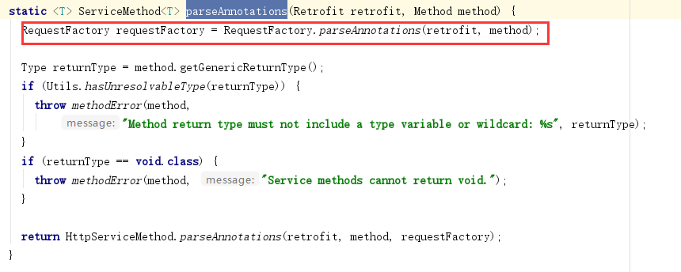
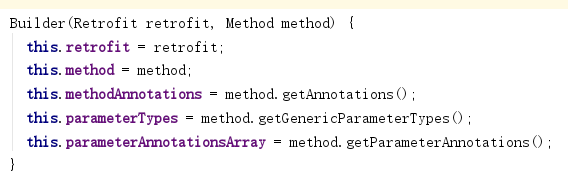
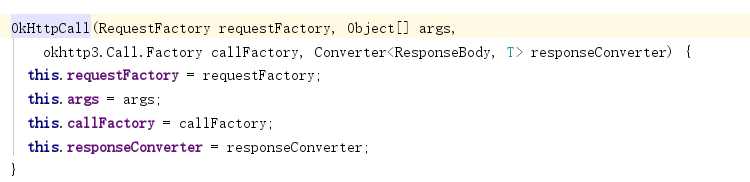

Retrofit 实现原理与源码分析（下）

<!--more-->

主要分析如下代码（红框处）：



下面来看看create方法中发生了哪些事情？

Retrofit.java 



create 方法入口参数 service 是我们自己编写的API接口 如：UserAPI
create方法中使用动态代理来拦截传入的api接口方法，如：UserAPI register方法。

如下是对于上图中编号的说明：

 1）动态代理——根据api接口创建了service实例。
 2）要加载的api接口类型对应的classloader。
 3）api类型
 4）api的实例
 5）hook到method如（register）
 6）方法的入口参数，如（register方法中的传入的userEntity）

接下来就是后面代码【.register（userEntity）】被执行



该方法做了两个处理，暂时先pass，一般会调用loadServiceMethod方法，下面我们来看看该方法的实现细节：



该方法会先到serviceMethodCache（Map结构）get一下看是否有当前method的value，如果有直接返回该method。
如果没有，使用类似单例double check方式进行线程并发处理，重新再次从Map获取一下，如果还为空就调用ServiceMethod.parseAnnotations（this,method）;
然后将ServiceMethod.parseAnnotations返回的ServiceMethod添加到如上Map中，下次再次执行该方法，就直接使用Map里的Method。

继续分享ServiceMethod.parseAnnotations方法。



 继续跟踪红框处的方法：

 

该处使用建造者设计模式，接下来我们跟踪一下Builder（retrofit，method） method->"register(userEntity)”。


 Builder里：
 1）retrofit进行属性赋值
 2）method进行属性赋值
 3）method上的注解赋值给methodAnnotations 当前注解->
 4)获取到method的所有入口参数的类型 赋值给parameterTypes
 5）获取method 的 入口参数上所有的参数注解，赋值给parameterAnnotationsArray

如下是build（）代码：


```java
RequestFactory build() {
  // 遍历方法上的所有注解 根据不同的注解来处理不同的http请求，包括：GET POST options delete put ...
  for (Annotation annotation : methodAnnotations) {
    parseMethodAnnotation(annotation);
  }
  //判断如果httpMethod（例如：POST）为null 则直接throw exception
  if (httpMethod == null) {
    throw methodError(method, "HTTP method annotation is required (e.g., @GET, @POST, etc.).");
  }
  // 如果hasBody为false 再次判断 isMultipart  isFormEncoded 为true 直接throw exception，意思就是如果是这两种  hasBody一定为true才可以。
  if (!hasBody) {
    if (isMultipart) {
      throw methodError(method,
          "Multipart can only be specified on HTTP methods with request body (e.g., @POST).");
    }
    if (isFormEncoded) {
      throw methodError(method, "FormUrlEncoded can only be specified on HTTP methods with "
          + "request body (e.g., @POST).");
    }
  }
  //获取方法入口参数上的注解数量
  int parameterCount = parameterAnnotationsArray.length;
  //初始化一个parameterCount大小的ParameterHandlers
  //遍历 parseParameter方法->根据我们设置的参数注解处理成对应方法逻辑如：Query  QueryMap  field fieldMap ........
  parameterHandlers = new ParameterHandler<?>[parameterCount];
  for (int p = 0; p < parameterCount; p++) {
    parameterHandlers[p] = parseParameter(p, parameterTypes[p], parameterAnnotationsArray[p]);
  }
  //合法性校验
  if (relativeUrl == null && !gotUrl) {
    throw methodError(method, "Missing either @%s URL or @Url parameter.", httpMethod);
  }
  if (!isFormEncoded && !isMultipart && !hasBody && gotBody) {
    throw methodError(method, "Non-body HTTP method cannot contain @Body.");
  }
  if (isFormEncoded && !gotField) {
    throw methodError(method, "Form-encoded method must contain at least one @Field.");
  }
  if (isMultipart && !gotPart) {
    throw methodError(method, "Multipart method must contain at least one @Part.");
  }
  //创建RequestFactory实例，将Builder作为入口参数传递进去
  return new RequestFactory(this);
}

```
```java

static <T> ServiceMethod<T> parseAnnotations(Retrofit retrofit, Method method) {
  //下面代码如上已经跟踪完成
  RequestFactory requestFactory = RequestFactory.parseAnnotations(retrofit, method);
  //对method（如：register（userEntity））进行方法返回值的判断处理，如下代码说明方法返回值不能为：variable wildcard void 类型
  Type returnType = method.getGenericReturnType();
  if (Utils.hasUnresolvableType(returnType)) {
    throw methodError(method,
        "Method return type must not include a type variable or wildcard: %s", returnType);
  }
  if (returnType == void.class) {
    throw methodError(method, "Service methods cannot return void.");
  }
  //继续调用如下方法
  return HttpServiceMethod.parseAnnotations(retrofit, method, requestFactory);
}

```

```java
static <ResponseT, ReturnT> HttpServiceMethod<ResponseT, ReturnT> parseAnnotations(
    Retrofit retrofit, Method method, RequestFactory requestFactory) {
  //获取到我们添加LiveDataAdapter
  CallAdapter<ResponseT, ReturnT> callAdapter = createCallAdapter(retrofit, method);
  //如：API接口中的方法返回值LiveData<BaseRespEntity<UserEntity>> 类型 则responseType 就是BaseRespEntity<UserEntity>
  Type responseType = callAdapter.responseType();
  //要求responseType 不能为 Response okhttp3.Response
  if (responseType == Response.class || responseType == okhttp3.Response.class) {
    throw methodError(method, "'"
        + Utils.getRawType(responseType).getName()
        + "' is not a valid response body type. Did you mean ResponseBody?");
  }
  //判断httpMethod 如果为HEAD 请求 responseType必须为void 
  if (requestFactory.httpMethod.equals("HEAD") && !Void.class.equals(responseType)) {
    throw methodError(method, "HEAD method must use Void as response type.");
  }
  //拿到了我们在RetrofitFactory中设置的GsonConverterFactory
  Converter<ResponseBody, ResponseT> responseConverter =
      createResponseConverter(retrofit, method, responseType);
  okhttp3.Call.Factory callFactory = retrofit.callFactory;
  //将我们获取到的requesFactory（post相关的信息） callFactory（OkHttp） callAdapter （LiveDataAdapterFactory）responseConverter（GsonConverterFactory）
  return new HttpServiceMethod<>(requestFactory, callFactory, callAdapter, responseConverter);
}
```


```java
//当前方法将外面传入的参选信息进行一个属性赋值
private HttpServiceMethod(RequestFactory requestFactory, okhttp3.Call.Factory callFactory,
    CallAdapter<ResponseT, ReturnT> callAdapter,
    Converter<ResponseBody, ResponseT> responseConverter) {
  this.requestFactory = requestFactory;
  this.callFactory = callFactory;
  this.callAdapter = callAdapter;
  this.responseConverter = responseConverter;
}
//该方法由Retrofit类中create方法中的return loadServiceMethod(method).invoke(args != null ? args : emptyArgs);方法调用；
//其中loadServiceMethod(method)其实就是当前HttpServiceMethod的实例，然后调用invoke也就是下面的invoke方法，并且传递了实际参数信息args（userEntity）
@Override ReturnT invoke(Object[] args) {
  //callAdapter（LiveDataAdapterFactory）对response结果进行适配，
  return callAdapter.adapt(
      //其实就是将请求信息及格式化工程（GSON）以及args参数 有了这些信息就可以使用OkHttp进行相应的网络请求了
      new OkHttpCall<>(requestFactory, args, callFactory, responseConverter));
}
```
OkHttpCall.java

以后交由OkHttp去处理，处理流程可参考OkHttp的源码分析。