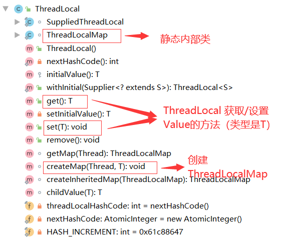
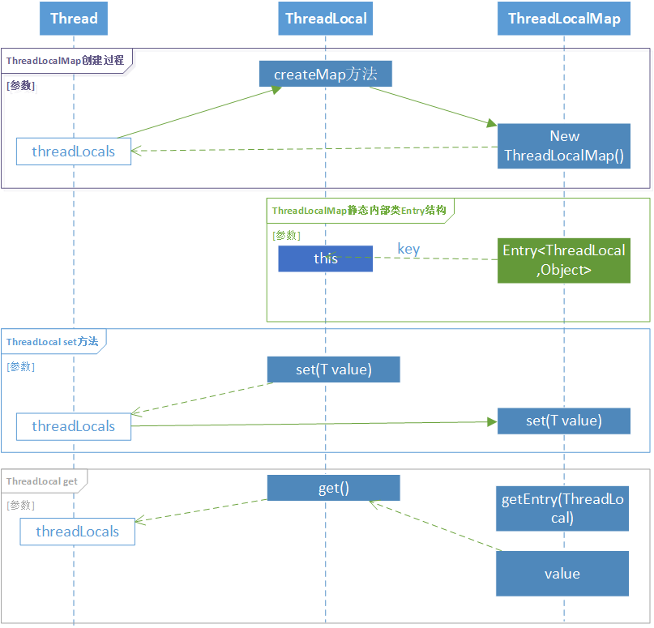

ThreadLocal分析（全）

<!--more-->

# ThreadLocal分析（全）

## 一个Demo来演示一下ThreadLocal

```java
private ThreadLocal<Integer> count2=new ThreadLocal<>();

Thread thread1=new Thread(new Runnable() {
            @Override
            public void run() {
                Log.d("123", "threadName - >"+Thread.currentThread().getName());
                count2.set(123);
                Integer result = count2.get();
                Log.d("123", "result - > "+"thread "+Thread.currentThread().getName()+result);
            }
        },"MyThread1");

        Thread thread2=new Thread(new Runnable() {
            @Override
            public void run() {
                Log.d("123", "threadName - >"+Thread.currentThread().getName());
                count2.set(456);
                Integer result = count2.get();
                Log.d("123", "result - > "+"thread "+Thread.currentThread().getName()+result);
            }
        },"MyThread2");


        thread2.start();
        thread1.start();
```

如上是对ThreadLocal的一个演示小Demo。

ThreadLocal有个泛型T，所以这块ThreadLocal可以放置任意类型。

我们发现在如上两个线程中使用时，ThreadLocal的get与set相对于Thread感觉像是“私有的”。

保证了多线程环境下的并发问题，也就是线程安全的。

## 下面我们来详细分析一下ThreadLocal原理

### ThreadLocal源码

如下是ThreadLocal的类结构图：



- ThreadLocalMap
- get()
- set(T)
- createMap(Thread,T):void


#### ThreadLocalMap

```java
static class ThreadLocalMap 
```

ThreadLocalMap是ThreadLocal的一个静态的内部类

下面我们来看看ThreadLocalMap中的一些重要属性及方法

首先看一下其中的静态内部类Entry

```java
//继承了弱引用并指定了泛型ThreadLocal
static class Entry extends WeakReference<ThreadLocal<?>> {
            /** The value associated with this ThreadLocal. */
    		//这里就是value属性
            Object value;

    	    //构造如下，key 类型 ThreadLocal  value是Object
            Entry(ThreadLocal<?> k, Object v) {
                super(k);
                value = v;
            }
        }
```

如下是ThreadLocalMap的构造函数

```java
//table用于存储Entry的数组
private Entry[] table;
//初始化容量大小
private static final int INITIAL_CAPACITY = 16;
//当前map的size
private int size = 0;
//构造函数
ThreadLocalMap(ThreadLocal<?> firstKey, Object firstValue) {
            //初始化上的Entry数组
            table = new Entry[INITIAL_CAPACITY];
            //通过key的hashcode计算出int值作为存储的数组下标
            int i = firstKey.threadLocalHashCode & (INITIAL_CAPACITY - 1);
            //创建一个新Entry存储到“i”的数组下标位置
            table[i] = new Entry(firstKey, firstValue);
            //当前map的size设置1
            size = 1;
            //设置扩容因子
            setThreshold(INITIAL_CAPACITY);
        }
```

如下还有一些常用方法：

```java
 private Entry getEntry(ThreadLocal<?> key) {
            int i = key.threadLocalHashCode & (table.length - 1);
            Entry e = table[i];
            if (e != null && e.get() == key)
                return e;
            else
                return getEntryAfterMiss(key, i, e);
        }
private void set(ThreadLocal<?> key, Object value) {

            // We don't use a fast path as with get() because it is at
            // least as common to use set() to create new entries as
            // it is to replace existing ones, in which case, a fast
            // path would fail more often than not.
			
    		//获取Entry数组 - table 赋值给tab
            Entry[] tab = table;
            //取出数组大小
            int len = tab.length;
    		//通过key的hashcode按位与数组大小-1 计算结果就是数组下标位置
            int i = key.threadLocalHashCode & (len-1);

            for (Entry e = tab[i];
                 e != null;
                 e = tab[i = nextIndex(i, len)]) {
                ThreadLocal<?> k = e.get();

                if (k == key) {
                    e.value = value;
                    return;
                }

                if (k == null) {
                    replaceStaleEntry(key, value, i);
                    return;
                }
            }

            tab[i] = new Entry(key, value);
            int sz = ++size;
            if (!cleanSomeSlots(i, sz) && sz >= threshold)
                rehash();
        }

private void remove(ThreadLocal<?> key) {
            Entry[] tab = table;
            int len = tab.length;
            int i = key.threadLocalHashCode & (len-1);
            for (Entry e = tab[i];
                 e != null;
                 e = tab[i = nextIndex(i, len)]) {
                if (e.get() == key) {
                    e.clear();
                    expungeStaleEntry(i);
                    return;
                }
            }
        }
```

####  分析ThreadLocal的set方法

```java
public void set(T value) {
        //获取当前线程
        Thread t = Thread.currentThread();
        //调用getMap方法 第一取一定是null
        ThreadLocalMap map = getMap(t);
        if (map != null)
            //如果不等于null 直接设置map中
            map.set(this, value);
        else
            //如果为空调用createMap
            createMap(t, value);
    }
```

##### getMap方法分析

```java
ThreadLocalMap getMap(Thread t) {
        //获取t->Thread的threadLocals属性
        return t.threadLocals;
    }

Thread类中的threadLocals的定义如下：

ThreadLocal.ThreadLocalMap threadLocals = null;
```

##### createMap方法分析

```java
 void createMap(Thread t, T firstValue) {
        //给thread的threadLocals赋值，new ThreadLocalMap（参见如上分析） 如下的this参数是ThreadLocal
        t.threadLocals = new ThreadLocalMap(this, firstValue);
    }
```

#### 分析ThreadLocal的get方法

如下在回忆一下之前get的代码

```java
Thread thread1=new Thread(new Runnable() {
            @Override
            public void run() {
                ...
                Integer result = count2.get();
                ...
            }
        },"MyThread1");
```

我们发现get（）方法没有任何的参数，但是它是允许在子线程（MyThread1）中的。

##### get()方法分析

```java
 public T get() {
        //获取了当前的线程，所有这也是get不需要参数的原因 这里获取到的线程（MyThread1）
        Thread t = Thread.currentThread();
        //从线程中获取ThreadLocalMap对象 也就是Thread中threadLocals
        ThreadLocalMap map = getMap(t);
     	//不为空直接从map中获取Entry进一步获取value
        if (map != null) {
            //从map中使用this（threadlocal对象）获取Entry
            ThreadLocalMap.Entry e = map.getEntry(this);
            if (e != null) {
                //如果Entry对象不为空从而获取value
                @SuppressWarnings("unchecked")
                T result = (T)e.value;
                //返回value结果
                return result;
            }
        }
        //如果map等于null 执行如下方法
        return setInitialValue();
    }
```

###### setInitialValue()方法分析

```java
private T setInitialValue() {
        //获取初始化值
        T value = initialValue();
        //获取当前线程
        Thread t = Thread.currentThread();
        //通过线程获取ThreadLocalMap对象
        ThreadLocalMap map = getMap(t);
    	//map不为空 直接将this（ThreadLocal） value-上面获取到的初始化值
        if (map != null)
            map.set(this, value);
        else
            //如果map为空就执行createMap - 逻辑参见如上对createMap方法的分析
            createMap(t, value);
        //返回value
        return value;
    }
```

###### initialValue()方法分析

```java
    protected T initialValue() {
        return null;
    }
```

如上方法是ThreadLocal类中的，保护类型也就是可以通过外部开发人员自己实现，如：

```java
 private ThreadLocal<Integer> count2=new ThreadLocal<Integer>(){
        @Nullable
        @Override
        protected Integer initialValue() {
            //设置了初始化值为 0
            return 0;
        }
    };
```

### Thread  ThreadLocal ThreadLocalMap三者直接的关系以及调用逻辑



我们发现虽然ThreadLocalMap是ThreadLocal的内部类，但是ThreadLocalMap其实是放到了Thread类中**threadLocals**属性里面,ThreadLocal被作为ThreadLocalMap中的内部类**Entry**的*[key]*来使用。


