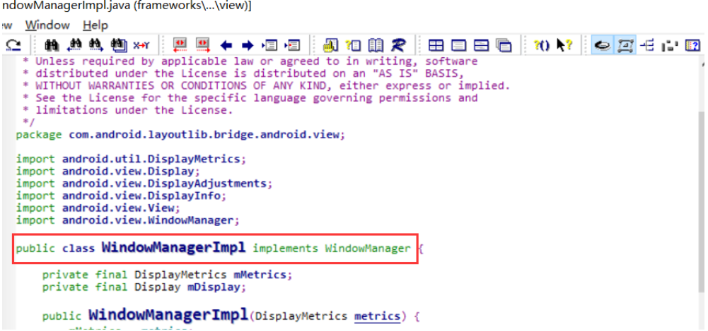
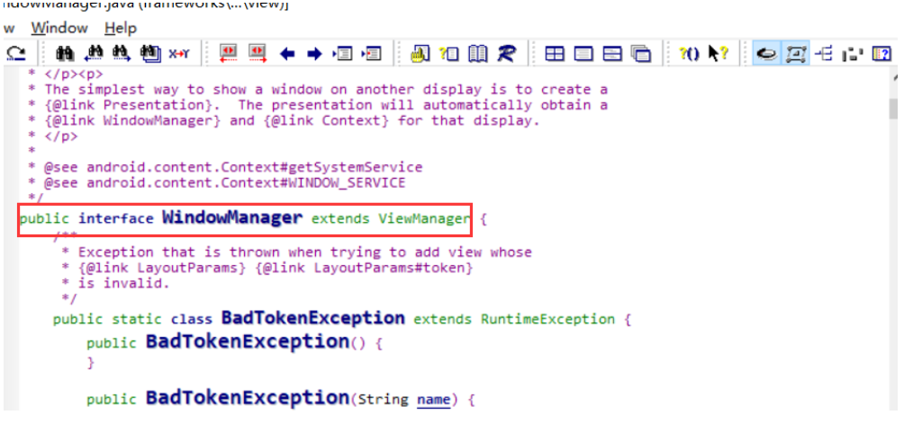
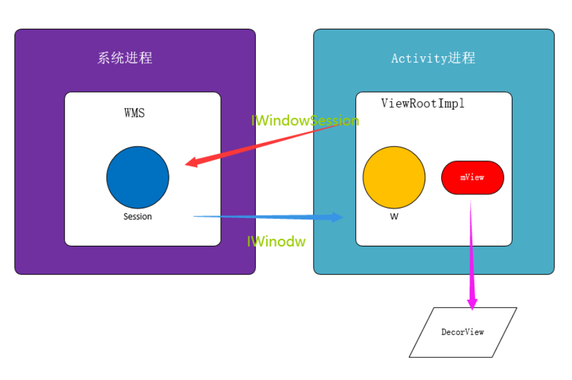

Android View绘制原理（前篇）

<!--more-->

# Android View绘制原理（前篇）

***PhoneWindow WindowManager WindowManagerImpl WindowMangerGlobal ViewRootImpl解析***

### PhoneWindow初始化

<font color=red>**Activity的attach**</font>

PhoneWindow在**Activity**中的*attach*方法被创建

```java
  final void attach(Context context, ActivityThread aThread,
            Instrumentation instr, IBinder token, int ident,
            Application application, Intent intent, ActivityInfo info,
            CharSequence title, Activity parent, String id,
            NonConfigurationInstances lastNonConfigurationInstances,
            Configuration config, String referrer, IVoiceInteractor voiceInteractor) {
        attachBaseContext(context);

        mFragments.attachHost(null /*parent*/);
		
        //初始化PhoneWindow
        mWindow = new PhoneWindow(this);
       
        ...

        //设置并初始化WindowManager
        mWindow.setWindowManager(
                (WindowManager)context.getSystemService(Context.WINDOW_SERVICE),
                mToken, mComponent.flattenToString(),
                (info.flags & ActivityInfo.FLAG_HARDWARE_ACCELERATED) != 0);
        if (mParent != null) {
            mWindow.setContainer(mParent.getWindow());
        }
        //获取WindowManager
        mWindowManager = mWindow.getWindowManager();
        mCurrentConfig = config;
    }

```

### DecorView初始化

<font color=red>**Activity的onCreate中**</font>

DecorView初始化我们从Activity的setContentView方法进行分析，一般setContentView都是在Activity的onCreate生命周期中设置的，我们来看一下Activity的setContentView源码：

```java
	/**
     * Set the activity content from a layout resource.  The resource will be
     * inflated, adding all top-level views to the activity.
     *
     * @param layoutResID Resource ID to be inflated.
     *
     * @see #setContentView(android.view.View)
     * @see #setContentView(android.view.View, android.view.ViewGroup.LayoutParams)
     */
    public void setContentView(@LayoutRes int layoutResID) {
        getWindow().setContentView(layoutResID);
        initWindowDecorActionBar();
    }
```

如上我们发现setContentView中使用getWindow（）[其实getWindow获取到的就是我们attach中new 的PhoneWindow实例]，所以调用就是phoneWindow的setContentView方法,具体代码如下：

```java
   @Override
    public void setContentView(int layoutResID) {
        // Note: FEATURE_CONTENT_TRANSITIONS may be set in the process of installing the window
        // decor, when theme attributes and the like are crystalized. Do not check the feature
        // before this happens.
        //mContentParent就是id等于content的ViewGroup控件
        if (mContentParent == null) {
            //见如下分析
            installDecor();
        } else if (!hasFeature(FEATURE_CONTENT_TRANSITIONS)) {
            mContentParent.removeAllViews();
        }

        if (hasFeature(FEATURE_CONTENT_TRANSITIONS)) {
            final Scene newScene = Scene.getSceneForLayout(mContentParent, layoutResID,
                    getContext());
            transitionTo(newScene);
        } else {
            //为mContentParent添加子视图
            //也就是给Activity中设置视图文件
            mLayoutInflater.inflate(layoutResID, mContentParent);
        }
        mContentParent.requestApplyInsets();
        final Callback cb = getCallback();
        if (cb != null && !isDestroyed()) {
            cb.onContentChanged();
        }
    }
```

#### installDecor

```java
    private void installDecor() {
        if (mDecor == null) {
            mDecor = generateDecor();
            ...
        }
        if (mContentParent == null) {
            //获取到id等于content的ViewGroup
            mContentParent = generateLayout(mDecor);
         ...
        }
        ...
    }
```

#### generateDecor

```java
protected DecorView generateDecor() {
        return new DecorView(getContext(), -1);
    }
```

我们发现了创建并初始化DecorView的位置。

#### generateLayout

```java
 protected ViewGroup generateLayout(DecorView decor) {
        // Apply data from current theme.
        //从主题里获取style样式
        TypedArray a = getWindowStyle();

        ...

        //decorview开始更改
        mDecor.startChanging();
		//加载了layoutResource
        View in = mLayoutInflater.inflate(layoutResource, null);
       //Decor中添加子控件
        decor.addView(in, new ViewGroup.LayoutParams(MATCH_PARENT, MATCH_PARENT));
        mContentRoot = (ViewGroup) in;

     	//此处获取到的就是id 为 content的FrameLayout的子类
        ViewGroup contentParent = (ViewGroup)findViewById(ID_ANDROID_CONTENT);
        if (contentParent == null) {
            throw new RuntimeException("Window couldn't find content container view");
        }

        ...
        //decorview完成更改
        mDecor.finishChanging();

        return contentParent;
    }
```

我们发现方法返回的就是我们activity自己实现布局的parent，也就是id等于content的ViewGroup。


**总结：**

​	***Activity中onCreate生命周期中调用setContentView方法来设置content视图，调用了PhoneWindow的setContentView方法，进而调用installDecor，继续调用generateDecor 该方法new 出了DecorView 然后返回。***


### WindowManager初始化

Window.java

```java
/**
     * Set the window manager for use by this Window to, for example,
     * display panels.  This is <em>not</em> used for displaying the
     * Window itself -- that must be done by the client.
     *
     * @param wm The window manager for adding new windows.
     */
    public void setWindowManager(WindowManager wm, IBinder appToken, String appName,
            boolean hardwareAccelerated) {
        mAppToken = appToken;
        mAppName = appName;
        mHardwareAccelerated = hardwareAccelerated
                || SystemProperties.getBoolean(PROPERTY_HARDWARE_UI, false);
        if (wm == null) {
            wm = (WindowManager)mContext.getSystemService(Context.WINDOW_SERVICE);
        }
        
        mWindowManager = ((WindowManagerImpl)wm).createLocalWindowManager(this);
    }
```

WindowManagerImpl.java

```java
public WindowManagerImpl createLocalWindowManager(Window parentWindow) {
        return new WindowManagerImpl(mDisplay, parentWindow);
    }
```

我们发现如上代码中的mWindow.setWindowManager其实是使用的就是WindowManagerImpl的实例。

### WindowManagerImpl与WindowManager 关系



我们发现WindowManagerImpl实现了WindowManager接口。

### WindowManager与ViewManager关系



我们发现WindowManager继承了ViewManager接口。


**所以WindowManagerImpl实现了WindowManager接口，WindowManager继承了ViewManager接口。**


### WindowMangerGlobal类

我们再看看WindowManagerImpl类的具体实现，其实WindowManagerGlobal这个位置是一个典型的代理模式

代码如下：

```java
public final class WindowManagerImpl implements WindowManager {
    //WindowManagerGlobal实例
    private final WindowManagerGlobal mGlobal = WindowManagerGlobal.getInstance();
    private final Display mDisplay;
    private final Window mParentWindow;

    private IBinder mDefaultToken;

    public WindowManagerImpl(Display display) {
        this(display, null);
    }

    private WindowManagerImpl(Display display, Window parentWindow) {
        mDisplay = display;
        mParentWindow = parentWindow;
    }

    public WindowManagerImpl createLocalWindowManager(Window parentWindow) {
        return new WindowManagerImpl(mDisplay, parentWindow);
    }

    public WindowManagerImpl createPresentationWindowManager(Display display) {
        return new WindowManagerImpl(display, mParentWindow);
    }

    /**
     * Sets the window token to assign when none is specified by the client or
     * available from the parent window.
     *
     * @param token The default token to assign.
     */
    public void setDefaultToken(IBinder token) {
        mDefaultToken = token;
    }

    @Override
    public void addView(@NonNull View view, @NonNull ViewGroup.LayoutParams params) {
        applyDefaultToken(params);
        mGlobal.addView(view, params, mDisplay, mParentWindow);
    }

    @Override
    public void updateViewLayout(@NonNull View view, @NonNull ViewGroup.LayoutParams params) {
        applyDefaultToken(params);
        mGlobal.updateViewLayout(view, params);
    }

    private void applyDefaultToken(@NonNull ViewGroup.LayoutParams params) {
        // Only use the default token if we don't have a parent window.
        if (mDefaultToken != null && mParentWindow == null) {
            if (!(params instanceof WindowManager.LayoutParams)) {
                throw new IllegalArgumentException("Params must be WindowManager.LayoutParams");
            }

            // Only use the default token if we don't already have a token.
            final WindowManager.LayoutParams wparams = (WindowManager.LayoutParams) params;
            if (wparams.token == null) {
                wparams.token = mDefaultToken;
            }
        }
    }

    @Override
    public void removeView(View view) {
        mGlobal.removeView(view, false);
    }

    @Override
    public void removeViewImmediate(View view) {
        mGlobal.removeView(view, true);
    }

    @Override
    public Display getDefaultDisplay() {
        return mDisplay;
    }
}

```

如上代码我们不难看出WindowManagerImpl只是WindowManagerGlobal的代理类，最终实现都在WindowManagerGlobal中。

### 再看 wm.addView(decor, l);

<font color=red>**Activity的Resume**</font>

ActivityThread.java

```java
final void handleResumeActivity(IBinder token,
            boolean clearHide, boolean isForward, boolean reallyResume) {
           ...
                    //将decor添加到vm中
                    wm.addView(decor, l);
           ...
 }
```

从上面分析中我们发现wm其实就是WindowManagerImpl但最终干活的是WindowManagerGlobal：

```java
WindowManagerImpl.java
    
@Override
    public void addView(@NonNull View view, @NonNull ViewGroup.LayoutParams params) {
        applyDefaultToken(params);
        //最终调用的WindowManagerGlobal addView方法
        mGlobal.addView(view, params, mDisplay, mParentWindow);
    }
```

我们来看一下WindowManagerGlobal的addView方法

```java
public void addView(View view, ViewGroup.LayoutParams params,
            Display display, Window parentWindow) {
        ...

        final WindowManager.LayoutParams wparams = (WindowManager.LayoutParams) params;
        if (parentWindow != null) {
            parentWindow.adjustLayoutParamsForSubWindow(wparams);
        } else {
            // If there's no parent, then hardware acceleration for this view is
            // set from the application's hardware acceleration setting.
            final Context context = view.getContext();
            if (context != null
                    && (context.getApplicationInfo().flags
                            & ApplicationInfo.FLAG_HARDWARE_ACCELERATED) != 0) {
                wparams.flags |= WindowManager.LayoutParams.FLAG_HARDWARE_ACCELERATED;
            }
        }

        ViewRootImpl root;
        View panelParentView = null;

        synchronized (mLock) {
            // Start watching for system property changes.
            ...
			//初始化了ViewRootImpl  整个View的绘制就开始于ViewRootImpl
            root = new ViewRootImpl(view.getContext(), display);

            view.setLayoutParams(wparams);
			//将DecorView ViewRootImpl LayoutParams存储到如下对应位置
            mViews.add(view);
            mRoots.add(root);
            mParams.add(wparams);
        }

        // do this last because it fires off messages to start doing things
        try {
            //如下会分析此处
            root.setView(view, wparams, panelParentView);
        } catch (RuntimeException e) {
            // BadTokenException or InvalidDisplayException, clean up.
            synchronized (mLock) {
                final int index = findViewLocked(view, false);
                if (index >= 0) {
                    removeViewLocked(index, true);
                }
            }
            throw e;
        }
    }
```

如下是对mViews mRoots  mParams的定义

```java
  private final ArrayList<View> mViews = new ArrayList<View>();
  private final ArrayList<ViewRootImpl> mRoots = new ArrayList<ViewRootImpl>();
  private final ArrayList<WindowManager.LayoutParams> mParams =
            new ArrayList<WindowManager.LayoutParams>();
```

上面代码中我们发现了ViewRootImpl的初始化，这也是我们View绘制的真正起点。

### ViewRootImpl分析

构造函数如下：

```java
public ViewRootImpl(Context context, Display display) {
        mContext = context;
    
        //使用远程的WMS服务获取Session 但是改会话是单向的只能用于ViewRootImpl发送给WMS
        mWindowSession = WindowManagerGlobal.getWindowSession();
        ...
        //此处作用参见如下分析
        mWindow = new W(this);
        mTargetSdkVersion = context.getApplicationInfo().targetSdkVersion;
        mViewVisibility = View.GONE;
        mTransparentRegion = new Region();
        mPreviousTransparentRegion = new Region();
        mFirst = true; // true for the first time the view is added
        mAdded = false;
        mAttachInfo = new View.AttachInfo(mWindowSession, mWindow, display, this, mHandler, this);
        ...
} 
```

我们发现了mWindowSession及mWindow

先来看看mWindowSession即WindowManagerGlobal.getWindowSession()

```java
public static IWindowManager getWindowManagerService() {
        synchronized (WindowManagerGlobal.class) {
            if (sWindowManagerService == null) {
                //通过Binder获取远程的WMS （WindowManagerService）服务
                sWindowManagerService = IWindowManager.Stub.asInterface(
                        ServiceManager.getService("window"));
                try {
                    sWindowManagerService = getWindowManagerService();
                    ValueAnimator.setDurationScale(sWindowManagerService.getCurrentAnimatorScale());
                } catch (RemoteException e) {
                    Log.e(TAG, "Failed to get WindowManagerService, cannot set animator scale", e);
                }
            }
            return sWindowManagerService;
        }
    }

    public static IWindowSession getWindowSession() {
        synchronized (WindowManagerGlobal.class) {
            if (sWindowSession == null) {
                try {
                    InputMethodManager imm = InputMethodManager.getInstance();
                    //此处获取WMS的实例 参见上面的方法
                    IWindowManager windowManager = getWindowManagerService();
                    sWindowSession = windowManager.openSession(
                            new IWindowSessionCallback.Stub() {
                                @Override
                                public void onAnimatorScaleChanged(float scale) {
                                    ValueAnimator.setDurationScale(scale);
                                }
                            },
                            imm.getClient(), imm.getInputContext());
                } catch (RemoteException e) {
                    Log.e(TAG, "Failed to open window session", e);
                }
            }
            return sWindowSession;
        }
    }
```

如上代码我们发现getWindowManagerService()通过Binder机制获取远程WindowManagerService，然后使用openSession获取WMS的WindowSession。

***ViewRootImpl通过使用WindowSession与WMS进行通信（该通信是单向的）。***


**那么如果WMS想与ViewRootImpl通信怎么办呢？**

我们看看如上代码中的

```java
mWindow = new W(this);
```

这里的W就是WMS与ViewRootImpl通信的桥梁，那么WMS是如何使用W与ViewRootImpl产生联系的呢？

还记得上面代码中WindowManagerGlobal的addView吗？

```java
public void addView(View view, ViewGroup.LayoutParams params,
            Display display, Window parentWindow) {
        ...

        // do this last because it fires off messages to start doing things
        try {
            root.setView(view, wparams, panelParentView);
        } catch (RuntimeException e) {
         
        }
    }
```

root也就是ViewRootImpl实例，我们来看看setView方法

```java
public void setView(View view, WindowManager.LayoutParams attrs, View panelParentView) {
        synchronized (this) {
                ...
                try {
                    mOrigWindowType = mWindowAttributes.type;
                    mAttachInfo.mRecomputeGlobalAttributes = true;
                    collectViewAttributes();
                    res = mWindowSession.addToDisplay(mWindow, mSeq, mWindowAttributes,
                            getHostVisibility(), mDisplay.getDisplayId(),
                            mAttachInfo.mContentInsets, mAttachInfo.mStableInsets,
                            mAttachInfo.mOutsets, mInputChannel);
                } catch (RemoteException e) {
                    ...
                } finally {
                    ...
                }
        }
```

这里面mWindowSession.addToDisplay方法中的第一个参数mWindow就是W实例了。

mWindowSession之前我们分析过了就是通过windowManager.openSession获取到的WindowSession实例。

下面用一张图来说明W、ViewRootImpl、WindowSession、WindowManagerService之间的关系：

