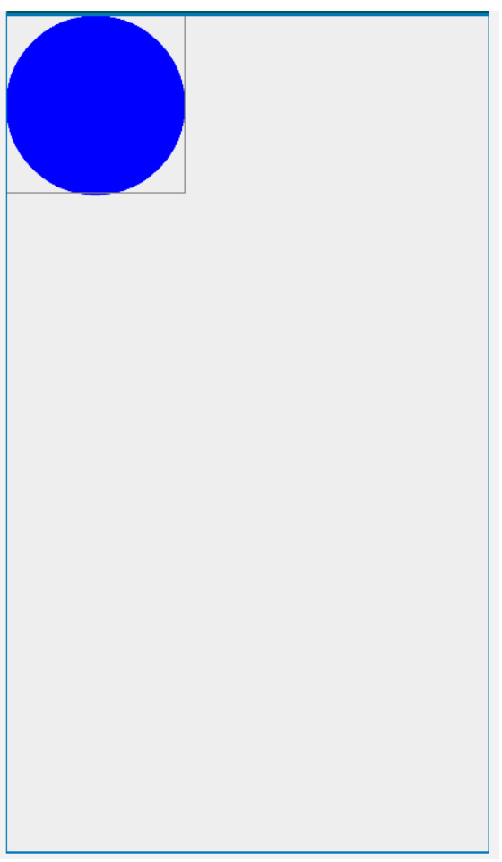
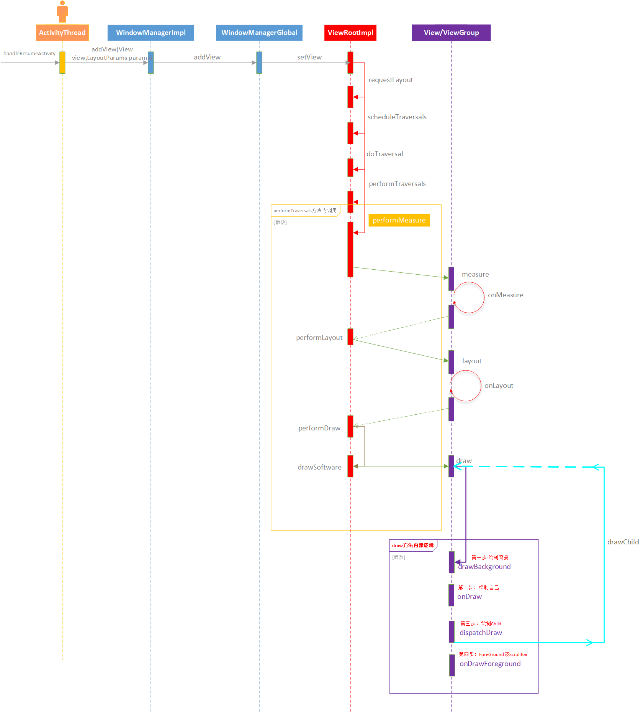
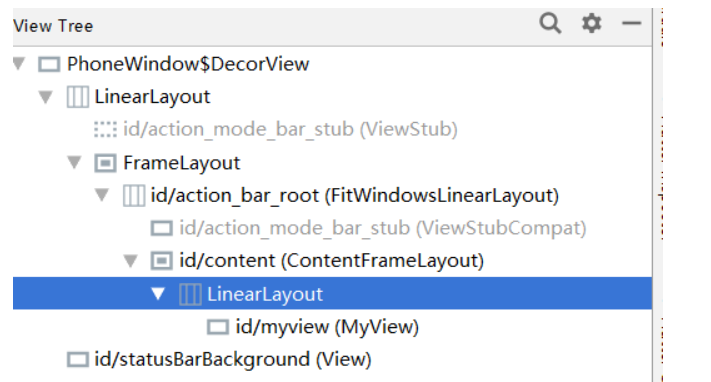

Android View的绘制流程分析

<!--more-->

# Android View的绘制流程分析

## Demo



​																				**页面效果图**

如下是“蓝色原型”自定义控件的代码：

```java
public class MyView extends View {
    private Paint mPaint;
    private float mRadius=0;

    private int defaultWidth=0;
    private int defaultHeight=0;

    private MyOnClickListener onClickListener;

    public MyView(Context context) {
        super(context);
    }

    @SuppressLint("ResourceType")
    public MyView(Context context, @Nullable AttributeSet attrs) {
        super(context, attrs);
        initPaint();
        TypedArray typedArray = context.getResources().obtainAttributes(attrs, R.styleable.MyView);
        mRadius = typedArray.getFloat(R.styleable.MyView_mRadius, 100);

        defaultWidth=2*(int)mRadius;
        defaultHeight=2*(int)mRadius;
    }

    private void initPaint() {
        mPaint=new Paint();
        mPaint.setColor(Color.BLUE);
        mPaint.setStyle(Paint.Style.FILL);
        mPaint.setDither(true);

    }

    @SuppressLint("ResourceType")
    public MyView(Context context, @Nullable AttributeSet attrs, int defStyleAttr) {
        super(context, attrs, defStyleAttr);

    }

    @Override
    protected void onMeasure(int widthMeasureSpec, int heightMeasureSpec) {
        super.onMeasure(widthMeasureSpec, heightMeasureSpec);

        int modeWidth = MeasureSpec.getMode(widthMeasureSpec);
        int sizeWidth = MeasureSpec.getSize(widthMeasureSpec);
        int modeHeight = MeasureSpec.getMode(heightMeasureSpec);
        int sizeHeight = MeasureSpec.getSize(heightMeasureSpec);

        if (modeWidth==MeasureSpec.AT_MOST&&modeHeight==MeasureSpec.AT_MOST){
            setMeasuredDimension(defaultWidth,defaultHeight);
        }else if (modeWidth==MeasureSpec.AT_MOST){
            setMeasuredDimension(defaultWidth,sizeHeight);
        }else if (modeHeight==MeasureSpec.AT_MOST){
            setMeasuredDimension(sizeWidth,defaultHeight);
        }

    }

    @Override
    protected void onDraw(Canvas canvas) {
        super.onDraw(canvas);
        float cx=getMeasuredWidth()/2;
        float cy=getMeasuredHeight()/2;
        int paddingTop = getPaddingTop();

        canvas.drawCircle(cx,cy,mRadius-paddingTop,mPaint);
    }

    @Override
    public boolean onTouchEvent(MotionEvent event) {
        switch (event.getAction()){
            case MotionEvent.ACTION_DOWN:
                doStyle(Color.RED);
                if (null!=onClickListener){
                    onClickListener.onClick("result");
                }

                break;
            case MotionEvent.ACTION_MOVE:

                break;
            case MotionEvent.ACTION_UP:
                doStyle(Color.BLUE);
                break;
            case MotionEvent.ACTION_CANCEL:
                doStyle(Color.BLUE);
                break;
        }
        return true;//super.onTouchEvent(event);
    }

    public void setMyOnClickListener(MyOnClickListener my){
        onClickListener=my;
    }

    private void doStyle(int color){
        mPaint.setColor(color);
        if (Looper.getMainLooper().getThread()==Thread.currentThread()){
            invalidate();
        }
        else{
            postInvalidate();
        }
    }

    public interface MyOnClickListener{
        void onClick(Object... params);
    }
```

如下是布局：

```xml
    <com.zy.news.MyView
        android:id="@+id/myview"
        android:layout_width="wrap_content"
        android:layout_height="wrap_content"
        app:mRadius="200"
        >

    </com.zy.news.MyView>
```

如下是activity中的调用代码：

```java
  private void initEvent() {
        myview.setMyOnClickListener(new MyView.MyOnClickListener() {
            @Override
            public void onClick(Object... params) {
                Toast.makeText(CustomViewActivity.this,"conent:"+params[0],Toast.LENGTH_SHORT).show();
            }
        });
    }

    private void initView() {
        myview = (MyView) findViewById(R.id.myview);
    }
```


## 调用时序图

先上一张分析的调用结构图




## 页面结构

使用AS IDE中Tools菜单下的【Layout Inspector】工具

如下是对当前activity的页面结果分析：



如上结果图分析：

- 根节点是PhoneWindow DecorView

- 接下来是由LinearLayout及状态栏（statusBarBackground）组成

- LinearLayout中FrameLayout

- FrameLayout中包含了action_bar_root(FitWindowsLinearLayout)

- FrameLayout中包含了ActionBar及**content** (ContentFrameLayout)

- conent中包含了我们自己实现的ui布局

  content也就是我们在Activity中onCreate进行设置

  ```java
  setContentView(R.layout.activity_custom_view);
  ```

## ActivityThread中handleResumeActivity方法

从Activity的启动流程中我们了解过handleResumeActivity方法，代码如下：

```java
 final void handleResumeActivity(IBinder token,
            boolean clearHide, boolean isForward, boolean reallyResume) {
     ...
        ActivityClientRecord r = performResumeActivity(token, clearHide);
     	 if (r != null) {
            //从r中获取activity
            final Activity a = r.activity;

            ...

            ...
            if (r.window == null && !a.mFinished && willBeVisible) {
                
                //从activity中获取getWindow
                r.window = r.activity.getWindow();
                View decor = r.window.getDecorView();
                decor.setVisibility(View.INVISIBLE);
                //getWindowManager 其实是WindowManagerImpl的实例  WindowManagerImpl 实现了 WindowManager接口  WM 实现 ViewManager接口     
                ViewManager wm = a.getWindowManager();
                WindowManager.LayoutParams l = r.window.getAttributes();
                a.mDecor = decor;
                l.type = WindowManager.LayoutParams.TYPE_BASE_APPLICATION;
                l.softInputMode |= forwardBit;
                if (a.mVisibleFromClient) {
                    a.mWindowAdded = true;
                    //将decor添加到vm中
                    wm.addView(decor, l);
                }
                ...
     ...
 }
```

如上代码中我们发现了一下类型 如：PhoneWindow WindowManager WindowManagerImpl WindowMangerGlobal ViewRootImpl。

下面我们来看看他们的关系：

参见[《Android View绘制原理（前篇》]()

### wm.addView(decor, l);

通过[《Android View绘制原理（前篇》]()中我们发现wm其实就是就是WindowManagerImpl的实例并且最终干活的是WindowMangerGlobal 

wm.addView(decor,l);其实最终调用的就是WindowManagerGlobal的addView方法，然后最终调用的是addView方法中的ViewRootImpl的setView方法

ViewRootImpl的seView方法如下：

```java
/**
     * We have one child
     */
    public void setView(View view, WindowManager.LayoutParams attrs, View panelParentView) {
        synchronized (this) {
            ...
                // Schedule the first layout -before- adding to the window
                // manager, to make sure we do the relayout before receiving
                // any other events from the system.
                //开始布局
                requestLayout();
                
                ...
                    
                try {
                    ...
                    res = mWindowSession.addToDisplay(mWindow, mSeq, mWindowAttributes,
                            getHostVisibility(), mDisplay.getDisplayId(),
                            mAttachInfo.mContentInsets, mAttachInfo.mStableInsets,
                            mAttachInfo.mOutsets, mInputChannel);
                } catch (RemoteException e) {
                  ...
                } finally {
                  ...
                }

             ...
        }
    }
```

#### requestLayout

```java
 	@Override
    public void requestLayout() {
        if (!mHandlingLayoutInLayoutRequest) {
            checkThread();
            mLayoutRequested = true;
            //计划遍历
            scheduleTraversals();
        }
    }
```

#### scheduleTraversals

```java
void scheduleTraversals() {
        if (!mTraversalScheduled) {
            mTraversalScheduled = true;
            mTraversalBarrier = mHandler.getLooper().getQueue().postSyncBarrier();
            mChoreographer.postCallback(
                    Choreographer.CALLBACK_TRAVERSAL, mTraversalRunnable, null);
            if (!mUnbufferedInputDispatch) {
                scheduleConsumeBatchedInput();
            }
            notifyRendererOfFramePending();
            pokeDrawLockIfNeeded();
        }
    }
```

<font color=blue>mTraversalRunnable</font>

```java
 final class TraversalRunnable implements Runnable {
        @Override
        public void run() {
            //开始遍历
            doTraversal();
        }
    }
 final TraversalRunnable mTraversalRunnable = new TraversalRunnable();
```

#### doTraversal

```java
 void doTraversal() {
        if (mTraversalScheduled) {
            mTraversalScheduled = false;
            mHandler.getLooper().getQueue().removeSyncBarrier(mTraversalBarrier);

            if (mProfile) {
                Debug.startMethodTracing("ViewAncestor");
            }

            //执行遍历
            performTraversals();

            if (mProfile) {
                Debug.stopMethodTracing();
                mProfile = false;
            }
        }
    }
```

#### performTraversals

```java
private void performTraversals() {
 ...
    performMeasure(childWidthMeasureSpec, childHeightMeasureSpec);
 ...
    performLayout(lp, desiredWindowWidth, desiredWindowHeight);
 ...
    performDraw();
 ...
}
```

performTraversals开始了measure  layout  draw 三个android View中特别重要的步骤。

#### performMeasure

```java
 private void performMeasure(int childWidthMeasureSpec, int childHeightMeasureSpec) {
        Trace.traceBegin(Trace.TRACE_TAG_VIEW, "measure");
        try {
           //mView即DecorView
           mView.measure(childWidthMeasureSpec, childHeightMeasureSpec);
        } finally {
            Trace.traceEnd(Trace.TRACE_TAG_VIEW);
        }
    }
```

调用了View的meause方法: <font color=red>mView.measure(childWidthMeasureSpec, childHeightMeasureSpec);</font>

##### View measure方法

```java
/**
     * <p>
     * This is called to find out how big a view should be. The parent
     * supplies constraint information in the width and height parameters.
     * </p>
     *
     * <p>
     * The actual measurement work of a view is performed in
     * {@link #onMeasure(int, int)}, called by this method. Therefore, only
     * {@link #onMeasure(int, int)} can and must be overridden by subclasses.
     * </p>
     *
     *
     * @param widthMeasureSpec Horizontal space requirements as imposed by the
     *        parent
     * @param heightMeasureSpec Vertical space requirements as imposed by the
     *        parent
     *
     * @see #onMeasure(int, int)
     */
    public final void measure(int widthMeasureSpec, int heightMeasureSpec) {
            ...
                // measure ourselves, this should set the measured dimension flag back
                onMeasure(widthMeasureSpec, heightMeasureSpec);
            ...
    }
```

我们发现View中的measure方法最终会调用onMeasure来完成控件的测量工作，onMeasure方法是可以由View的子类来复写实现，当然View也有一个默认实现

```java
protected void onMeasure(int widthMeasureSpec, int heightMeasureSpec) {
        setMeasuredDimension(getDefaultSize(getSuggestedMinimumWidth(), widthMeasureSpec),
                getDefaultSize(getSuggestedMinimumHeight(), heightMeasureSpec));
    }
```


比如如上代码中的mView是DecorView的实例，DecorView继承了FrameLayout我们来看一下FrameLayout的onMeasure方法实现：

```java
   FrameLayout.java
       
   /**
     * {@inheritDoc}
     */
    @Override
    protected void onMeasure(int widthMeasureSpec, int heightMeasureSpec) {
        //获取子控件的个数
        int count = getChildCount();

        ...

        //遍历所有子控件
        for (int i = 0; i < count; i++) {
            final View child = getChildAt(i);
            if (mMeasureAllChildren || child.getVisibility() != GONE) {
                //测量子控件带有margin的情况
                measureChildWithMargins(child, widthMeasureSpec, 0, heightMeasureSpec, 0);
                //获取了子控件的布局参数
                final LayoutParams lp = (LayoutParams) child.getLayoutParams();
                //将当前子控件的width与布局参数中左右margin值相加与maxWidth比较取最大值
                maxWidth = Math.max(maxWidth,
                        child.getMeasuredWidth() + lp.leftMargin + lp.rightMargin);
                //将当前子控件的height与布局参数中上下margin值相加与maxWidth比较取最大值
                maxHeight = Math.max(maxHeight,
                        child.getMeasuredHeight() + lp.topMargin + lp.bottomMargin);
                childState = combineMeasuredStates(childState, child.getMeasuredState());
                //将child 布局参数中的widht与height 是MATCH_PARENT放到一个集合中
                if (measureMatchParentChildren) {
                    if (lp.width == LayoutParams.MATCH_PARENT ||
                            lp.height == LayoutParams.MATCH_PARENT) {
                        mMatchParentChildren.add(child);
                    }
                }
            }
        }

        //padding也考虑进来
        // Account for padding too
        maxWidth += getPaddingLeftWithForeground() + getPaddingRightWithForeground();
        maxHeight += getPaddingTopWithForeground() + getPaddingBottomWithForeground();

        // Check against our minimum height and width
        maxHeight = Math.max(maxHeight, getSuggestedMinimumHeight());
        maxWidth = Math.max(maxWidth, getSuggestedMinimumWidth());

        // Check against our foreground's minimum height and width
        final Drawable drawable = getForeground();
        if (drawable != null) {
            maxHeight = Math.max(maxHeight, drawable.getMinimumHeight());
            maxWidth = Math.max(maxWidth, drawable.getMinimumWidth());
        }

        //开始测量自己FrameLayout
        setMeasuredDimension(resolveSizeAndState(maxWidth, widthMeasureSpec, childState),
                resolveSizeAndState(maxHeight, heightMeasureSpec,
                        childState << MEASURED_HEIGHT_STATE_SHIFT));

        //获取子控件布局参数中的widht与height 是MATCH_PARENT的控件
        count = mMatchParentChildren.size();
        if (count > 1) {
            //遍历
            for (int i = 0; i < count; i++) {
                final View child = mMatchParentChildren.get(i);
                final MarginLayoutParams lp = (MarginLayoutParams) child.getLayoutParams();

                final int childWidthMeasureSpec;
                //width为LayoutParams.MATCH_PARENT的情况处理
                if (lp.width == LayoutParams.MATCH_PARENT) {
                    final int width = Math.max(0, getMeasuredWidth()
                            - getPaddingLeftWithForeground() - getPaddingRightWithForeground()
                            - lp.leftMargin - lp.rightMargin);
                    childWidthMeasureSpec = MeasureSpec.makeMeasureSpec(
                            width, MeasureSpec.EXACTLY);
                } else {
                    childWidthMeasureSpec = getChildMeasureSpec(widthMeasureSpec,
                            getPaddingLeftWithForeground() + getPaddingRightWithForeground() +
                            lp.leftMargin + lp.rightMargin,
                            lp.width);
                }

                final int childHeightMeasureSpec;
                //height为LayoutParams.MATCH_PARENT的情况处理
                if (lp.height == LayoutParams.MATCH_PARENT) {
                    final int height = Math.max(0, getMeasuredHeight()
                            - getPaddingTopWithForeground() - getPaddingBottomWithForeground()
                            - lp.topMargin - lp.bottomMargin);
                    childHeightMeasureSpec = MeasureSpec.makeMeasureSpec(
                            height, MeasureSpec.EXACTLY);
                } else {
                    childHeightMeasureSpec = getChildMeasureSpec(heightMeasureSpec,
                            getPaddingTopWithForeground() + getPaddingBottomWithForeground() +
                            lp.topMargin + lp.bottomMargin,
                            lp.height);
                }
				//子控件重新测量
                child.measure(childWidthMeasureSpec, childHeightMeasureSpec);
            }
        }
    }
```

#### performLayout

```java
 private void performLayout(WindowManager.LayoutParams lp, int desiredWindowWidth,
            int desiredWindowHeight) {
        ...
		//host DecorView
        final View host = mView;
        ...

        
        try {
            host.layout(0, 0, host.getMeasuredWidth(), host.getMeasuredHeight());
        }
 }
```

通过如上代码我们发现host就是DecorView的实例，然后调用layout方法其实最终调用的是View的layout方法，View的layout方法中调用onLayout方法，该方法一般由子类来具体实现View中就是一个空方法。

##### View的layout方法

代码如下：

```java
    @SuppressWarnings({"unchecked"})
    public void layout(int l, int t, int r, int b) {
         ...
            onLayout(changed, l, t, r, b);
         ...
    }
```

```java
    protected void onLayout(boolean changed, int left, int top, int right, int bottom) {
    }
```

接下来我们来看看host（DecorView）的onLayout发现调用了super.onLayout，这里的super指的就是FrameLayout，所有我们来关注一下FrameLayout的onLayout方法，代码如下：

```java
    @Override
    protected void onLayout(boolean changed, int left, int top, int right, int bottom) {
        //布局子视图
        layoutChildren(left, top, right, bottom, false /* no force left gravity */);
    }
```

```java
void layoutChildren(int left, int top, int right, int bottom,
                                  boolean forceLeftGravity) {
        //获取子实体个数
        final int count = getChildCount();

        //获取parent ltrb
        final int parentLeft = getPaddingLeftWithForeground();
        final int parentRight = right - left - getPaddingRightWithForeground();

        final int parentTop = getPaddingTopWithForeground();
        final int parentBottom = bottom - top - getPaddingBottomWithForeground();
        //遍历子视图
        for (int i = 0; i < count; i++) {
            //获取子视图
            final View child = getChildAt(i);
            //子视图没有GONE的
            if (child.getVisibility() != GONE) {
                //获取子视图的布局参数
                final LayoutParams lp = (LayoutParams) child.getLayoutParams();

                //获取子视图测量后的宽高
                final int width = child.getMeasuredWidth();
                final int height = child.getMeasuredHeight();

                int childLeft;
                int childTop;

                int gravity = lp.gravity;
                
                //省略的代码为处理子视图的Gravity 
                ...

                //布局子视图
                child.layout(childLeft, childTop, childLeft + width, childTop + height);
            }
        }
    }
```

我们用FrameLayout为例来演示layout，最终child.layout又是调用View中的layout然后调用child的onLayout逐步遍历直到所有视图布局完成。

#### performDraw

```java
private void performDraw() {
   ...
        try {
            //绘制方法
            draw(fullRedrawNeeded);
        } finally {
            mIsDrawing = false;
            Trace.traceEnd(Trace.TRACE_TAG_VIEW);
        }
    ...
}
```

```java
private void draw(boolean fullRedrawNeeded) {
           ...

                if (!drawSoftware(surface, mAttachInfo, xOffset, yOffset, scalingRequired, dirty)) {
                    return;
                }
            ...
    }
```

##### drawSoftware

```java
/**
     * @return true if drawing was successful, false if an error occurred
     */
    private boolean drawSoftware(Surface surface, AttachInfo attachInfo, int xoff, int yoff,
            boolean scalingRequired, Rect dirty) {

        // Draw with software renderer.
        final Canvas canvas;
        try {
            final int left = dirty.left;
            final int top = dirty.top;
            final int right = dirty.right;
            final int bottom = dirty.bottom;

            canvas = mSurface.lockCanvas(dirty);

            ...
        }
        ...
                //mView DecorView 调用draw方法并传入canvas
                mView.draw(canvas);

        ...
        return true;
    }
```

mView的draw方法与上面measure及layout一样，都是在View.java中实现的

##### View的draw方法

```java
 public void draw(Canvas canvas) {
        ...

        // Step 1, draw the background, if needed
        int saveCount;

        if (!dirtyOpaque) {
            drawBackground(canvas);
        }

        // skip step 2 & 5 if possible (common case)
        final int viewFlags = mViewFlags;
        boolean horizontalEdges = (viewFlags & FADING_EDGE_HORIZONTAL) != 0;
        boolean verticalEdges = (viewFlags & FADING_EDGE_VERTICAL) != 0;
        if (!verticalEdges && !horizontalEdges) {
            // Step 3, draw the content
            if (!dirtyOpaque) onDraw(canvas);

            // Step 4, draw the children
            dispatchDraw(canvas);

            // Overlay is part of the content and draws beneath Foreground
            if (mOverlay != null && !mOverlay.isEmpty()) {
                mOverlay.getOverlayView().dispatchDraw(canvas);
            }

            // Step 6, draw decorations (foreground, scrollbars)
            onDrawForeground(canvas);

            // we're done...
            return;
        }

        
    }

```

我们发现draw方法中涉及6步（2,5是基础的不分析了），具体可以理解为4步：

- 第一步  绘制背景
- 第二步 调用各实现View的onDraw来绘制自己
- 第三步 绘制Child
- 第四步 绘制前景及滚动条

##### dispatchDraw

关于如上的第三步绘制Child我们再来关注一下

代码如下：

```java
    protected void dispatchDraw(Canvas canvas) {

    }
```

我们发现View中的dispatchDraw方法是一个空方法并没有任何实现，所以我们还是已DecorView为例来跟踪代码发现在ViewGroup类中进行了具体实现，代码如下：

```java
/**
     * {@inheritDoc}
     */
    @Override
    protected void dispatchDraw(Canvas canvas) {
        ...
        for (int i = 0; i < childrenCount; i++) {
            ...
                    more |= drawChild(canvas, transientChild, drawingTime);
           
            ...
        }
        ...
    }
```

我们发现还是遍历所有的子View调用drawChild方法，下面继续看drawChild

```java
protected boolean drawChild(Canvas canvas, View child, long drawingTime) {
        return child.draw(canvas, this, drawingTime);
    }
```

如上我们发现还是调用的View的draw这样就很容易看出了View的不断遍历绘制方式了。


<font color=red>上面的调用时序图是对如上代码分析的总结结合参考。</font>


<font color=blue>如上！咱们的View绘制流程已经分析完成 ， DONE！</font>

